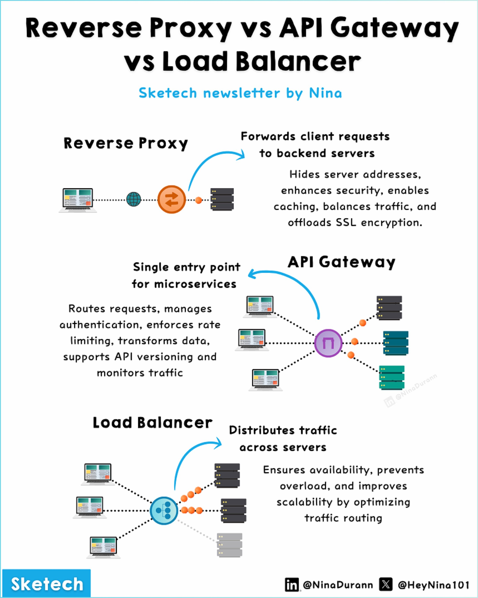

**Source:** [https://twitter.com/i/web/status/1869132701930017099](https://twitter.com/i/web/status/1869132701930017099)
**Original Post Date:** 2025-07-20 09:26:49

# Reverse Proxy vs API Gateway vs Load Balancer: A Technical Comparison

## Introduction
In modern web and application architectures, understanding the roles and functionalities of key components like Reverse Proxy, API Gateway, and Load Balancer is crucial. This infographic provides a clear and concise comparison of these three essential elements, highlighting their distinct purposes and how they work together in a system.

## Reverse Proxy

A reverse proxy is a server that sits between clients and backend servers. It forwards client requests to the appropriate backend server based on predefined rules or configurations.

The primary functionality of a reverse proxy includes hiding server addresses, enhancing security by acting as an intermediary, enabling caching for improved performance, balancing traffic across multiple servers, and offloading SSL encryption tasks.

- Hides server addresses to enhance security.
- Enables caching to improve performance.
- Balances traffic across backend servers.
- Offloads SSL encryption to reduce server load.

> **Note/Tip:** Reverse proxies are often used in conjunction with load balancers for optimal performance and scalability.

> **Note/Tip:** Caching can significantly reduce the load on backend servers, improving response times for clients.

## API Gateway

An API Gateway acts as a single entry point for multiple microservices in an application. It routes client requests to the appropriate microservice based on the request's path or headers.

The key features of an API Gateway include managing authentication and authorization, enforcing rate limiting to prevent abuse, transforming data formats between clients and services, supporting API versioning, and monitoring traffic for performance insights.

- Routes requests to the appropriate microservice.
- Manages authentication and authorization.
- Enforces rate limiting to prevent abuse.
- Transforms data formats between clients and services.
- Supports API versioning for backward compatibility.
- Monitors traffic for performance insights.

> **Note/Tip:** API Gateways are essential in microservices architectures where multiple services need to be exposed through a single interface.

> **Note/Tip:** Rate limiting helps prevent abuse and ensures fair usage of API resources.

## Load Balancer

A load balancer is a device or software that distributes incoming network traffic across multiple servers to ensure availability, prevent server overload, and improve scalability.

The primary functionality of a load balancer includes distributing traffic based on various algorithms (e.g., round-robin, least connections), ensuring high availability by redirecting traffic if a server fails, and improving scalability by optimizing the distribution of requests.

- Distributes traffic across multiple servers.
- Ensures high availability by redirecting traffic if a server fails.
- Improves scalability by optimizing request distribution.

> **Note/Tip:** Load balancers are crucial for applications that experience variable loads or need to scale horizontally.

> **Note/Tip:** Using multiple load balancers can improve fault tolerance and reduce single points of failure.

## Overall Layout and Design

The infographic uses a clean, minimalist design with a white background. Each section is clearly separated with distinct icons and colors to represent the Reverse Proxy, API Gateway, and Load Balancer.

Arrows and dotted lines illustrate the flow of requests and responses between clients, the respective component, and backend servers or microservices.

- Reverse Proxy: Orange bidirectional arrow icon.
- API Gateway: Purple circle with a Greek letter Π inside.
- Load Balancer: Blue circle with multiple dots inside.

## Footer Information

The infographic is credited to 'Sketech newsletter by Nina'. Social media handles for further engagement and information are provided as follows:

- LinkedIn: @NinaDurann
- X (formerly Twitter): @HeyNina101

## Summary

The infographic effectively compares the roles and functionalities of Reverse Proxy, API Gateway, and Load Balancer in modern web architectures. Each component is explained with a clear diagram and a concise list of features, making it easy to understand their distinct purposes and how they work together in a system.

## Key Takeaways

- Reverse Proxies enhance security by hiding server addresses and offloading SSL encryption.
- API Gateways manage authentication, rate limiting, and data transformation for microservices.
- Load Balancers distribute traffic across multiple servers to ensure availability and scalability.

## Conclusion
Understanding the distinct roles of Reverse Proxy, API Gateway, and Load Balancer is essential for designing efficient and scalable web architectures. Each component plays a crucial part in ensuring security, performance, and reliability.

## External References

- [Sketech newsletter by Nina](https://www.sketchnewsletter.com)
- [Nina Durann on LinkedIn](https://www.linkedin.com/in/ninadurann/)
- [HeyNina101 on X (formerly Twitter)](https://twitter.com/HeyNina101)

## Media

**Image Description:** ### Image Description

The image is an infographic titled **"Reverse Proxy vs API Gateway vs Load Balancer"**. It is designed to compare and contrast the functionalities of three key components in modern web and application architectures: **Reverse Proxy**, **API Gateway**, and **Load Balancer**. The infographic is visually organized into three sections, each dedicated to one of these components, with accompanying diagrams and descriptions.

---

### **1. Reverse Proxy**

#### **Diagram:**
- **Client:** Represented by a laptop icon on the left.
- **Internet:** Symbolized by a globe icon.
- **Reverse Proxy:** Depicted as an orange bidirectional arrow icon (`↔`).
- **Backend Servers:** Represented by a stack of server icons on the right.

#### **Description:**
- **Functionality:** The reverse proxy forwards client requests to backend servers.
- **Key Features:**
  - Hides server addresses.
  - Enhances security.
  - Enables caching.
  - Balances traffic.
  - Offloads SSL encryption.

#### **Visual Flow:**
- The client sends a request through the internet to the reverse proxy.
- The reverse proxy processes the request and forwards it to the appropriate backend server.
- The response from the server is then sent back to the client via the reverse proxy.

---

### **2. API Gateway**

#### **Diagram:**
- **Client:** Represented by a laptop icon on the left.
- **API Gateway:** Depicted as a purple circle with a Greek letter `Π` inside.
- **Microservices:** Represented by multiple server icons on the right, each connected to the API Gateway.

#### **Description:**
- **Functionality:** The API Gateway acts as a single entry point for microservices.
- **Key Features:**
  - Routes requests to the appropriate microservice.
  - Manages authentication.
  - Enforces rate limiting.
  - Transforms data.
  - Supports API versioning.
  - Monitors traffic.

#### **Visual Flow:**
- The client sends a request to the API Gateway.
- The API Gateway processes the request, applies necessary transformations, and routes it to the appropriate microservice.
- The response from the microservice is sent back to the client via the API Gateway.

---

### **3. Load Balancer**

#### **Diagram:**
- **Client:** Represented by a laptop icon on the left.
- **Load Balancer:** Depicted as a blue circle with multiple dots inside.
- **Servers:** Represented by multiple server icons on the right, each connected to the load balancer.

#### **Description:**
- **Functionality:** The load balancer distributes traffic across multiple servers.
- **Key Features:**
  - Ensures availability.
  - Prevents server overload.
  - Improves scalability by optimizing traffic routing.

#### **Visual Flow:**
- The client sends a request to the load balancer.
- The load balancer distributes the request across multiple servers based on load balancing algorithms.
- The response from the server is sent back to the client.

---

### **Overall Layout and Design:**
- The infographic uses a clean, minimalist design with a white background.
- Each section is clearly separated with distinct icons and colors:
  - **Reverse Proxy:** Orange bidirectional arrow.
  - **API Gateway:** Purple circle with `Π`.
  - **Load Balancer:** Blue circle with dots.
- Arrows and dotted lines are used to illustrate the flow of requests and responses.
- The text is concise and highlights key functionalities of each component.

---

### **Footer Information:**
- The infographic is credited to **"Sketech newsletter by Nina"**.
- Social media handles are provided:
  - **LinkedIn:** @NinaDurann
  - **X (formerly Twitter):** @HeyNina101

---

### **Summary:**
The infographic effectively compares the roles and functionalities of **Reverse Proxy**, **API Gateway**, and **Load Balancer** in modern web architectures. Each component is explained with a clear diagram and a concise list of features, making it easy to understand their distinct purposes and how they work together in a system.
