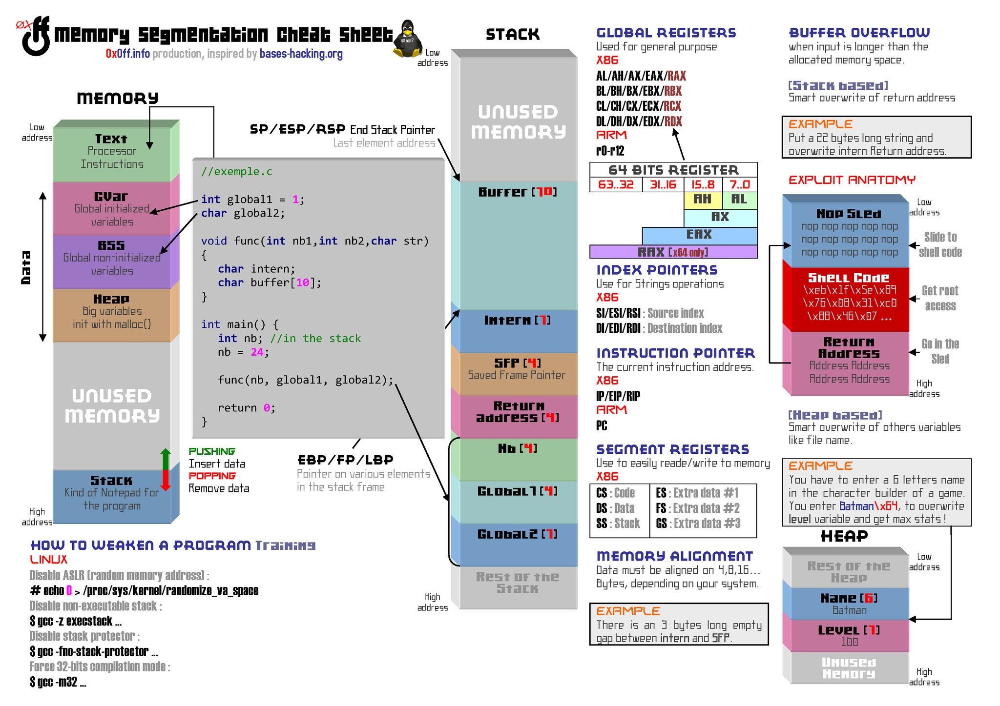

**Source:** [https://twitter.com/i/web/status/1877700730875674820](https://twitter.com/i/web/status/1877700730875674820)
**Original Post Date:** 2025-06-17 09:01:57

# Memory Segmentation: Understanding Layout, Vulnerabilities, and Exploitation Techniques

## Introduction
Memory segmentation is fundamental to understanding system security and program behavior. This resource explores how different memory segments interact, common vulnerabilities like buffer overflows, and exploitation techniques while highlighting critical defensive considerations for secure systems development.

## Memory Segmentation Architecture

Memory is divided into distinct segments: Text (code), Data (initialized variables), BSS (uninitialized data), Heap (dynamic memory), Stack (function calls and local data). Each serves a specific purpose in program execution.

The stack grows downward from high to low addresses, containing function parameters, return addresses, frame pointers, and local variables. Proper understanding of this layout is crucial for security analysis.

_Shows variable placement across different memory segments_

```c
// Memory Layout Example
int global_var = 10; // Data Segment
char buffer[10];
void function() {
    int local_var; // Stack Segment
    malloc(1024); // Heap Allocation
}
```

## Buffer Overflow Vulnerabilities

Buffer overflow occurs when data exceeds allocated memory boundaries. This can overwrite adjacent stack elements, including return addresses and frame pointers.

A NOP sled ensures reliable execution of injected shellcode by providing a landing area for execution flow.

- Exploit steps: 1) Trigger overflow 2) Overwrite return address 3) Execute payload
- Common mitigations: ASLR, stack canaries, DEP

> **Note/Tip:** Always validate input sizes to prevent buffer overflows

## Registers and Memory Access

Key registers include ESP/RSP (stack pointer), EBP/FP (frame pointer), IP/EIP/RIP (instruction pointer). Different architectures handle memory access differently.

- X86: AL/AH/AX/EAX/RAX for general purpose operations
- ARM: R0-R12 for parameters and results

## Defensive Programming Techniques

Implementing proper memory alignment, using bounds-checking functions, and enabling security features like ASLR and non-executable stack are essential.

> **Note/Tip:** Compile with -Wall for maximum warnings about potential issues

## Key Takeaways

- Memory segmentation layout directly impacts program behavior and security
- Buffer overflows can be mitigated through proper input validation and security features
- Understanding register operations is crucial for exploitation and defense
- Proper memory alignment and bounds checking prevent many common vulnerabilities

## Conclusion
Mastering memory segmentation fundamentals is essential for secure systems programming. This knowledge enables developers to write robust code while understanding potential attack vectors and defensive measures.

## External References

- [Original Cheat Sheet Source](https://0x0ff.info/memory_segmentation_cheatsheet)
- [Base Exploitation Concepts](https://bases-hacking.org/exploitation)


## Media

**Image Description:** This image is a detailed cheat sheet titled **"Memory Segmentation Cheat Sheet"**, created by **0x0ff.info** and inspired by **bases-hacking.org**. It provides an in-depth overview of memory segmentation, stack operations, buffer overflows, and exploitation techniques. Below is a detailed breakdown of the image:

---

### **Main Sections and Layout**

The image is divided into several sections, each focusing on a different aspect of memory segmentation and exploitation:

1. **Memory Segmentation Diagram**
   - **Text Segment (Green)**: Contains executable code (instructions).
   - **Data Segment (Pink)**: Holds initialized global variables.
   - **BSS Segment (Purple)**: Contains uninitialized global variables.
   - **Heap (Orange)**: Dynamically allocated memory using functions like `malloc()`.
   - **Stack (Blue)**: Contains local variables, function parameters, return addresses, and saved frame pointers.
   - **Unused Memory (Gray)**: Represents unused memory regions.

2. **Stack Frame Diagram**
   - **Stack Pointer (SP/ESP/RSP)**: Points to the top of the stack.
   - **Stack Frame Components**:
     - **Return Address**: Stores the address to return to after function execution.
     - **Saved Frame Pointer (SFP)**: Stores the previous frame pointer.
     - **Local Variables**: Such as `nb`, `char intern`, and `buffer`.
     - **Function Parameters**: Passed to the function `func()`.

3. **Code Example**
   - A C program is shown on the left side, illustrating how memory is allocated and used:
     ```c
     //exemple.c
     int global1 = 1;
     char global2;
     void func(int nb1, int nb2, char *str) {
         char char intern;
         char buffer[10];
         // ...
     }
     int main() {
         int nb; // in the stack
         nb = 24;
         func(nb, global1, global2);
         return 0;
     }
     ```
   - The program demonstrates the use of global variables, local variables, and function calls.

4. **Stack Operations**
   - **PUSHING**: Adding data to the stack.
   - **POPPING**: Removing data from the stack.
   - **Frame Pointer (EBP/FP/LBP)**: Points to the base of the current stack frame.

5. **Buffer Overflow Explanation**
   - **Buffer Overflow**: Occurs when input exceeds the allocated memory space.
   - **Example**: A buffer of size 10 is shown, and an overflow is demonstrated by writing more than 10 bytes into it.

6. **Exploit Anatomy**
   - **NOP Sled**: A sequence of NOP (no-operation) instructions to ensure the shellcode execution.
   - **Shellcode**: Malicious code executed after overwriting the return address.
   - **Return Address**: Overwritten to redirect execution flow to the shellcode.

7. **Registers**
   - **General Purpose Registers**: Used for general computation.
     - **X86**: AL/AH/AX/EAX/RAX, BL/BH/BX/EBX/RBX, etc.
     - **ARM**: R0-R12.
   - **Index Pointers**: Used for string operations.
     - **X86**: SI/ESI/RSI (source index), DI/EDI/RDI (destination index).
   - **Instruction Pointer (IP/EIP/RIP)**: Points to the current instruction being executed.
   - **Segment Registers**: Used for memory segmentation.
     - **X86**: CS (code segment), DS (data segment), SS (stack segment), etc.

8. **Memory Alignment**
   - Data must be aligned on specific boundaries (e.g., 4, 8, 16 bytes) depending on the system.

9. **How to Weaken a Program**
   - Techniques to disable security features:
     - Disable ASLR (Address Space Layout Randomization).
     - Disable non-executable stack.
     - Compile in 32-bit mode (`gcc -m32`).

10. **Heap-Based Exploitation**
    - **Heap**: Dynamically allocated memory.
    - **Example**: Overwriting a file name variable to gain elevated privileges.

---

### **Key Technical Details**

- **Stack Layout**:
  - The stack grows downward in memory (from high addresses to low addresses).
  - Local variables and function parameters are stored near the top of the stack.
  - The return address is stored just below the local variables.

- **Buffer Overflow**:
  - When a buffer is overflowed, the return address can be overwritten, redirecting execution to malicious code.

- **Registers**:
  - Different architectures (X86, ARM) have different register names and sizes.
  - The instruction pointer (IP/EIP/RIP) is crucial for controlling program flow.

- **Memory Segmentation**:
  - Memory is divided into segments for code, data, BSS, heap, and stack.
  - Each segment has specific purposes and protections.

- **Exploitation Techniques**:
  - NOP sleds ensure reliable execution of shellcode.
  - Return address overwrites redirect program flow.

---

### **Visual Elements**

- **Color Coding**:
  - Different segments and stack components are color-coded for clarity.
  - Registers and memory regions are highlighted in distinct colors.

- **Annotations**:
  - Arrows and labels provide detailed explanations of stack operations and memory layout.

- **Examples**:
  - Practical examples are provided for buffer overflows and heap-based exploitation.

---

### **Purpose**

This cheat sheet serves as a comprehensive reference for understanding memory segmentation, stack operations, and exploitation techniques. It is particularly useful for developers, security researchers, and students learning about low-level programming and system security.

---

### **Summary**

The image is a detailed and visually rich resource that explains memory segmentation, stack operations, buffer overflows, and exploitation techniques. It combines theoretical concepts with practical examples, making it a valuable tool for anyone studying or working in the field of computer security and systems programming.
