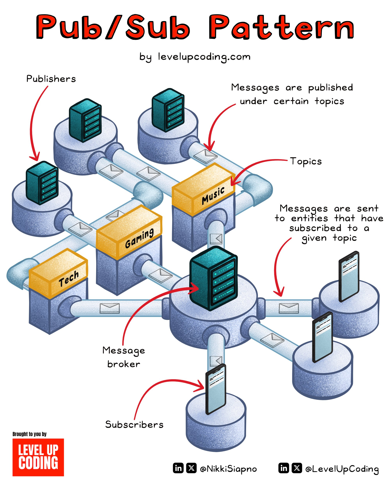

**Source:** [https://twitter.com/i/web/status/1889910591718039886](https://twitter.com/i/web/status/1889910591718039886)
**Original Post Date:** 2025-05-27 20:12:35

# Pub-Sub Pattern in Distributed Systems: Architecture and Implementation Details

## Introduction
The Publish-Subscribe (Pub/Sub) pattern represents a fundamental messaging paradigm in distributed systems, enabling asynchronous communication between producers and consumers without direct coupling. This architectural pattern is crucial for building scalable event-driven applications where publishers and subscribers operate independently. The pattern's strength lies in its ability to decouple message production from consumption through a centralized broker that manages topic-based routing of messages.

## Core Components of the Pub/Sub Pattern

The Pub/Sub architecture consists of four essential components: publishers, topics, message brokers, and subscribers. Publishers generate and send messages to specific topics, while a centralized broker receives these messages and routes them based on topic subscriptions.

Topics serve as logical channels that group related messages together. Subscribers can selectively subscribe to one or more topics, ensuring they only receive relevant information without needing knowledge of the publishers.

```python
from rabbitmq import Publisher

class TechPublisher:
    def publish(self, message):
        publisher = Publisher()
        publisher.send(topic='tech', message=message)
        return 'Message published to tech topic'
```

- Publishers generate and send messages to specific topics
- Message broker receives and routes messages based on subscriptions
- Subscribers can dynamically subscribe/unsubscribe from topics
- Topics act as logical channels for message grouping

> **Note/Tip:** Always implement retry mechanisms for failed message deliveries

> **Note/Tip:** Consider using dead-letter queues for handling undeliverable messages

## Message Flow and Routing Mechanisms

Messages flow from publishers to the broker, which then filters and routes them to interested subscribers. This asynchronous communication ensures that publishers can send messages without waiting for acknowledgment.

The message broker maintains a mapping of topics to active subscriptions and efficiently delivers messages only to relevant endpoints.

1. Publisher sends message with topic metadata
1. Broker receives and stores message temporarily
1. Broker routes message to all subscribed clients
1. Subscribers receive messages asynchronously

## Implementation Considerations

When implementing a Pub/Sub system, consider factors such as message persistence, delivery guarantees, and scaling strategies. Message brokers like RabbitMQ or Kafka provide robust implementations with various configuration options.

```kafka
# Subscribe to multiple topics
consumer.subscribe(['tech', 'gaming', 'music'])

# Process messages in a loop
while True:
    message = consumer.poll()
    process_message(message)
```

## Key Takeaways

- Pub/Sub decouples message producers from consumers through a centralized broker
- Asynchronous communication enables scalable event-driven architectures
- Topic-based routing ensures efficient and targeted message delivery

## Conclusion
The Pub/Sub pattern provides a robust foundation for building distributed systems with loose coupling, scalability, and asynchronous communication. By understanding its components and implementation considerations, developers can effectively leverage this pattern to build resilient messaging solutions.

## External References

- [RabbitMQ Documentation](https://www.rabbitmq.com/documentation.html)
- [Apache Kafka Design](https://kafka.apache.org/documentation/)


## Media

**Image Description:** The image illustrates the **Pub/Sub (Publish-Subscribe) Pattern**, a common architectural pattern used in distributed systems for message communication. The diagram is colorful and visually engaging, with clear labels and annotations to explain the flow of messages between publishers, subscribers, and a message broker. Below is a detailed description:

### **Main Subject: Pub/Sub Pattern**
The Pub/Sub pattern is depicted as a system where publishers send messages to a broker, which then routes those messages to subscribers who have expressed interest in specific topics. This pattern is asynchronous and decouples publishers from subscribers, allowing for scalable and flexible communication.

### **Key Components**
1. **Publishers**:
   - Represented by the teal-colored server-like icons on the left side of the diagram.
   - These are the entities that generate and publish messages.
   - The diagram shows multiple publishers, indicating that the system can handle messages from multiple sources.

2. **Topics**:
   - Represented by the yellow rectangular blocks labeled "Tech," "Gaming," and "Music."
   - These are the categories or channels under which messages are published.
   - Each topic acts as a logical grouping for messages, allowing subscribers to subscribe to specific topics of interest.

3. **Message Broker**:
   - The central component of the system, depicted as a large teal server-like icon in the middle.
   - The broker is responsible for receiving messages from publishers, filtering them based on topics, and routing them to the appropriate subscribers.
   - It acts as an intermediary, decoupling publishers and subscribers.

4. **Subscribers**:
   - Represented by the smartphone-like icons on the right side of the diagram.
   - These are the entities that consume messages published under specific topics.
   - Subscribers can subscribe to one or more topics and will only receive messages relevant to those topics.

### **Flow of Messages**
1. **Publishing Messages**:
   - Publishers send messages to the broker.
   - Each message is associated with a specific topic (e.g., "Tech," "Gaming," "Music").
   - The broker receives these messages and stores them temporarily.

2. **Routing Messages**:
   - The broker filters the messages based on the topics they are associated with.
   - It then routes the messages to the subscribers who have subscribed to those topics.

3. **Subscribing to Topics**:
   - Subscribers can subscribe to one or more topics.
   - Once subscribed, they will receive all messages published under those topics.

### **Technical Details**
- **Asynchronous Communication**: The diagram emphasizes that publishers and subscribers do not need to interact directly or be online simultaneously. The broker handles the message routing asynchronously.
- **Decoupling**: Publishers and subscribers are decoupled, meaning they do not need to know about each other. Publishers only need to know the topic they are publishing to, and subscribers only need to know the topics they are interested in.
- **Scalability**: The system can handle multiple publishers and subscribers, as shown by the multiple icons for each.
- **Topic-Based Filtering**: The broker uses topics to filter and route messages, ensuring that subscribers only receive relevant messages.

### **Visual Elements**
- **Color Coding**:
  - Publishers are teal.
  - Topics are yellow with labels ("Tech," "Gaming," "Music").
  - Subscribers are represented by smartphones in blue.
  - The broker is a central teal server.
- **Annotations**:
  - Arrows indicate the direction of message flow.
  - Text annotations explain the roles of publishers, topics, subscribers, and the broker.
- **Icons**:
  - Envelope icons represent messages being sent or received.
  - The broker is depicted as a central hub, emphasizing its role as the intermediary.

### **Additional Notes**
- The diagram is created by **levelupcoding.com**, as indicated in the text at the top and bottom of the image.
- Social media handles for the creator (@NikkiSiapno) and the platform (@LevelUpCoding) are included at the bottom.

### **Overall Purpose**
The image serves as an educational tool to explain the Pub/Sub pattern in a clear and visually intuitive manner. It highlights the key components and flow of the pattern, making it easier for learners to understand how this architectural pattern works in distributed systems.
