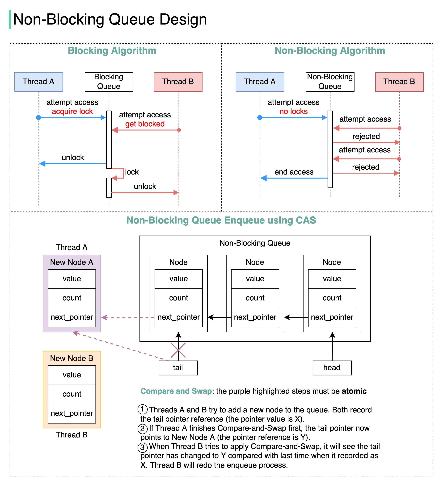

### Description

This knowledge base entry provides a comprehensive overview of system design questions, including examples of designing systems for popular applications such as Instagram, YouTube, and WhatsApp. It also covers key concepts related to message queues, including blocking and non-blocking algorithms.

### Technical Content

System design interviews often involve designing scalable and efficient systems for real-world applications. Here are six examples of system design questions:

1. **Instagram Design**: Design a system that can handle the high traffic and user engagement of Instagram. This includes handling user uploads, processing images, and storing metadata.
2. **YouTube Design**: Design a system that can stream videos to millions of users simultaneously. This includes handling video uploads, processing video content, and ensuring low latency.
3. **LMS (Learning Management System) Design**: Design a system that can handle the needs of an online learning platform. This includes handling user enrollments, course content, and assignments.
4. **WhatsApp Design**: Design a system that can handle the high volume of messages sent through WhatsApp. This includes handling message encryption, routing, and storage.
5. **Parking Lot Design**: Design a system that can manage parking lot operations, including handling vehicle entry and exit, payment processing, and space allocation.
6. **URL Shortener Design**: Design a system that can shorten URLs and handle redirects. This includes handling URL hash generation, storage, and retrieval.

In addition to these examples, it's essential to understand key concepts related to message queues, such as blocking and non-blocking algorithms.

#### Blocking Algorithm

A blocking algorithm uses locks to manage access to the queue. Here's an example of how a blocking algorithm works:

*   A lock is acquired before attempting to enqueue or dequeue an item.
*   If the lock is not available, the operation is blocked until the lock can be obtained.

Example use case: A simple producer-consumer problem where one thread produces items and another thread consumes them.

#### Non-Blocking Algorithm

A non-blocking algorithm uses atomic operations to ensure thread safety without blocking. Here's an example of how a non-blocking algorithm works:

*   Atomic operations allow multiple threads to access the queue simultaneously without conflicts.
*   The CAS (Compare-and-Swap) instruction is used to update the queue's state atomically.

Example use case: A high-performance message queue where multiple threads need to enqueue and dequeue items concurrently.

#### Non-Blocking Queue Enqueue Using CAS

Here's an example of how to enqueue an item using atomic operations with CAS:

*   The CAS instruction compares the current value of a pointer to the expected value and updates it if they match.
*   If the update is successful, the new item is added to the queue.

Example use case: A high-performance message queue where multiple threads need to enqueue items concurrently without blocking.

### Key Takeaways and Best Practices

Here are some key takeaways and best practices for system design:

*   **Understand the requirements**: Clearly understand the requirements of the system you're designing, including performance, scalability, and functionality.
*   **Choose the right data structures**: Choose data structures that are optimized for your use case, such as arrays, linked lists, or trees.
*   **Use blocking or non-blocking algorithms**: Use blocking algorithms when thread safety is not a concern, and non-blocking algorithms when high performance is required.
*   **Test and iterate**: Test your design with different scenarios and iterate on your design based on the results.

### References

Here are some references to tools and technologies mentioned in this entry:

*   [Grokking the System Design Interview](https://www.educative.io/courses/grokking-the-system-design-interview)
*   [Grokking the Object-Oriented Design Interview](https://www.educative.io/courses/lta/grokking-the-object-oriented-design-interview/RMlM3NgjAyR)
*   [System Design Interview Course](https://bytebytego.com/courses/system-design-interview/design-youtube?fpr=javarevisited)
*   [Design a Chat System](https://bytebytego.com/courses/system-design-interview/design-a-chat-system?fpr=javarevisited)
## Source

- Original Tweet: [https://twitter.com/i/web/status/1869694441549676982](https://twitter.com/i/web/status/1869694441549676982)
- Date: 2025-02-20 21:30:03

## Media

### Media 1

**Description:** The infographic illustrates the design of a non-blocking queue, showcasing both blocking and non-blocking algorithms. The image is divided into three sections: "Blocking Algorithm," "Non-Blocking Algorithm," and "Non-Blocking Queue Enqueue Using CAS."

**Blocking Algorithm**

*   **Locking Mechanism**: This approach uses locks to manage access to the queue.
    *   A lock is acquired before attempting to enqueue or dequeue an item.
    *   If the lock is not available, the operation is blocked until the lock can be obtained.

**Non-Blocking Algorithm**

*   **Atomic Operations**: This method employs atomic operations to ensure thread safety without blocking.
    *   Atomic operations allow multiple threads to access the queue simultaneously without conflicts.
    *   The CAS (Compare-and-Swap) instruction is used to update the queue's state atomically.

**Non-Blocking Queue Enqueue Using CAS**

*   **Atomic Update**: This section demonstrates how to enqueue an item using atomic operations with CAS.
    *   The CAS instruction compares the current value of a pointer to the expected value and updates it if they match.
    *   If the update is successful, the new item is added to the queue.

The infographic effectively illustrates the differences between blocking and non-blocking algorithms for managing queues. By using atomic operations with CAS, the non-blocking algorithm ensures thread safety without introducing performance bottlenecks due to locking mechanisms.

*Last updated: 2025-02-20 21:30:03*