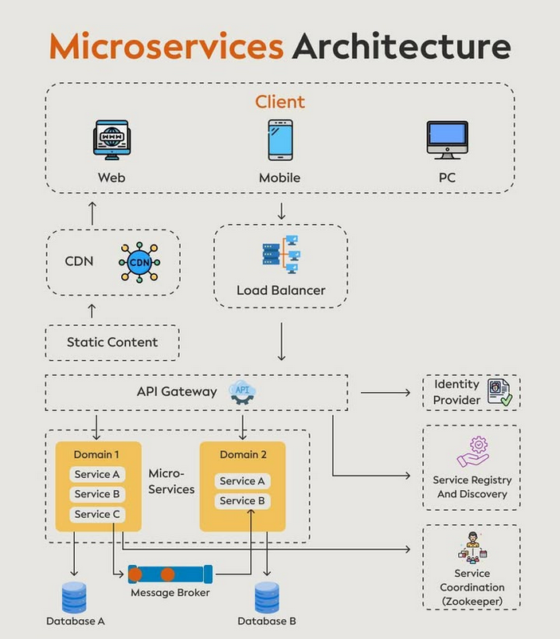

# Microservices Architecture

## Description
Microservices Architecture https://amzn.to/4fAiKjm

#Microservices #python #programming #developer #programmer #coding #coder #softwaredeveloper #computerscience #webdev #webdeveloper #webdevelopment ...

## Content
Microservices Architecture https://amzn.to/4fAiKjm

#Microservices #python #programming #developer #programmer #coding #coder #softwaredeveloper #computerscience #webdev #webdeveloper #webdevelopment #pythonprogramming #pythonquiz #ai #ml #machinelearning #datascience

## Category Information

- Main Category: system_design
- Sub Category: microservices
- Item Name: microservices_architecture

## Source

- Original Tweet: [https://twitter.com/i/web/status/1872829824773046485](https://twitter.com/i/web/status/1872829824773046485)
- Date: 2025-02-20 15:36:34

## Media

### Media 1

**Description:** The image presents a comprehensive overview of the Microservices Architecture, illustrating its various components and their interactions. The diagram is divided into several sections, each representing a different aspect of the architecture.

*   **Client**
    *   Web
    *   Mobile
    *   PC
*   **Load Balancer**
    *   Static Content
*   **API Gateway**
    *   Identity Provider
    *   Service Registry and Discovery
*   **Domain 1 - Service A, B, C**
    *   Database A
    *   Message Broker
*   **Domain 2 - Service A, B**
    *   Database B

The diagram effectively illustrates the Microservices Architecture's key components and their relationships, providing a clear understanding of how they work together to enable efficient and scalable application development.

*Last updated: 2025-02-20 15:36:34*