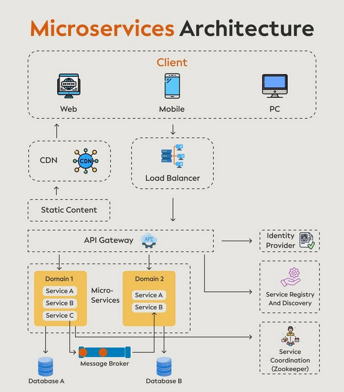

Microservices architecture is a software development approach that structures an application as a collection of small, independent services. Each service is responsible for a specific business capability and can be developed, tested, and deployed independently. This allows for greater flexibility, scalability, and fault tolerance in the overall system.

## Technical Overview
A microservices architecture typically consists of several key components:

* **Client**: The client can be a web application, mobile app, or desktop application that interacts with the microservices.
* **Load Balancer**: The load balancer distributes incoming traffic across multiple instances of a service to improve responsiveness and reliability.
* **API Gateway**: The API gateway acts as an entry point for clients, providing a single interface to access multiple services. It often includes features such as authentication, rate limiting, and caching.
* **Service Registry and Discovery**: This component allows services to register themselves and be discovered by other services.
* **Domain Services**: Each domain service is responsible for a specific business capability and typically includes its own database and message broker.

The following diagram illustrates the interactions between these components:
```mermaid
graph LR;
    Client --> Load Balancer;
    Load Balancer --> API Gateway;
    API Gateway --> Service Registry and Discovery;
    Service Registry and Discovery --> Domain 1 - Service A, B, C;
    Service Registry and Discovery --> Domain 2 - Service A, B;
```
For example, consider an e-commerce application with separate services for user authentication, order management, and product catalog. Each service would have its own database and could be developed and deployed independently.

### Example Use Case
Suppose we want to build a simple e-commerce platform using microservices architecture. We can break it down into the following services:

* **Authentication Service**: Handles user registration, login, and authentication.
* **Order Service**: Manages orders, including creating, updating, and canceling orders.
* **Product Service**: Maintains the product catalog, including adding, removing, and updating products.

Each service would have its own database and could be developed using a different programming language or framework. The API gateway would provide a unified interface for clients to access these services.

## Key Takeaways and Best Practices
1. **Loose Coupling**: Each microservice should be designed to be loosely coupled, allowing for changes in one service without affecting others.
2. **Autonomy**: Services should be autonomous, with their own databases and message brokers.
3. **Organized Around Business Capabilities**: Services should be organized around business capabilities, rather than being structured by technology layers.
4. **Scaling**: Microservices architecture allows for scaling individual services independently, improving overall system responsiveness and reliability.

## References
* [Building Microservices: Designing Fine-Grained Systems](https://www.amazon.com/Building-Microservices-Designing-Fine-Grained-Systems/dp/B09RTQY7SX)
* [Microservices Architecture on Amazon](https://amzn.to/4fAiKjm)

## Tools and Technologies
* Python: A popular programming language used for building microservices.
* API Gateway: A component that provides a unified interface for clients to access multiple services.
* Load Balancer: A component that distributes incoming traffic across multiple instances of a service.
* Service Registry and Discovery: A component that allows services to register themselves and be discovered by other services.
## Source

- Original Tweet: [https://twitter.com/i/web/status/1872829824773046485](https://twitter.com/i/web/status/1872829824773046485)
- Date: 2025-02-20 17:31:53


## Media

### Media 1

**Description:** The image presents a comprehensive overview of the Microservices Architecture, illustrating its various components and their interactions. The diagram is divided into several sections, each representing a different aspect of the architecture.

*   **Client**
    *   Web
    *   Mobile
    *   PC
*   **Load Balancer**
    *   Static Content
*   **API Gateway**
    *   Identity Provider
    *   Service Registry and Discovery
*   **Domain 1 - Service A, B, C**
    *   Database A
    *   Message Broker
*   **Domain 2 - Service A, B**
    *   Database B

The diagram effectively illustrates the Microservices Architecture's key components and their relationships, providing a clear understanding of how they work together to enable efficient and scalable application development.

*Last updated: 2025-02-20 17:31:53*