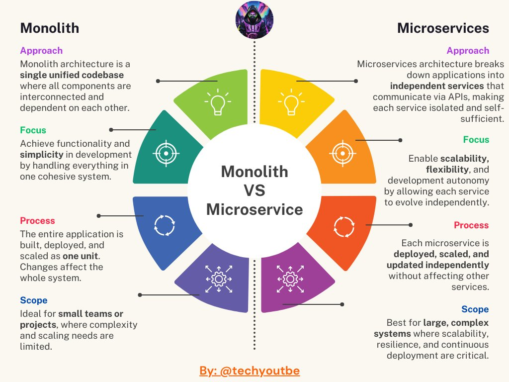

**Source:** [https://twitter.com/i/web/status/1868262033520542020](https://twitter.com/i/web/status/1868262033520542020)
**Original Post Date:** 2025-05-27 20:06:28

# Monolithic vs Microservices Architecture: Core Concepts and Trade-offs

## Introduction
Understanding architectural choices between monolithic and microservices approaches is crucial in modern software development. This knowledge base explores the fundamental differences between these two paradigms, their underlying principles, and practical implications for system design. By analyzing each component's characteristics and trade-offs, developers can make informed decisions aligned with project requirements.

## Approach: Architectural Foundation

Monolithic architecture represents a unified codebase where all components are interconnected, creating a cohesive but potentially complex system. This approach simplifies initial development and deployment by maintaining everything within a single unit.

Microservices architecture decomposes the application into independent services that communicate via APIs. Each service operates autonomously with its own database, business logic, and interface, enabling greater flexibility and scalability.

- Monolith: Single deployment unit with shared resources
- Microservices: Independent deployments with isolated resources

## Focus: Development and Maintenance Strategy

The monolithic approach emphasizes simplicity in development, focusing on rapid functionality delivery through a unified system. This centralized structure reduces initial complexity but can become unwieldy as the application grows.

Microservices prioritize independent service evolution and team autonomy. Each service can use different technologies, frameworks, or deployment strategies, allowing teams to innovate independently.

> **Note/Tip:** Teams should consider their ability to manage distributed systems before adopting microservices

## Process: Development Lifecycle

In monolithic architecture, changes require redeploying the entire application. This creates challenges in managing dependencies and coordinating team efforts during deployment.

Microservices enable isolated deployments where each service can be updated independently without affecting others. This promotes continuous integration/deployment practices but requires robust API management.

1. Monolith: Changes impact entire system
1. Microservices: Granular control over updates

## Scope: Scalability and Complexity Management

Monolithic architectures are ideal for small teams or projects with limited scalability needs. The unified structure simplifies debugging and reduces operational overhead.

Microservices excel in large-scale systems requiring independent scaling of components. This approach handles complex requirements but introduces challenges in distributed system management.

## Key Takeaways

- Monolithic architecture provides simplicity and ease of development for small projects with limited complexity
- Microservices offer scalability, flexibility, and team autonomy at the cost of increased operational complexity
- Architecture choice should align with project size, team expertise, and scaling requirements

## Conclusion
Choosing between monolithic and microservices architectures requires careful consideration of project scope, team capabilities, and long-term maintenance goals. While monoliths offer simplicity for small projects, microservices provide the flexibility needed for complex, scalable systems.

## Media

**Image Description:** The image is a comparative diagram that contrasts the **Monolithic Architecture** and **Microservices Architecture**. It is visually structured as a circular diagram with two halves, each representing one of the architectural styles. The central theme is the comparison of these two approaches, highlighting their differences in **Approach**, **Focus**, **Process**, and **Scope**. Below is a detailed breakdown:

---

### **Central Theme**
- The diagram is titled **"Monolith VS Microservices"**, emphasizing the comparison between the two architectural styles.
- The central circle contains the text **"Monolith VS Microservices"**, serving as the focal point of the comparison.

---

### **Left Half: Monolithic Architecture**
#### **Approach**
- **Description**: Monolithic architecture is a single, unified codebase where all components are interconnected and dependent on each other.
- **Visual Representation**: A green segment with a lightbulb icon, symbolizing the unified nature of the architecture.

#### **Focus**
- **Description**: The focus is on achieving functionality and simplicity in development by handling everything in one cohesive system.
- **Visual Representation**: A blue segment with a target icon, symbolizing the singular focus on a unified system.

#### **Process**
- **Description**: The entire application is built, deployed, and scaled as one unit. Changes in one part can affect the whole system.
- **Visual Representation**: A purple segment with a circular arrow icon, symbolizing the monolithic process of development and deployment as a single unit.

#### **Scope**
- **Description**: Ideal for small teams or projects where complexity and scalability needs are limited.
- **Visual Representation**: A dark purple segment with a gear icon, symbolizing the limited scope and manageable complexity.

---

### **Right Half: Microservices Architecture**
#### **Approach**
- **Description**: Microservices architecture breaks down applications into independent services that communicate via APIs, making each service isolated and self-sufficient.
- **Visual Representation**: A yellow segment with a lightbulb icon, symbolizing the modular and independent nature of the architecture.

#### **Focus**
- **Description**: The focus is on enabling scalability, flexibility, and autonomy by allowing each service to evolve independently.
- **Visual Representation**: An orange segment with a target icon, symbolizing the distributed focus on individual services.

#### **Process**
- **Description**: Each microservice is deployed, scaled, and updated independently without affecting other services.
- **Visual Representation**: A red segment with a circular arrow icon, symbolizing the independent and modular process of development and deployment.

#### **Scope**
- **Description**: Best for large, complex systems where scalability, resilience, and continuous deployment are critical.
- **Visual Representation**: A dark red segment with a gear icon, symbolizing the extensive scope and complexity handled by microservices.

---

### **Visual Design**
- **Color Coding**: The diagram uses contrasting colors (green/blue/purple for Monolithic and yellow/orange/red for Microservices) to differentiate the two approaches.
- **Icons**: Each segment is accompanied by an icon (lightbulb, target, circular arrow, gear) to visually represent the key characteristics of the respective architectural style.
- **Text Alignment**: The text is aligned to the left and right sides of the diagram, providing a clear and organized comparison.

---

### **Additional Notes**
- The diagram is credited to **@techyoutubeb** at the bottom, indicating the source or creator.
- The comparison is structured to highlight the trade-offs between the two architectures, such as simplicity vs. complexity, scalability, and development processes.

---

### **Key Takeaways**
- **Monolithic Architecture**: Suitable for small projects with limited complexity, offering simplicity and ease of development.
- **Microservices Architecture**: Ideal for large, complex systems requiring scalability, flexibility, and independent service management.

This diagram effectively communicates the core differences between the two architectural styles, making it a useful tool for understanding their respective strengths and use cases.
