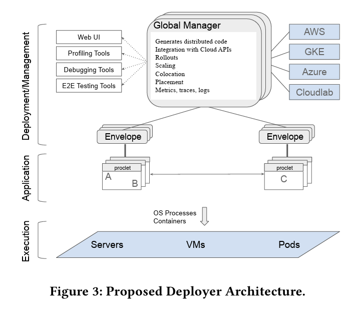

**Source:** [https://twitter.com/i/web/status/1935223453008937418](https://twitter.com/i/web/status/1935223453008937418)
**Original Post Date:** 2025-07-12 21:31:03

# Google's Modular Monolith Architecture: A Deep Dive into Distributed Application Management

## Introduction
This knowledge base item delves into a detailed architecture diagram titled 'Figure 3: Proposed Deployer Deployer Architecture.' The system is designed to manage, deploy, and execute applications across various cloud environments. The architecture is divided into four primary layers: Global Manager Manager, Deployment/Management, Application, and Execution.

## Main Components and Structure

The architecture is divided into four primary layers, each with specific responsibilities: Global Manager Manager, Deployment/Management, Application, and Execution.

- Global Manager Manager
- Deployment/Management
- Application
- Execution

## 1. Global Manager Manager

The Global Manager Manager is the core of the architecture, responsible for orchestrating and managing the entire system.

Key responsibilities include generating distributed code, integrating with cloud APIs, and monitoring metrics and logs.

- Generates distributed code
- Integration with Cloud APIs (AWS, GKE, Azure, Cloudlab)
- Monitoring and Metrics: Collects and processes metrics, traces, and logs

> **Note/Tip:** The Global Manager Manager directly integrates with cloud providers for deployment and management.

> **Note/Tip:** It communicates with the Deployment/Management layer for tooling and orchestration.

## 2. Deployment/Management

This layer includes tools and services such as a Web UI, profiling tools, debugging tools, rollouts, scaling, colocation/placement, and E2E testing tools.

These tools are managed by the Global Manager Manager and interact with the Application layer.

- Web UI for user management and monitoring
- Profiling Tools for performance analysis
- Debugging Tools for runtime debugging
- Rollouts for deploying new versions
- Scaling for dynamic resource allocation
- Colocation/Placement for optimal performance
- E2E Testing Tools for end-to-end testing

## 3. Application

The Application layer consists of prolet components (A, B, C) encapsulated within Envelopes.

These components communicate with each other to form a distributed application.

> **Note/Tip:** The Global Manager Manager and Deployment/Management tools interact with the Application layer for deployment and management.

## 4. Execution

The Execution layer represents the physical or virtual infrastructure where applications run.

It includes servers, VMs (Virtual Machines), pods (containerized environments), and OS processes.

> **Note/Tip:** The Application layer runs on the Execution layer, leveraging servers, VMs, and pods for execution.

## Cloud Providers

The architecture integrates with multiple cloud providers: AWS, GKE, Azure, and Cloudlab.

These providers are connected to the Global Manager Manager for seamless deployment and management across different environments.

- AWS (Amazon Web Services)
- GKE (Google Kubernetes Engine)
- Azure (Microsoft Azure)
- Cloudlab

## Key Technical Details

The system is designed to support distributed applications with components communicating across the network.

The Global Manager Manager generates distributed code to facilitate this communication.

- Distributed Architecture: Supports distributed applications with components (prolet A, B, C) communicating across the network.
- Cloud Integration: Leverages cloud APIs for deployment, scaling, and management.
- Monitoring and Debugging: Metrics, traces, and logs are collected and processed by the Global Manager Manager.
- Containerization: Supports containerized environments using pods (likely Kubernetes).
- Hierarchical Structure: The architecture is hierarchical with the Global Manager Manager at the top.

## Summary

The proposed architecture is a comprehensive, cloud-agnostic system designed for managing, deploying, and executing distributed applications.

It leverages cloud providers, containerization, and advanced monitoring tools to ensure scalability, flexibility, and reliability.

> **Note/Tip:** The Global Manager Manager acts as the central orchestrator, managing all aspects of the system from deployment to execution.

> **Note/Tip:** The diagram illustrates the interplay between different layers and components, highlighting the system's distributed and cloud-integrated nature.

## Key Takeaways

- Google's architecture is designed for managing, deploying, and executing distributed applications across various cloud environments.
- The system is divided into four primary layers: Global Manager Manager, Deployment/Management, Application, and Execution.
- The Global Manager Manager is the core component responsible for orchestrating and managing the entire system.
- The architecture integrates with multiple cloud providers (AWS, GKE, Azure, Cloudlab) for seamless deployment and management.
- Containerization and hierarchical structure are key features of this architecture.

## Conclusion
In conclusion, Google's proposed architecture offers a robust solution for managing distributed applications across various cloud environments. The system's modular design, integration with multiple cloud providers, and advanced monitoring capabilities make it a versatile and scalable solution for modern application management.

## External References

- [Google Cloud Architecture](https://cloud.google.com/architecture)
- [Kubernetes Documentation](https://kubernetes.io/docs/home/)

## Media

**Image Description:** The image depicts a detailed architecture diagram titled **"Figure 3: Proposed Deployer Deployer Architecture."** This diagram illustrates a multi-tiered system architecture designed for managing, deploying, and executing applications across various cloud environments. Below is a detailed breakdown of the image:

---

### **Main Components and Structure**

The architecture is divided into four primary layers, each with specific responsibilities:

1. **Global Manager Manager**
2. **Deployment/Management**
3. **Application**
4. **Execution**

---

### **1. Global Manager Manager**
- **Central Component**: The **Global Manager Manager** is the core of the architecture, responsible for orchestrating and managing the entire system.
- **Key Responsibilities**:
  - **Generates distributed code**: Manages the distribution and execution of code across different environments.
  - **Integration with Cloud APIs**: Interfaces with cloud providers (AWS, GKE, Azure, Cloudlab) to facilitate deployment and management.
  - **Monitoring and Metrics**: Collects and processes metrics, traces, and logs for monitoring and debugging purposes.
- **Connections**:
  - Directly integrates with cloud providers (AWS, GKE, Azure, Cloudlab) for deployment and management.
  - Communicates with the **Deployment/Management** layer for tooling and orchestration.

---

### **2. Deployment/Management**
- **Tools and Services**:
  - **Web UI**: Provides a graphical interface for users to manage and monitor the system.
  - **Profiling Tools**: Analyzes application performance and identifies bottlenecks.
  - **Debugging Tools**: Facilitates debugging of applications during runtime.
  - **Rollouts**: Manages the deployment of new versions of applications.
  - **Scaling**: Dynamically scales resources based on demand.
  - **Colocation/Placement**: Manages the placement of application components for optimal performance.
  - **E2E Testing Tools**: Ensures end-to-end testing of applications before deployment.
- **Relationship**:
  - These tools are managed and orchestrated by the **Global Manager Manager**.
  - They interact with the **Application** layer to deploy and manage applications.

---

### **3. Application**
- **Prolet Components**:
  - The **Application** layer consists of **prolet** components (A, B, C), which are the building blocks of the application.
  - These components are encapsulated within **Envelopes**, which serve as wrappers or containers for the application logic.
- **Communication**:
  - The **prolet** components (A, B, C) communicate with each other, forming a distributed application.
  - The **Envelopes** provide isolation and encapsulation for the application logic.
- **Relationship**:
  - The **Global Manager Manager** and **Deployment/Management** tools interact with the **Application** layer to deploy, monitor, and manage the application components.

---

### **4. Execution**
- **Execution Environment**:
  - The **Execution** layer represents the physical or virtual infrastructure where applications run.
  - It includes:
    - **Servers**: Physical servers hosting the applications.
    - **VMs (Virtual Machines)**: Virtualized environments for running applications.
    - **Pods**: Containerized environments (e.g., Kubernetes pods) for executing applications.
  - **OS Processes**: The operating system processes that manage and execute the applications.
- **Relationship**:
  - The **Application** layer runs on the **Execution** layer, leveraging servers, VMs, and pods for execution.
  - The **Global Manager Manager** and **Deployment/Management** tools manage the execution environment.

---

### **Cloud Providers**
- The architecture integrates with multiple cloud providers:
  - **AWS**: Amazon Web Services.
  - **GKE**: Google Kubernetes Engine.
  - **Azure**: Microsoft Azure.
  - **Cloudlab**: A cloud computing platform.
- These providers are connected to the **Global Manager Manager**, enabling seamless deployment and management across different cloud environments.

---

### **Key Technical Details**
1. **Distributed Architecture**:
   - The system is designed to support distributed applications, with components (prolet A, B, C) communicating across the network.
   - The **Global Manager Manager** generates distributed code to facilitate this.

2. **Cloud Integration**:
   - The architecture leverages cloud APIs for deployment, scaling, and management, ensuring flexibility and scalability.

3. **Monitoring and Debugging**:
   - Metrics, traces, and logs are collected and processed by the **Global Manager Manager** for monitoring and debugging purposes.

4. **Containerization**:
   - The use of **Pods** indicates support for containerized environments, likely leveraging Kubernetes or similar orchestration tools.

5. **Hierarchical Structure**:
   - The architecture is hierarchical, with the **Global Manager Manager** at the top, orchestrating all layers below it.

---

### **Summary**
The proposed architecture is a comprehensive, cloud-agnostic system designed for managing, deploying, and executing distributed applications. It leverages cloud providers, containerization, and advanced monitoring tools to ensure scalability, flexibility, and reliability. The **Global Manager Manager** acts as the central orchestrator, managing all aspects of the system, from deployment to execution. The diagram effectively illustrates the interplay between different layers and components, highlighting the system's distributed and cloud-integrated nature.
