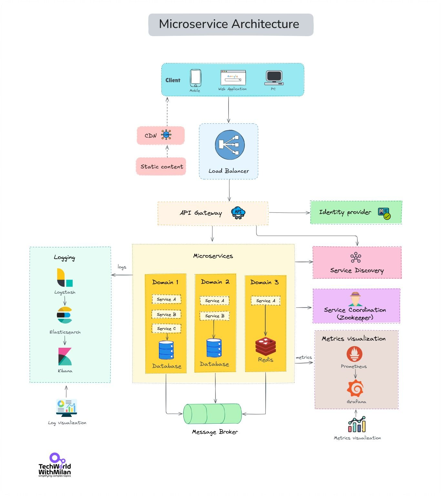

**Source:** [https://twitter.com/i/web/status/1871101048552575374](https://twitter.com/i/web/status/1871101048552575374)
**Original Post Date:** 2025-07-23 06:32:20

# Microservices Load Balancing: Architecture, Components, and Best Practices

## Introduction
In modern distributed systems, microservices architecture is a popular approach to building scalable and resilient applications. A critical aspect of this architecture is load balancing, which ensures that incoming client requests are efficiently distributed across multiple microservices. This article delves into the components involved in microservices load balancing, their interactions, and best practices for implementation.

## Architecture Overview

The architecture diagram illustrates a detailed view of a microservices-based system with a focus on load balancing. The client layer includes mobile devices, web applications, and PCs that interact with the system through a load balancer.

The content delivery network (CDN) serves static content to reduce latency and improve performance. The load balancer distributes incoming requests across multiple microservices, ensuring scalability and fault tolerance.

- Client Layer: Mobile, Web Application, PC
- Content Delivery Network (CDN)
- Load Balancer
- API Gateway
- Identity Provider
- Microservices (Domain 1, Domain 2, Domain 3)
- Databases for each domain
- Service Discovery and Coordination
- Message Broker
- Logging and Monitoring (ELK Stack)
- Metrics and Visualization (Prometheus/Grafana)

## Key Components and Their Roles

The load balancer is a central component that distributes incoming client requests across multiple microservices. It ensures scalability, fault tolerance, and efficient resource utilization.

The API Gateway acts as a single entry point for all client requests, handling authentication, authorization, request routing, rate limiting, and monitoring.

- Load Balancer: Distributes incoming requests across microservices.
- API Gateway: Handles authentication, authorization, request routing, rate limiting, and monitoring.
- Identity Provider: Manages user authentication and authorization.
- Microservices: Each domain contains multiple microservices responsible for specific business functions.

## Service Discovery and Coordination

Service discovery is crucial for load balancing and service routing in a distributed system. Tools like Zookeeper or Consul are used to manage and discover the locations of microservices dynamically.

Service coordination ensures that microservices can communicate and coordinate with each other effectively, using tools like Zookeeper or Consul.

- Service Discovery: Manages and discovers the locations of microservices dynamically.
- Service Coordination: Ensures effective communication and coordination between microservices.

## Asynchronous Communication with Message Broker

The message broker, such as RabbitMQ or Kafka, is used for asynchronous communication between microservices. It handles message queuing, pub/sub patterns, and event-driven architectures.

This setup ensures that microservices can communicate efficiently without being tightly coupled, promoting modularity and scalability.

- Message Broker: Handles asynchronous communication between microservices.
- Asynchronous Communication: Ensures efficient and decoupled interaction between services.

## Logging and Monitoring

The ELK Stack (Logstash, Elasticsearch, Kibana) is used for centralized logging and monitoring. Logstash collects and processes logs from microservices, Elasticsearch stores and indexes them, and Kibana provides a visualization interface.

Prometheus and Grafana are used for collecting and visualizing metrics, providing dashboards for monitoring system performance, resource usage, and other key indicators.

- ELK Stack: Centralized logging and monitoring.
- Prometheus/Grafana: Metrics collection and visualization.

## Key Technical Details

Decoupling: Each microservice is independent and can be developed, deployed, and scaled independently.

Scalability: The use of a Load Balancer, multiple databases, and a Message Broker ensures horizontal scalability.

Resilience: Service Discovery and Load Balancing contribute to fault tolerance and high availability.

- Decoupling: Independent development, deployment, and scaling of microservices.
- Scalability: Horizontal scalability through load balancing and multiple databases.
- Resilience: Fault tolerance and high availability through service discovery and load balancing.

## Best Practices for Microservices Load Balancing

Implementing a robust load balancing strategy involves understanding the specific needs of your application, such as traffic patterns, performance requirements, and fault tolerance needs.

Regular monitoring and logging are essential to identify and address potential issues proactively.

- Understand Application Needs: Traffic patterns, performance requirements, fault tolerance.
- Monitoring and Logging: Proactive identification and addressing of issues.

## Key Takeaways

- Load balancing is crucial for scalability and fault tolerance in microservices architecture.
- The API Gateway acts as a single entry point for client requests, handling authentication, authorization, and routing.
- Service discovery and coordination are essential for dynamic management and communication between microservices.
- Asynchronous communication via message brokers ensures efficient and decoupled interaction between services.
- Centralized logging and monitoring with tools like ELK Stack and Prometheus/Grafana provide comprehensive observability.

## Conclusion
In conclusion, microservices load balancing is a critical aspect of modern distributed systems. By understanding the components involved, their roles, and best practices for implementation, you can ensure that your system is scalable, resilient, and efficient.

## External References

- [Microservices Architecture](https://microservices.io/architecture.html)
- [Load Balancing in Microservices](https://www.nginx.com/resources/glossary/load-balancing/)

## Media

**Image Description:** The image depicts a detailed architecture diagram of a **Microservices Architecture**. This diagram illustrates the various components and their interactions in a modern, distributed system. Below is a detailed breakdown of the image:

---

### **Main Components and Flow**

1. **Client Layer**
   - At the top of the diagram, the **Client** is shown as the entry point for user interactions.
   - The client includes:
     - **Mobile** (represented by a mobile phone icon).
     - **Web Application** (represented by a browser icon).
     - **PC** (represented by a desktop computer icon).
   - The client interacts with the system through a **Load Balancer**.

2. **Content Delivery Network (CDN)**
   - The **CDN** is positioned to the left of the Load Balancer.
   - It is responsible for serving **static content** (e.g., images, CSS, JavaScript files) to the client, reducing latency and improving performance.

3. **Load Balancer**
   - The **Load Balancer** is a central component that distributes incoming client requests across multiple microservices.
   - It ensures scalability, fault tolerance, and efficient resource utilization.

4. **API Gateway**
   - The **API Gateway** sits below the Load Balancer and acts as a single entry point for all client requests.
   - It handles tasks such as:
     - Authentication and Authorization.
     - Request routing to the appropriate microservices.
     - Rate limiting and monitoring.
   - The API Gateway interacts with the **Identity Provider** for user authentication.

5. **Identity Provider**
   - The **Identity Provider** manages user authentication and authorization.
   - It ensures that only authenticated and authorized users can access the system.

6. **Microservices**
   - The core of the architecture is the **Microservices** layer, which is divided into three domains:
     - **Domain 1**, **Domain 2**, and **Domain 3**.
   - Each domain contains multiple microservices:
     - **Domain 1** has **Service A**, **Service B**, and **Service C**.
     - **Domain 2** has **Service A**, **Service B**, and **Service C**.
     - **Domain 3** has **Service A**, **Service B**, and **Service C**.
   - Each microservice is responsible for a specific business function or domain logic.
   - **Domain 3** includes a **Redis** database, which is often used for caching or managing stateful data.

7. **Databases**
   - Each domain has its own **Database**:
     - **Domain 1**, **Domain 2**, and **Domain 3** each have their own database.
   - This design ensures that each microservice has its own data store, promoting independence and scalability.

8. **Service Discovery**
   - The **Service Discovery** component (e.g., **Zookeeper**) is used to manage and discover the locations of microservices dynamically.
   - This is crucial for load balancing and service routing in a distributed system.

9. **Service Coordination**
   - The **Service Coordination** component ensures that microservices can communicate and coordinate with each other effectively.
   - This might involve using tools like **Zookeeper** or **Consul** for service orchestration.

10. **Message Broker**
    - The **Message Broker** (e.g., **RabbitMQ**, **Kafka**) is used for asynchronous communication between microservices.
    - It handles message queuing, pub/sub patterns, and event-driven architectures.

11. **Logging and Monitoring**
    - The **Logging** system is implemented using the **ELK Stack**:
      - **Logstash**: Collects and processes logs from microservices.
      - **Elasticsearch**: Stores and indexes logs for efficient querying.
      - **Kibana**: Provides a visualization interface for logs.
    - This setup enables centralized logging and monitoring of the system.

12. **Metrics and Visualization**
    - **Prometheus** is used for collecting and storing metrics from the system.
    - **Grafana** is used for visualizing these metrics, providing dashboards for monitoring system performance, resource usage, and other key indicators.

---

### **Key Technical Details**
- **Decoupling**: Each microservice is independent and can be developed, deployed, and scaled independently.
- **Scalability**: The use of a Load Balancer, multiple databases, and a Message Broker ensures horizontal scalability.
- **Resilience**: Service Discovery and Load Balancing contribute to fault tolerance and high availability.
- **Observability**: The combination of logging (ELK Stack) and metrics (Prometheus/Grafana) ensures comprehensive monitoring and debugging capabilities.

---

### **Summary**
The diagram illustrates a robust and scalable microservices architecture. It emphasizes modularity, independence, and observability through components like the API Gateway, Load Balancer, Service Discovery, and monitoring tools. The system is designed to handle high traffic and complex interactions efficiently while maintaining reliability and performance.
