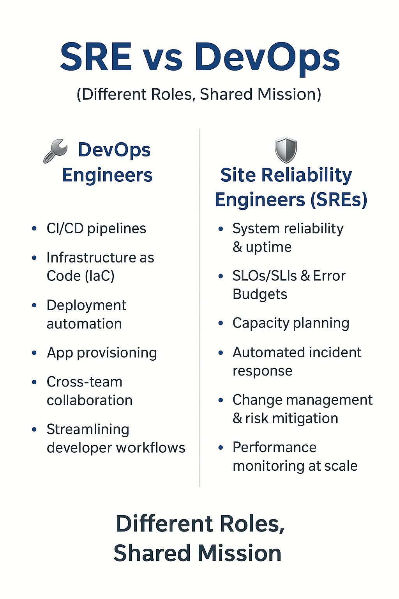

**Source:** [https://twitter.com/i/web/status/1934452574582874230](https://twitter.com/i/web/status/1934452574582874230)
**Original Post Date:** 2025-06-17 13:30:22

# SRE vs DevOps: Role Analysis & Collaboration in Microservices Environments

## Introduction
In the context of microservices architecture, understanding the nuanced roles of Site Reliability Engineers (SREs) and DevOps Engineers is crucial for effective systems management. While both roles contribute to overall system stability and efficiency, they focus on different aspects of operations. This knowledge base item explores their distinct responsibilities, operational approaches, and how their complementary nature drives successful microservices deployments.

## Role Definitions & Core Responsibilities

DevOps Engineers primarily focus on streamlining development workflows through automation of CI/CD pipelines, infrastructure provisioning, and cross-team collaboration. Their work ensures efficient application deployment and maintenance within the microservices ecosystem.

SREs concentrate on system reliability and availability by implementing robust monitoring systems, managing Service Level Objectives (SLOs), and establishing error budgets to maintain high uptime while allowing for controlled risks during updates.

- DevOps Core Focus: CI/CD automation, infrastructure as code, deployment optimization
- SRE Core Focus: System reliability, capacity planning, incident response

> **Note/Tip:** Cross-team collaboration is crucial for both roles but manifests differently - DevOps through development workflow integration and SREs through operational readiness assessments.

> **Note/Tip:** Automation approaches vary by role: DevOps focuses on deployment automation while SREs prioritize incident response automation.

## Operational Focus Areas

While both roles emphasize automation, their focus areas differ significantly. DevOps Engineers concentrate on streamlining developer workflows and infrastructure management through tools like Terraform and Kubernetes.

SREs prioritize system reliability metrics such as SLIs/SLOs and error budgets to ensure consistent service availability under varying load conditions.

1. DevOps Automation: Deployment pipelines, infrastructure provisioning, environment setup
1. SRE Automation: Incident detection, response workflows, capacity forecasting

> **Note/Tip:** Implementation of SLOs should be collaborative between DevOps and SRE teams to ensure realistic targets.

> **Note/Tip:** Monitoring strategies must align with both roles' objectives for effective system management.

## Shared Mission & Complementary Roles

Despite their distinct responsibilities, both roles share a common mission of ensuring reliable and efficient microservices operations. This shared goal drives collaboration in areas such as incident response and system optimization.

Understanding these roles' interdependence is crucial for building high-performing engineering teams that can effectively manage modern distributed systems.

- Shared Focus: System reliability, efficiency, scalability
- Collaborative Areas: Incident response, capacity planning, automation strategies

## Key Takeaways

- DevOps Engineers focus on workflow optimization and infrastructure management through code-driven approaches.
- SREs concentrate on system reliability metrics and automated incident response mechanisms.
- Both roles are complementary in achieving overall system stability and efficiency in microservices environments.

## Conclusion
Understanding the distinct yet interconnected roles of SREs and DevOps Engineers is fundamental to effective microservices management. While their primary focuses differ, their shared commitment to system reliability drives successful deployment strategies and operational excellence.

## External References

- [Google Site Reliability Engineering Book](https://sre.google)
- [DevOps Handbook by Gene Kim et al.](https://www.devopsbook.com)

## Media

**Image Description:** The image is a comparison chart titled **"SRE vs DevOps"**, highlighting the differences in roles and responsibilities between **Site Reliability Engineers (SREs)** and **DevOps Engineers**. The chart emphasizes that while the roles are distinct, they share a common mission. Below is a detailed breakdown of the image:

### **Title and Subtitle**
- **Title**: "SRE vs DevOps"
- **Subtitle**: "(Different Roles, Shared Shared Mission Mission)"  
  - The repetition of "Shared Shared Mission Mission" is likely a typographical error, but it emphasizes the shared goals of both roles.

### **Structure**
The chart is divided into two columns:
1. **Left Column**: DevOps Engineers
2. **Right Column**: Site Reliability Engineers (SREs)

Each column lists key responsibilities and focuses of the respective roles.

---

### **Left Column: DevOps Engineers**
- **Icon**: A wrench symbolizes tools and engineering work.
- **Header**: "DevOps Engineers"
- **Responsibilities**:
  - **CI/CD pipelines**: Continuous Integration/Continuous Deployment processes.
  - **Infrastructure as Code (IaC)**: Managing infrastructure using code-based tools.
  - **Deployment automation**: Automating the deployment of applications and services.
  - **App provisioning**: Setting up and configuring applications.
  - **Cross-team collaboration**: Working with various teams (e.g., development, operations) to ensure smooth processes.
  - **Streamlining developer workflows**: Optimizing the development process for efficiency.

---

### **Right Column: Site Reliability Engineers (SREs)**
- **Icon**: A shield symbolizes reliability and security.
- **Header**: "Site Reliability Engineers (SREs)"
- **Responsibilities**:
  - **System reliability & uptime**: Ensuring systems are stable and available.
  - **SLOs/SLIs & Error Budgets**: Managing Service Level Objectives (SLOs), Service Level Indicators (SLIs), and Error Budgets to maintain reliability.
  - **Capacity planning**: Forecasting and managing system capacity to handle load.
  - **Automated incident response**: Implementing automated systems to detect and respond to incidents.
  - **Change management & risk mitigation**: Managing changes to systems while minimizing risks.
  - **Performance monitoring at scale**: Monitoring system performance for large-scale operations.

---

### **Footer**
- **Text**: "Different Roles, Shared Shared Mission Mission Mission"  
  - This reiterates the idea that despite their differences, both roles work toward a common goal of system reliability and efficiency.

---

### **Design Elements**
- **Color Scheme**: 
  - The text is primarily in dark blue, with white as the background.
  - Icons (wrench and shield) are in a metallic gray color.
- **Typography**: 
  - The title is in a bold, larger font.
  - Subtitles and headers are in a slightly smaller but still prominent font.
  - Bullet points and descriptions are in a standard font size for readability.
- **Alignment**: 
  - The content is well-aligned, with clear separation between columns using a vertical line.
  - The text is left-aligned within each column for a clean and organized look.

---

### **Key Observations**
1. **Focus on Automation**: Both roles emphasize automation, but DevOps focuses more on deployment and provisioning, while SREs focus on incident response and monitoring.
2. **Collaboration**: Both roles require cross-team collaboration, but DevOps is more directly involved in development processes.
3. **Shared Mission**: Despite their differences, both roles aim to ensure system reliability and efficiency.

This chart effectively contrasts the responsibilities of DevOps Engineers and SREs while highlighting their complementary nature in achieving a shared mission.
