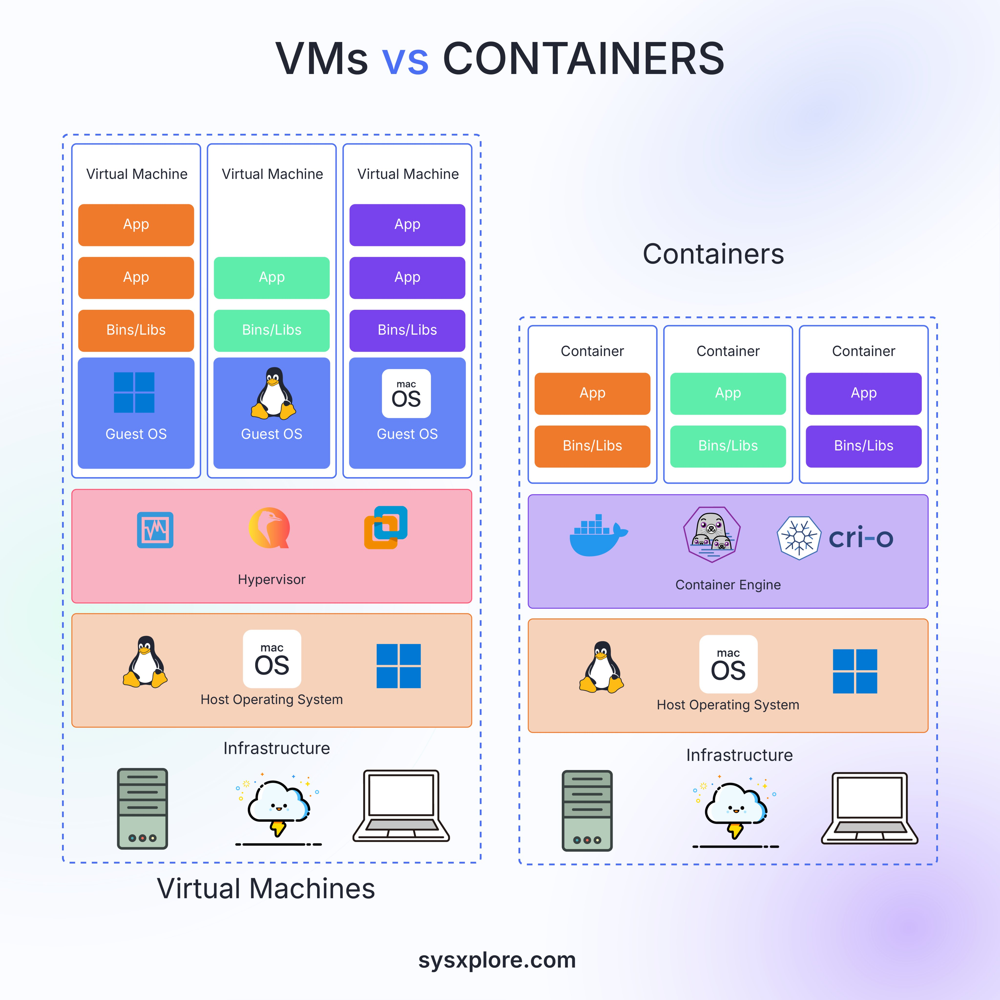

**Source:** [https://twitter.com/i/web/status/1875015667424104799](https://twitter.com/i/web/status/1875015667424104799)
**Original Post Date:** 2025-05-28 09:40:45

# Understanding Virtual Machines vs Containers in Microservices Architecture

## Introduction
When designing modern microservices-based systems, understanding the fundamental differences between virtual machines (VMs) and containers is crucial. This knowledge impacts critical decisions around resource allocation, deployment strategies, and system architecture. We'll explore their structural differences, performance implications, and trade-offs to help you make informed choices for your microservices environment.

## Architectural Comparison

Virtual Machines operate in isolation with each instance running its own Guest OS. This provides strong security boundaries but requires more resources per instance.

Containers, on the other hand, share the Host OS kernel and are lightweight, enabling faster startup times and efficient resource utilization.

- VMs require full Guest OS installation for each instance
- Containers share a single Host OS with multiple instances
- Hypervisor vs Container Engine management layer distinction

> **Note/Tip:** Always consider isolation requirements when choosing between VMs and containers

## Resource Management and Efficiency

VMs consume significantly more resources due to the overhead of running multiple Guest OS instances.

Containers achieve higher density on a single host by sharing system resources through the Host OS.

1. Resource efficiency: Containers typically use 20-30% less memory than VMs for equivalent workloads
1. Startup time reduction: Containers boot in seconds vs minutes for VMs

> **Note/Tip:** Consider resource constraints when scaling containerized applications horizontally

## Operational Characteristics

The shared kernel approach of containers provides significant advantages in terms of portability and scalability.

However, this comes with trade-offs in terms of isolation capabilities compared to VMs.

- Containers offer better portability across homogeneous environments
- VMs provide stronger security boundaries through OS-level isolation
- Container orchestration requires different management approaches than VM clusters

## Key Takeaways

- Choose containers for microservices requiring high density and rapid deployment cycles
- Select VMs when strict isolation or multi-OS support is required
- Consider hybrid architectures for complex systems with varying requirements

## Conclusion
Understanding the architectural differences between VMs and containers enables better decision-making in microservices design. While containers offer efficiency advantages, VMs provide stronger isolation guarantees. The choice should align with specific use case requirements, considering factors such as resource constraints, security needs, and operational complexity.

## External References

- [Docker Documentation](https://docs.docker.com/)
- [Kubernetes Architecture Guide](https://kubernetes.io/docs/concepts/architecture/)

## Media

**Image Description:** The image is a comparative diagram illustrating the differences between **Virtual Machines (VMs)** and **Containers**. It visually breaks down the architecture and resource allocation of both technologies, highlighting their key components and how they operate. Below is a detailed description:

### **Main Title**
- The title at the top reads: **"VMs vs Containers"**, indicating the comparison between Virtual Machines and Containers.

### **Left Side: Virtual Machines (VMs)**
#### **Structure**
1. **Virtual Machines (VMs):**
   - Three separate virtual machines are depicted, each with its own **Guest OS**.
   - Each VM is shown as a self-contained unit with its own operating system and applications.
   - The Guest OSes are represented by different icons:
     - A Windows icon (blue square with a white window).
     - A Linux icon (green square with a penguin).
     - A macOS icon (purple square with a macOS logo).

2. **Applications and Libraries:**
   - Each VM has its own set of applications and libraries (Bins/Libs) that are specific to the Guest OS.
   - The applications are shown in colored rectangles (orange, green, and purple) within each VM.

3. **Hypervisor:**
   - Below the VMs, there is a **Hypervisor** layer, represented by a pink box.
   - The Hypervisor manages and isolates the VMs from the Host Operating System.
   - Hypervisor icons (e.g., VMware, KVM, Hyper-V) are shown within the Hypervisor layer.

4. **Host Operating System:**
   - Below the Hypervisor, there is a **Host Operating System** layer.
   - The Host OS is shared by all VMs and is depicted with icons for Linux, macOS, and Windows.

5. **Infrastructure:**
   - At the bottom, there is an **Infrastructure** layer, which includes:
     - A server icon.
     - A cloud icon.
     - A laptop icon, representing the physical or virtualized hardware resources.

### **Right Side: Containers**
#### **Structure**
1. **Containers:**
   - Multiple containers are shown, each with its own application and libraries (Bins/Libs).
   - The containers are depicted as separate units but share the same Host Operating System.

2. **Applications and Libraries:**
   - Each container has its own application and libraries, represented by colored rectangles (orange, green, and purple).
   - Unlike VMs, the containers do not have their own operating system; they share the Host OS.

3. **Container Engine:**
   - Below the containers, there is a **Container Engine** layer, represented by a purple box.
   - The Container Engine manages and isolates the containers.
   - Icons for popular container engines (e.g., Docker, Podman, CRI-O) are shown within this layer.

4. **Host Operating System:**
   - Below the Container Engine, there is a **Host Operating System** layer, similar to the VMs.
   - The Host OS is shared by all containers and is depicted with icons for Linux, macOS, and Windows.

5. **Infrastructure:**
   - At the bottom, there is an **Infrastructure** layer, which includes:
     - A server icon.
     - A cloud icon.
     - A laptop icon, representing the physical or virtualized hardware resources.

### **Comparison Highlights**
1. **Isolation:**
   - **VMs:** Each VM has its own Guest OS, providing strong isolation between VMs.
   - **Containers:** Containers share the Host OS, providing lighter isolation but faster startup and resource efficiency.

2. **Resource Usage:**
   - **VMs:** Each VM requires its own OS, leading to higher resource usage.
   - **Containers:** Containers share the Host OS, leading to more efficient resource usage.

3. **Portability:**
   - **VMs:** VMs are portable across different hardware and OS environments.
   - **Containers:** Containers are portable across different environments as long as the Host OS is compatible.

4. **Startup Time:**
   - **VMs:** VMs take longer to start due to the need to boot the Guest OS.
   - **Containers:** Containers start much faster as they do not require booting an OS.

### **Visual Elements**
- **Color Coding:** Different colors (orange, green, purple) are used to differentiate applications and libraries across VMs and containers.
- **Icons:** Various icons represent operating systems (Linux, macOS, Windows), container engines (Docker, CRI-O), and hypervisors (KVM, VMware).
- **Layered Structure:** Both VMs and containers are shown in a layered architecture, emphasizing the separation of components.

### **Footer**
- The footer includes the website URL: **sysxplore.com**, indicating the source of the image.

### **Overall Theme**
The image effectively contrasts the two technologies by visually demonstrating how VMs and containers differ in terms of resource allocation, isolation, and operational efficiency. It highlights the key components of each technology, making it easy to understand the fundamental differences between them.
