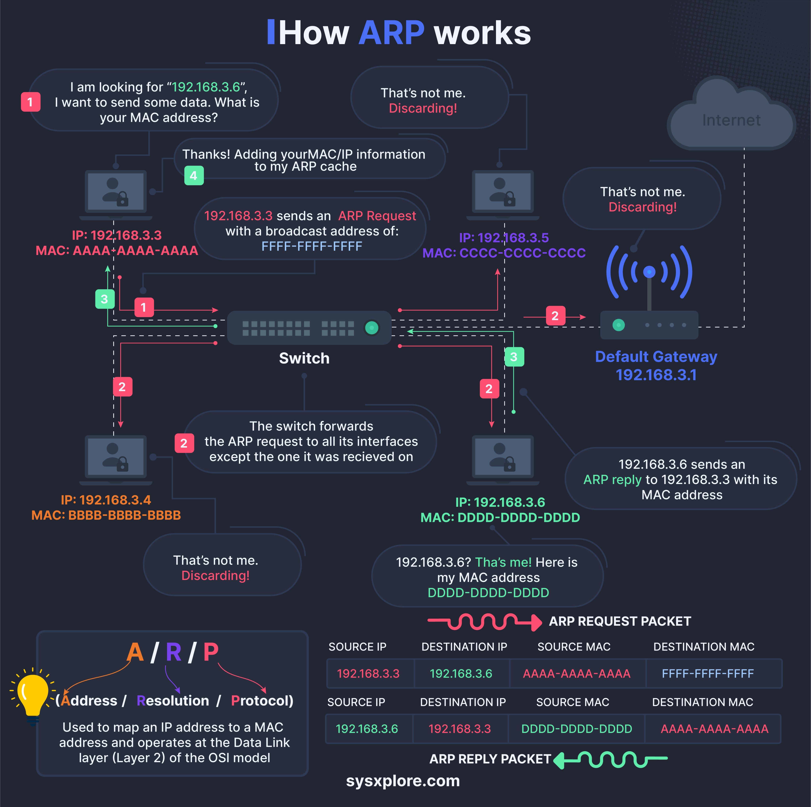

The Address Resolution Protocol (ARP) is a crucial protocol used to resolve IP addresses to MAC addresses on a local network. This entry provides an in-depth explanation of how ARP works, including its request and response process.

#### Technical Content
The ARP protocol flow involves the following steps:
1. **Request for MAC Address**: When a computer wants to send data to another device on the same network, it first needs to resolve the IP address of the target device to its corresponding MAC address. This is initiated by sending an ARP request packet that includes the IP address of the target device.
2. **Response and Forwarding**: The switch receives the ARP request packet and forwards it to all interfaces except the one that received it. This ensures that the correct device responds with its MAC address.
3. **Switch Forwarding**: As mentioned earlier, the switch plays a crucial role in forwarding the ARP request to all connected devices on the network. This step is essential for ensuring that the target device receives the ARP request and can respond accordingly.
4. **Response from Target Device**: Once the target device receives the ARP request packet, it responds with its MAC address. The responding device sends an ARP reply packet that includes its MAC address, which is then sent back to the requesting computer.

For example, consider a scenario where Computer A wants to send data to Computer B on the same network. The IP address of Computer B is `192.168.3.6`. Computer A initiates an ARP request by sending a packet with the message "I am looking for '192.168.3.6', I want to send some data. What is your MAC address?" The switch forwards this request to all connected devices on the network, and Computer B responds with its MAC address.

#### Key Takeaways and Best Practices
* **Understanding ARP**: It's essential to understand how ARP works to troubleshoot network issues related to IP address resolution.
* **Network Configuration**: Ensure that network devices are properly configured to forward ARP requests correctly.
* **Security Considerations**: Be aware of potential security threats related to ARP spoofing, where an attacker sends fake ARP messages to manipulate the network.

#### References
The infographic titled "How ARP works" provides a visual representation of the ARP protocol flow and can be used as a reference for understanding the process. For more information on networking protocols and technologies, refer to resources such as:
* [RFC 826](https://tools.ietf.org/html/rfc826) - An Ethernet Address Resolution Protocol
* [IEEE 802.3](https://standards.ieee.org/content/ieee-802.3.html) - Standard for Ethernet

Note: The tools and technologies mentioned in this entry, including switches and network devices, are standard components of local area networks (LANs).
## Source

- Original Tweet: [https://twitter.com/i/web/status/1875630944713085212](https://twitter.com/i/web/status/1875630944713085212)
- Date: 2025-02-20 17:50:25

## Media

### Media 1

**Description:** The infographic, titled "How ARP works," provides a comprehensive explanation of the Address Resolution Protocol (ARP) process through a flowchart and accompanying text. The chart features four numbered steps, each accompanied by an illustration of a computer screen displaying a conversation between two individuals.

**Step 1: Request for MAC Address**
The first step involves one computer requesting the MAC address of another. This is represented by the message "I am looking for '192.168.3.6', I want to send some data. What is your MAC address?"

**Step 2: Response and Forwarding**
In response, the second computer provides its IP address, which is then forwarded to the switch. The switch forwards the ARP request to all interfaces except the one that received it.

**Step 3: Switch Forwarding**
The switch forwards the ARP request to all interfaces except the one that received it, ensuring that the correct device responds with its MAC address.

**Step 4: Response from Target Device**
Finally, the target device responds with its MAC address, which is then sent back to the requesting computer. The infographic effectively illustrates the process of how ARP works, making it easy to understand and visualize the protocol's functionality.

*Last updated: 2025-02-20 17:50:25*