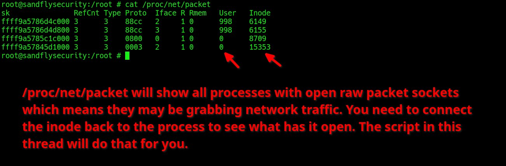
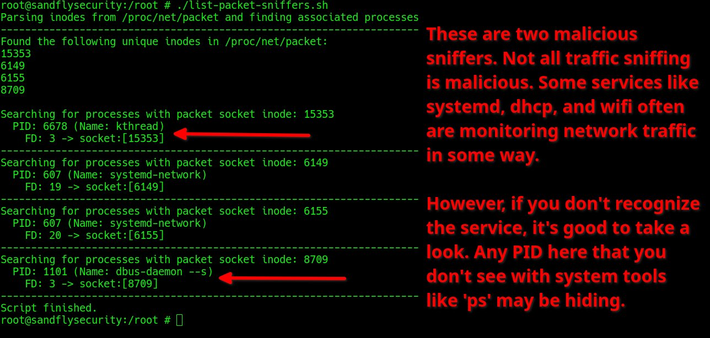

**Source:** [https://twitter.com/i/web/status/1934384622529548310](https://twitter.com/i/web/status/1934384622529548310)
**Original Post Date:** 2025-06-17 14:47:49

# Analyzing Raw Packet Sockets for Network Traffic Inspection on Linux Systems

## Introduction
Raw packet sockets provide a powerful mechanism for low-level network monitoring in Linux systems. Understanding how to analyze these sockets is crucial for both legitimate debugging purposes and security audits. This guide explores the /proc/net/packet interface and associated tools for identifying processes using raw sockets, with detailed interpretation of output fields and security implications.

## Understanding Raw Packet Sockets

Raw packet sockets allow applications to bypass standard protocol stacks and interact directly with network packets. They're essential for tasks like custom packet crafting or low-level traffic analysis but require root privileges, making them a potential security concern.

The /proc/net/packet file provides real-time information about all open raw sockets in the system, including socket metadata, interface bindings, and process identifiers.

```bash
cat /proc/net/packet
# or
list-packet-sniffers.sh
```

## /proc/net/packet Output Fields

The output displays critical socket information across multiple columns, each serving a specific purpose in network analysis and security auditing.

- sk: Kernel's internal socket address (hexadecimal)
- RefCnt: Socket reference count indicating concurrent usage
- Type: Socket type (3 for raw sockets)
- Proto: Protocol identifier (e.g., 0800 for IPv4)
- Iface: Network interface index
- R/Rmem: Receive queue and memory statistics
- User/Inode: Process identification via UID and inode number

> **Note/Tip:** Focus on the Inode column as it's crucial for process tracing.

> **Note/Tip:** Proto values help identify protocol types (e.g., 0800 = IPv4)

## Process Tracing with Script

The list-packet-sniffers.sh script automates the analysis of raw sockets by mapping inodes to process information, providing a comprehensive view of network activity.

```bash
FD: 3 -> socket:[15353]
Process: kthreadd
PID: 2
```

## Security Implications and Best Practices

While raw sockets are valuable for legitimate network operations, they can be exploited. Regular monitoring of /proc/net/packet is essential for maintaining system security.

1. Monitor unexpected processes with active raw sockets
1. Document authorized uses of raw sockets in your environment
1. Audit socket activity periodically

## Key Takeaways

- /proc/net/packet provides comprehensive visibility into raw packet sockets usage.
- Inode mapping is crucial for identifying processes using raw sockets.
- Regular monitoring helps detect unauthorized network traffic manipulation.
- Balance legitimate debugging needs with security considerations.

## Conclusion
Effective analysis of raw packet sockets through /proc/net/packet and associated tools provides valuable insights into network activity. This knowledge enables both proactive troubleshooting and robust security auditing, making it essential for system administrators and security professionals.

## External References

- [Linux Man Pages: Raw Sockets](https://man7.org/linux/man-pages/man7/raw.7.html)
- [Red Hat Documentation: Network Security Guide](https://access.redhat.com/documentation/en-us/red_hat_enterprise_linux/8/html/security_guide/index)


## Media

**Image Description:** The image appears to be a screenshot of a terminal session on a Linux system, displaying the output of a command related to network packet sockets. Below is a detailed description:

### **Main Subject: Terminal Output**
The terminal command executed is:
```bash
cat /proc/net/packet
```
This command is used to display information about open raw packet sockets in the system. Raw packet sockets allow applications to send and receive raw network packets, bypassing the normal protocol stack. This can be useful for network debugging, packet crafting, or monitoring network traffic, but it can also be exploited for malicious purposes.

### **Output Details**
The output is tabular, with columns labeled as follows:
1. **sk**: The socket address (a hexadecimal value representing the kernel's internal socket structure).
2. **RefCnt**: The reference count of the socket, indicating how many processes or threads are using it.
3. **Type**: The type of socket (e.g., `3` typically represents a raw socket).
4. **Proto**: The protocol associated with the socket (e.g., `88cc`, `0800`, etc.).
5. **Iface**: The interface index (e.g., `2`, `0`, etc.), indicating which network interface the socket is bound to.
6. **R**: The receive queue size.
7. **Rmem**: The receive memory size.
8. **User**: The user ID of the process that opened the socket.
9. **Inode**: The inode number of the socket file in the `/proc` filesystem.

#### **Sample Rows in the Output:**
- **Row 1**: 
  - `sk`: `ffffa5786d4c000`
  - `RefCnt`: `3`
  - `Type`: `3`
  - `Proto`: `88cc`
  - `Iface`: `2`
  - `R`: `0`
  - `Rmem`: `0`
  - `User`: `998`
  - `Inode`: `6149`

- **Row 2**: 
  - `sk`: `ffffa5786d4800`
  - `RefCnt`: `3`
  - `Type`: `3`
  - `Proto`: `88cc`
  - `Iface`: `2`
  - `R`: `3`
  - `Rmem`: `0`
  - `User`: `998`
  - `Inode`: `6155`

- **Row 3**: 
  - `sk`: `ffffa5785c1c000`
  - `RefCnt`: `3`
  - `Type`: `3`
  - `Proto`: `0800`
  - `Iface`: `0`
  - `R`: `1`
  - `Rmem`: `0`
  - `User`: `0`
  - `Inode`: `8709`

- **Row 4**: 
  - `sk`: `ffffa5784d1000`
  - `RefCnt`: `3`
  - `Type`: `3`
  - `Proto`: `0003`
  - `Iface`: `2`
  - `R`: `1`
  - `Rmem`: `0`
  - `User`: `0`
  - `Inode`: `15353`

### **Highlighted Elements**
- **Red Arrows**: The red arrows point to the **Inode** column in the last row (`15353`). This suggests that the focus is on identifying the inode number, which can be used to trace the socket back to the process that opened it.

### **Text Overlay**
Below the terminal output, there is a block of text in red, which provides context and instructions:
- **Purpose of `/proc/net/packet`**:
  - It shows all processes with open raw packet sockets.
  - These sockets may be used for grabbing network traffic.
- **Action Required**:
  - The user needs to trace the inode back to the process that opened the socket.
  - A script is mentioned, which will automate this process.

### **Technical Details**
1. **Raw Sockets**:
   - Raw sockets (`Proto` values like `88cc` or `0800`) are used for low-level network operations, such as crafting custom packets or capturing raw traffic.
   - `Proto` values correspond to specific protocols (e.g., `0800` for IPv4, `86dd` for IPv6).

2. **User and Inode**:
   - The `User` column shows the user ID of the process that opened the socket.
   - The `Inode` column is crucial for identifying the socket file in the `/proc` filesystem, which can be used to trace the socket back to the process.

3. **Security Implication**:
   - The presence of raw sockets can indicate network monitoring or packet crafting activities, which might be legitimate or malicious.
   - The user is advised to investigate further, especially if the socket is opened by an unknown or suspicious process.

### **Summary**
The image shows a terminal output of `/proc/net/packet`, listing open raw packet sockets along with their details. The focus is on identifying the processes associated with these sockets, particularly by tracing the inode numbers. The red text overlay provides context and instructions for further investigation, emphasizing the potential security implications of raw sockets. The red arrows highlight the inode column, drawing attention to its importance in the analysis.


**Image Description:** The image shows a terminal output from a Linux system, where a script named `list-packet-sniffers.sh` is being executed. The script appears to be designed to identify processes that are using packet sockets, which are often associated with network traffic sniffing. Below is a detailed breakdown of the image:

### **Main Subject**
The main subject of the image is the output of the script `list-packet-sniffers.sh`. This script parses the `/proc/net/packet` file to identify processes that are using packet sockets, which are typically used for capturing network traffic. The output lists unique inodes associated with these packet sockets and the corresponding processes that are using them.

### **Key Sections of the Output**

1. **Header Information:**
   - The script starts by parsing inodes from `/proc/net/packet` and finding associated processes.
   - The output indicates that it is searching for processes using packet sockets.

2. **Unique Inodes Identified:**
   - The script identifies the following unique inodes in `/proc/net/packet`:
     - **15353**
     - **6149**
     - **6155**
     - **8709**

3. **Process Details for Each Inode:**
   - For each inode, the script searches for processes using that inode and lists their Process IDs (PIDs), names, and file descriptors (FDs) associated with the packet sockets.

   #### **Inode 15353:**
   - **PID:** 6678
   - **Name:** `kthreadd`
   - **FD:** 3 -> socket:[15353]

   #### **Inode 6149:**
   - **PID:** 607
   - **Name:** `systemd-network`
   - **FD:** 19 -> socket:[6149]

   #### **Inode 6155:**
   - **PID:** 607
   - **Name:** `systemd-network`
   - **FD:** 20 -> socket:[6155]

   #### **Inode 8709:**
   - **PID:** 1101
   - **Name:** `dbus-daemon --system`
   - **FD:** 3 -> socket:[8709]

4. **Annotations and Warnings:**
   - The right side of the image contains red text with annotations and warnings. These annotations highlight the following points:
     - **Malicious Sniffers:** The text warns that not all traffic sniffing is malicious, but some processes may be malicious sniffers.
     - **Known Services:** It notes that services like `systemd`, `dhcp`, and `wifi` often monitor network traffic in legitimate ways.
     - **Unrecognized Services:** If a service is not recognized, it is recommended to investigate further.
     - **Hidden Processes:** The text warns that any PID not visible with tools like `ps` may be hiding malicious activity.

5. **Script Completion:**
   - The script finishes with the message: "Script finished."

### **Visual Elements**
- **Terminal Interface:** The output is displayed in a terminal window with a black background and green text for the script's output.
- **Red Arrows and Text:** Red arrows point to specific parts of the output, and red text provides additional warnings and explanations.
- **Annotations:** The red text on the right side provides context and warnings about the processes identified.

### **Technical Details**
1. **Packet Sockets:**
   - Packet sockets are used for capturing raw network traffic. They are often associated with network sniffing tools like `tcpdump` or `Wireshark`.
   - The script identifies processes using these sockets by parsing `/proc/net/packet`.

2. **Inodes:**
   - Inodes are unique identifiers for files in a Linux filesystem. In this context, they are used to identify specific packet sockets.

3. **File Descriptors (FDs):**
   - File descriptors indicate the specific socket being used by a process. For example, `FD: 3 -> socket:[15353]` means that file descriptor 3 is associated with the socket identified by inode 15353.

4. **Processes:**
   - The script lists the PIDs and names of the processes using the packet sockets. For example:
     - `kthreadd` (kernel thread daemon)
     - `systemd-network` (part of the systemd service manager)
     - `dbus-daemon` (D-Bus message bus system)

### **Summary**
The image shows the output of a script designed to detect processes using packet sockets, which are often associated with network traffic sniffing. The script identifies several processes and their associated inodes and file descriptors. Annotations in red text provide context, warning about the potential for malicious activity and advising caution when encountering unrecognized services. The output is presented in a terminal with clear formatting and visual cues to highlight important details.
