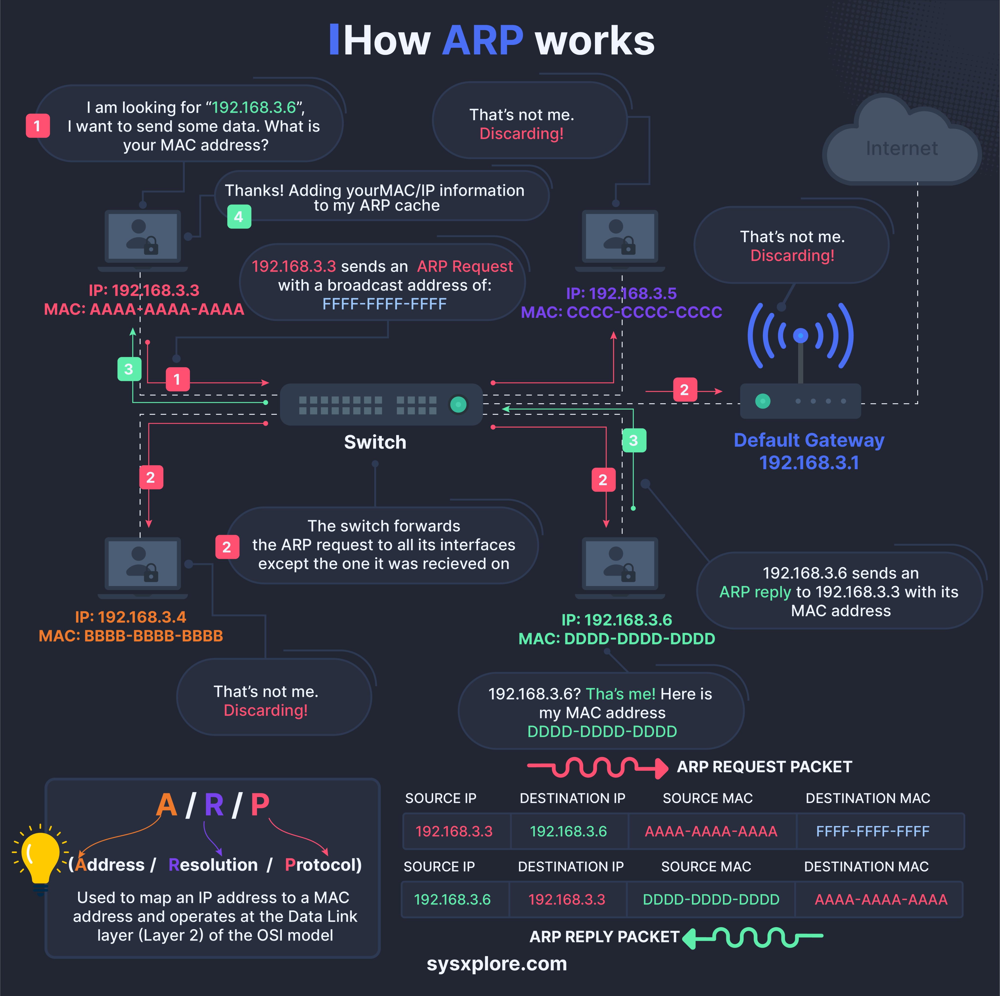

# Arp Protocol Flow

## Description
How does Address Resolution Protocol works?...

## Content
How does Address Resolution Protocol works?

## Category Information

- Main Category: system_design
- Sub Category: networking
- Item Name: arp_protocol_flow

## Source

- Original Tweet: [https://twitter.com/i/web/status/1875630944713085212](https://twitter.com/i/web/status/1875630944713085212)
- Date: 2025-02-20 15:36:34

## Media

### Media 1

**Description:** The infographic, titled "How ARP works," provides a comprehensive explanation of the Address Resolution Protocol (ARP) process through a flowchart and accompanying text. The chart features four numbered steps, each accompanied by an illustration of a computer screen displaying a conversation between two individuals.

**Step 1: Request for MAC Address**
The first step involves one computer requesting the MAC address of another. This is represented by the message "I am looking for '192.168.3.6', I want to send some data. What is your MAC address?"

**Step 2: Response and Forwarding**
In response, the second computer provides its IP address, which is then forwarded to the switch. The switch forwards the ARP request to all interfaces except the one that received it.

**Step 3: Switch Forwarding**
The switch forwards the ARP request to all interfaces except the one that received it, ensuring that the correct device responds with its MAC address.

**Step 4: Response from Target Device**
Finally, the target device responds with its MAC address, which is then sent back to the requesting computer. The infographic effectively illustrates the process of how ARP works, making it easy to understand and visualize the protocol's functionality.

*Last updated: 2025-02-20 15:36:34*