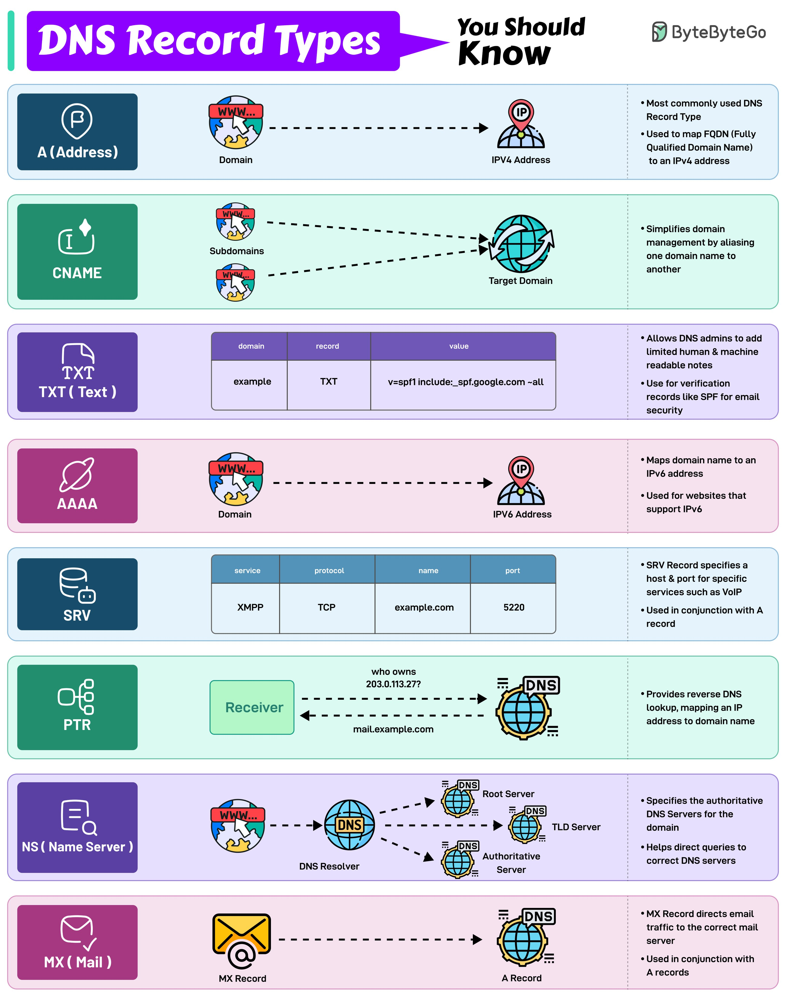

# Dns Record Types

## Description
DNS Record Types...

## Content
DNS Record Types

## Category Information

- Main Category: system_design
- Sub Category: networking
- Item Name: dns_record_types

## Source

- Original Tweet: [https://twitter.com/i/web/status/1891716788620230815](https://twitter.com/i/web/status/1891716788620230815)
- Date: 2025-02-20 15:36:34

## Media

### Media 1

**Description:** The infographic, titled "DNS Record Types," provides a comprehensive overview of DNS record types and their functions. The title is prominently displayed in white text within a purple banner at the top left corner.

**Record Types:**

* **A (Address)**
	+ Most commonly used DNS record type
	+ Used to map FQDNs to IPv4 addresses
	+ Example: WWW.example.com points to 192.0.2.1
* **CNAME (Canonical Name)**
	+ Simplifies domain management by aliasing one domain name to another
	+ Example: Subdomain.subdomain.example.com points to example.com
* **TXT (Text)**
	+ Allows DNS admins to add human-readable notes or machine-readable data
	+ Used for verification records like SPF for email security
* **AAAA (IPV6 Address)**
	+ Maps domain name to an IPv6 address
	+ Example: WWW.example.com points to 2001:0db8::1234
* **SRV (Service Record)**
	+ Specifies a host and port number for specific services like VoIP or DNS
	+ Used in conjunction with A records
* **PTR (Pointer)**
	+ Provides reverse DNS lookup, mapping an IP address to its corresponding domain name
	+ Example: 192.0.2.1 points to WWW.example.com
* **MX (Mail Exchange)**
	+ Specifies the mail server responsible for handling email for a particular domain
	+ Used in conjunction with A records

**Key Takeaways:**

* DNS record types are used to manage and resolve domain names on the internet.
* Each type has its own specific function, such as mapping FQDNs to IP addresses or specifying mail servers.
* Understanding these record types is essential for managing and troubleshooting DNS-related issues.

In summary, this infographic provides a concise and informative overview of the various DNS record types and their functions. By understanding these record types, individuals can better manage and troubleshoot DNS-related issues, ensuring smooth internet connectivity.

*Last updated: 2025-02-20 15:36:34*