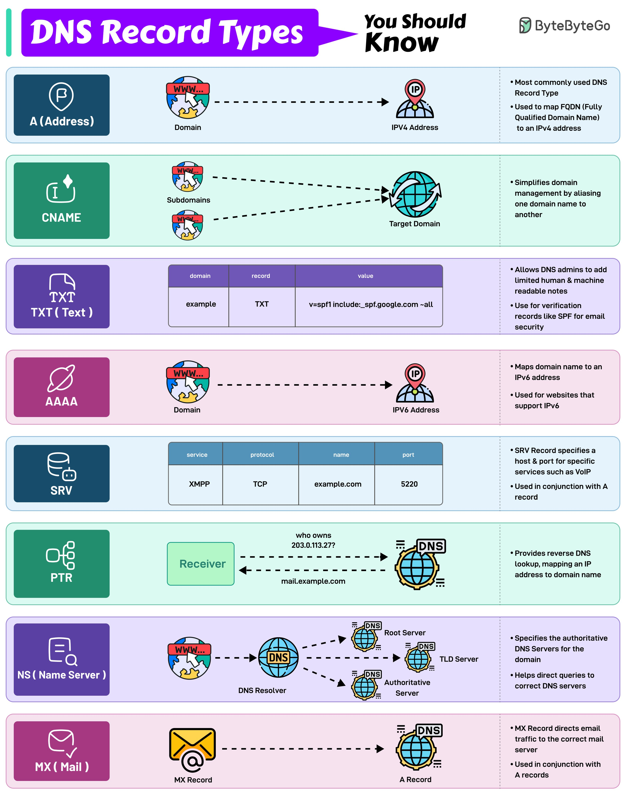

DNS (Domain Name System) record types are essential for managing and resolving domain names on the internet. They play a crucial role in mapping domain names to IP addresses, specifying mail servers, and providing reverse DNS lookups. This article provides an overview of the different DNS record types, their functions, and examples to help individuals understand and manage DNS-related issues.

## Technical Content
DNS record types are used to store information about a domain name, such as its IP address, mail server, or other services. The following are some of the most common DNS record types:

### A (Address) Records
* **Function:** Maps a fully qualified domain name (FQDN) to an IPv4 address.
* **Example:** `WWW.example.com` points to `192.0.2.1`.
* **Use cases:** Most commonly used for websites, web applications, and other services that require a static IP address.

### CNAME (Canonical Name) Records
* **Function:** Simplifies domain management by aliasing one domain name to another.
* **Example:** `subdomain.subdomain.example.com` points to `example.com`.
* **Use cases:** Useful for creating subdomains, redirecting traffic, or masking IP addresses.

### TXT (Text) Records
* **Function:** Allows DNS administrators to add human-readable notes or machine-readable data.
* **Example:** Used for verification records like SPF (Sender Policy Framework) for email security.
* **Use cases:** Commonly used for email authentication, domain ownership verification, and other security-related purposes.

### AAAA (IPv6 Address) Records
* **Function:** Maps a domain name to an IPv6 address.
* **Example:** `WWW.example.com` points to `2001:0db8::1234`.
* **Use cases:** Necessary for websites, web applications, and other services that require IPv6 support.

### SRV (Service Record) Records
* **Function:** Specifies a host and port number for specific services like VoIP or DNS.
* **Example:** Used in conjunction with A records to provide load balancing or failover capabilities.
* **Use cases:** Commonly used for VoIP, instant messaging, and other real-time communication services.

### PTR (Pointer) Records
* **Function:** Provides reverse DNS lookup, mapping an IP address to its corresponding domain name.
* **Example:** `192.0.2.1` points to `WWW.example.com`.
* **Use cases:** Essential for email delivery, as many mail servers use reverse DNS lookups to verify the sender's identity.

### MX (Mail Exchange) Records
* **Function:** Specifies the mail server responsible for handling email for a particular domain.
* **Example:** Used in conjunction with A records to route email traffic to the designated mail server.
* **Use cases:** Critical for email services, as they ensure that email messages are delivered to the correct mail server.

## Key Takeaways and Best Practices
* Understand the different DNS record types and their functions to manage and troubleshoot DNS-related issues effectively.
* Use A records for mapping FQDNs to IPv4 addresses and AAAA records for mapping FQDNs to IPv6 addresses.
* Implement CNAME records for domain aliasing and TXT records for email authentication and security purposes.
* Configure SRV records for load balancing or failover capabilities, and PTR records for reverse DNS lookups.
* Ensure that MX records are properly configured to route email traffic to the designated mail server.

## References
* [RFC 1035](https://tools.ietf.org/html/rfc1035) - Domain Names - Implementation and Specification
* [RFC 3596](https://tools.ietf.org/html/rfc3596) - DNS Extensions to Support IP Version 6
* [RFC 5321](https://tools.ietf.org/html/rfc5321) - Simple Mail Transfer Protocol
* [DNS Record Types Infographic](https://example.com/dns-record-types-infographic) - A visual representation of the different DNS record types and their functions.

By understanding and implementing these DNS record types, individuals can ensure smooth internet connectivity, improve email delivery, and enhance overall network security.
## Source

- Original Tweet: [https://twitter.com/i/web/status/1891716788620230815](https://twitter.com/i/web/status/1891716788620230815)
- Date: 2025-02-20 16:33:21

## Media

### Media 1

**Description:** The infographic, titled "DNS Record Types," provides a comprehensive overview of DNS record types and their functions. The title is prominently displayed in white text within a purple banner at the top left corner.

**Record Types:**

* **A (Address)**
	+ Most commonly used DNS record type
	+ Used to map FQDNs to IPv4 addresses
	+ Example: WWW.example.com points to 192.0.2.1
* **CNAME (Canonical Name)**
	+ Simplifies domain management by aliasing one domain name to another
	+ Example: Subdomain.subdomain.example.com points to example.com
* **TXT (Text)**
	+ Allows DNS admins to add human-readable notes or machine-readable data
	+ Used for verification records like SPF for email security
* **AAAA (IPV6 Address)**
	+ Maps domain name to an IPv6 address
	+ Example: WWW.example.com points to 2001:0db8::1234
* **SRV (Service Record)**
	+ Specifies a host and port number for specific services like VoIP or DNS
	+ Used in conjunction with A records
* **PTR (Pointer)**
	+ Provides reverse DNS lookup, mapping an IP address to its corresponding domain name
	+ Example: 192.0.2.1 points to WWW.example.com
* **MX (Mail Exchange)**
	+ Specifies the mail server responsible for handling email for a particular domain
	+ Used in conjunction with A records

**Key Takeaways:**

* DNS record types are used to manage and resolve domain names on the internet.
* Each type has its own specific function, such as mapping FQDNs to IP addresses or specifying mail servers.
* Understanding these record types is essential for managing and troubleshooting DNS-related issues.

In summary, this infographic provides a concise and informative overview of the various DNS record types and their functions. By understanding these record types, individuals can better manage and troubleshoot DNS-related issues, ensuring smooth internet connectivity.

*Last updated: 2025-02-20 16:33:21*