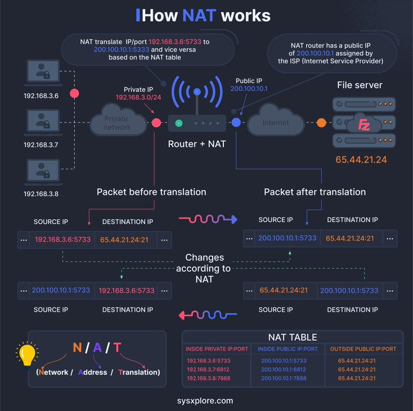

Network Address Translation (NAT) is a crucial technology used in networking to enable multiple devices on a private network to connect to the public internet using a single public IP address. This entry provides an in-depth explanation of how NAT works, its key components, and best practices for implementation.

#### Technical Content
##### Introduction to NAT
NAT is a technique used by routers to translate private IP addresses to public IP addresses, allowing devices on a private network to communicate with the internet. The process involves mapping private IP addresses to a public IP address, which is then used to represent the device on the internet.

##### Key Components of NAT
* **Private IP Addresses**: These are the IP addresses assigned to devices on a private network. Private IP addresses are typically represented in the format `192.168.x.x` or `10.x.x.x`.
* **Public IP Addresses**: These are the IP addresses used to represent devices on the internet. Public IP addresses are unique and must be registered with an Internet Service Provider (ISP).
* **Router Functionality**: A router plays a critical role in NAT, as it connects multiple private networks to a single public internet connection. The router translates private IP addresses to public IP addresses, allowing devices on the private network to communicate with the internet.

##### How NAT Works
The NAT process can be broken down into the following steps:
1. **Private IP Address**: A device on a private network is assigned a private IP address (e.g., `192.168.3.6`).
2. **NAT Translation**: When the device sends data to the internet, the router translates the private IP address to a public IP address (e.g., `200.100.10.1`).
3. **Public Internet**: The translated data is then sent to the public internet, where it is received by the destination server.
4. **Return Traffic**: When the destination server responds, the process is reversed, and the router translates the public IP address back to the private IP address.

##### Example
Suppose a device on a private network with an IP address of `192.168.3.6` wants to access a website on the internet. The router, which has been configured with NAT, translates the private IP address to a public IP address (`200.100.10.1`) and sends the request to the destination server. When the server responds, the router translates the public IP address back to the private IP address, allowing the device to receive the response.

#### Key Takeaways and Best Practices
* **Use NAT to conserve IP addresses**: NAT allows multiple devices on a private network to share a single public IP address, conserving IP address space.
* **Configure routers correctly**: Ensure that routers are properly configured with NAT to enable communication between private networks and the internet.
* **Monitor NAT performance**: Regularly monitor NAT performance to ensure optimal network connectivity and security.

#### References
* [RFC 3022: Traditional IP Network Address Translator (Traditional NAT)](https://tools.ietf.org/html/rfc3022)
* [RFC 3235: Network Address Translator (NAT)-Friendly Application Design Guidelines](https://tools.ietf.org/html/rfc3235)

Note: The references provided are Request for Comments (RFCs) documents that outline the technical specifications and guidelines for NAT implementation.
## Source

- Original Tweet: [https://twitter.com/i/web/status/1880222098234224810](https://twitter.com/i/web/status/1880222098234224810)
- Date: 2025-02-24 13:20:10

## Media

### Media 1

**Description:** The infographic, titled "How NAT Works," provides a comprehensive overview of Network Address Translation (NAT) technology. The title is prominently displayed at the top center of the image.

**Key Components:**

* **Network Diagram:** A network diagram illustrates how NAT works, featuring various devices and connections.
	+ Private IP addresses are represented by red dots, while public IP addresses are depicted in blue.
	+ Clouds symbolize the internet, with a router connecting private networks to the public internet.
* **NAT Process:** The infographic outlines the step-by-step process of how NAT translates private IP addresses to public IP addresses.
	+ Private IP address: 192.168.3.6
	+ Public IP address: 200.100.10.1
* **Router Functionality:** A router is shown connecting multiple private networks to a single public internet connection.
	+ The router's role in translating private IP addresses to public IP addresses is highlighted.

**Visual Elements:**

* Color-coded icons and graphics are used throughout the infographic to represent different devices and connections.
* Arrows and lines illustrate the flow of data between devices and the internet.
* A lightbulb icon is used to highlight key concepts, such as the translation process.

**Conclusion:**

The infographic effectively explains how NAT works by breaking down the process into manageable steps. It provides a clear understanding of the technology's role in connecting multiple private networks to a single public internet connection while preserving IP address space. The use of color-coded icons and graphics makes it easy to follow along with the explanation.

**Summary:**

The infographic "How NAT Works" is a valuable resource for anyone looking to understand Network Address Translation (NAT) technology. By using clear language, colorful visuals, and simple diagrams, the infographic provides an accessible introduction to this complex topic. Whether you're a beginner or an experienced IT professional, this infographic is sure to be a helpful tool in your understanding of NAT.

*Last updated: 2025-02-24 13:20:10*