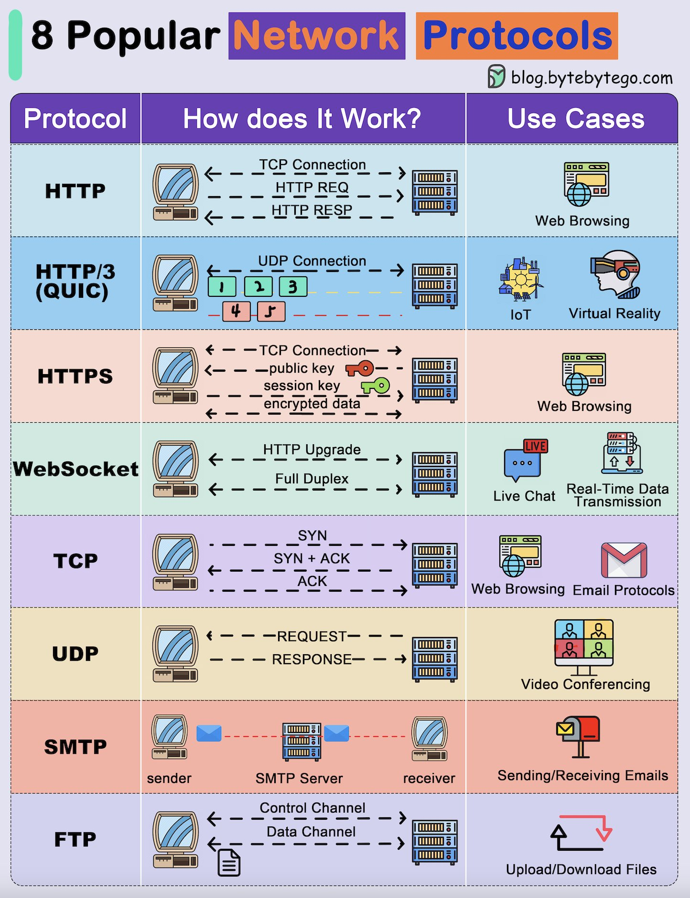

Network protocols are the backbone of modern computing and communication systems, enabling devices to communicate with each other over the internet. In this entry, we will delve into the world of network protocols, exploring eight fundamental protocols that facilitate data exchange between devices.

### Description
This technical knowledge base entry provides a comprehensive overview of eight popular network protocols, including HTTP, HTTP/3 (QUIC), HTTPS, WebSockets, TCP, UDP, SMTP, and FTP. Each protocol is explained in detail, covering its operation, use cases, and applications.

## Technical Content
The following sections provide an in-depth look at each of the eight network protocols:

### 1. HTTP (Hypertext Transfer Protocol)
* **Protocol:** HTTP is a request-response protocol used for transferring data over the internet.
* **How Does It Work?:** A client sends an HTTP request to a server, which responds with the requested data.
* **Use Cases:** Web browsing, API interactions

### 2. HTTP/3 (QUIC)
* **Protocol:** HTTP/3 is a next-generation protocol built on top of QUIC (Quick UDP Internet Connections), providing improved performance and security.
* **How Does It Work?:** HTTP/3 uses QUIC's connection-oriented approach to establish a secure connection between the client and server.
* **Use Cases:** High-performance web applications, real-time communication

### 3. HTTPS (Hypertext Transfer Protocol Secure)
* **Protocol:** HTTPS is an extension of HTTP that adds an extra layer of security using SSL/TLS encryption.
* **How Does It Work?:** The client and server establish a secure connection using SSL/TLS, ensuring encrypted data transfer.
* **Use Cases:** Secure web browsing, e-commerce transactions

### 4. WebSockets
* **Protocol:** WebSockets is a bi-directional communication protocol that enables real-time communication between clients and servers.
* **How Does It Work?:** A client establishes a WebSocket connection with a server, allowing for continuous data exchange.
* **Use Cases:** Real-time web applications, live updates, gaming

### 5. TCP (Transmission Control Protocol)
* **Protocol:** TCP is a transport-layer protocol that ensures reliable data transfer between devices.
* **How Does It Work?:** TCP establishes a connection-oriented approach, guaranteeing delivery of data packets in the correct order.
* **Use Cases:** File transfers, email communications

### 6. UDP (User Datagram Protocol)
* **Protocol:** UDP is a transport-layer protocol that prioritizes speed over reliability, using best-effort delivery.
* **How Does It Work?:** UDP sends data packets without establishing a connection, relying on the receiver to handle errors.
* **Use Cases:** Real-time applications, online gaming, video streaming

### 7. SMTP (Simple Mail Transfer Protocol)
* **Protocol:** SMTP is an application-layer protocol used for sending and receiving email messages.
* **How Does It Work?:** An SMTP client sends email messages to a server, which relays them to the recipient's server.
* **Use Cases:** Email communications, mailing lists

### 8. FTP (File Transfer Protocol)
* **Protocol:** FTP is an application-layer protocol used for transferring files over a network.
* **How Does It Work?:** An FTP client establishes a connection with an FTP server, allowing for file uploads and downloads.
* **Use Cases:** File sharing, website updates

## Key Takeaways and Best Practices
When working with network protocols, keep the following best practices in mind:

* Understand the strengths and weaknesses of each protocol to choose the most suitable one for your application.
* Ensure secure data transfer by using encryption mechanisms like SSL/TLS.
* Optimize performance by selecting the most efficient protocol for your specific use case.

## References
The following tools and technologies are mentioned in this entry:

* [HTTP](https://www.w3.org/Protocols/rfc2616/rfc2616.html)
* [QUIC](https://www.chromium.org/quic)
* [HTTPS](https://www.w3.org/Protocols/rfc2616/rfc2616.html)
* [WebSockets](https://www.rfc-editor.org/rfc/rfc6455)
* [TCP](https://www.ietf.org/rfc/rfc793.txt)
* [UDP](https://www.ietf.org/rfc/rfc768.txt)
* [SMTP](https://www.ietf.org/rfc/rfc5321.txt)
* [FTP](https://www.ietf.org/rfc/rfc959.txt)
## Source

- Original Tweet: [https://twitter.com/i/web/status/1875600551146352755](https://twitter.com/i/web/status/1875600551146352755)
- Date: 2025-02-24 12:07:48

## Media

### Media 1

**Description:** The infographic, titled "8 Popular Network Protocols," presents a comprehensive overview of eight fundamental network protocols that facilitate communication between devices over the internet. The title is displayed prominently at the top of the page.

**Protocols Covered:**

1. **HTTP (Hypertext Transfer Protocol)**
2. **HTTP/3 (QUIC)**
3. **HTTPS (Hypertext Transfer Protocol Secure)**
4. **WebSockets**
5. **TCP (Transmission Control Protocol)**
6. **UDP (User Datagram Protocol)**
7. **SMTP (Simple Mail Transfer Protocol)**
8. **FTP (File Transfer Protocol)**

**How Each Protocol Works:**

Each protocol is explained in a concise and easy-to-understand format, using simple graphics to illustrate its operation. The explanations are divided into three columns:

* **Protocol:** A brief description of the protocol.
* **How Does It Work?**: A simplified explanation of how each protocol functions.
* **Use Cases:** Examples of real-world applications for each protocol.

**Visual Representation:**

The infographic features a visually appealing design, with each protocol represented by a distinct color scheme. The use of simple graphics and illustrations makes it easy to understand the complex concepts underlying each protocol.

**Conclusion:**

In conclusion, this infographic provides a clear and concise introduction to eight essential network protocols. By understanding how these protocols work and their various applications, individuals can better appreciate the complexities of modern computing and communication systems.

*Last updated: 2025-02-24 12:07:48*