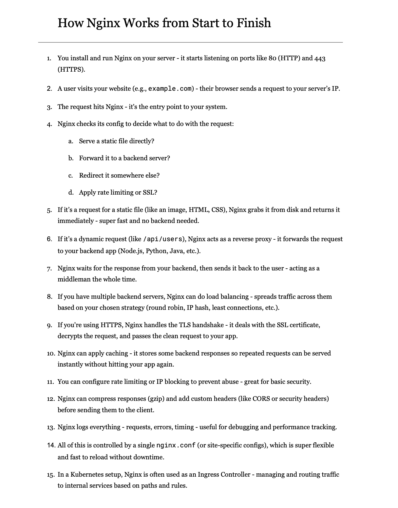

**Source:** [https://twitter.com/i/web/status/1918635461775368256](https://twitter.com/i/web/status/1918635461775368256)
**Original Post Date:** 2025-06-17 15:38:50

# End-to-End Analysis of Nginx Architecture

## Introduction
Nginx is a high-performance web server and reverse proxy that serves as the backbone for many modern applications. This analysis provides an in-depth examination of its architecture and operational flow, focusing on key aspects like request processing, load balancing, caching mechanisms, and Kubernetes integration.

Understanding Nginx's end-to-end workflow is crucial for system engineers and developers working with web infrastructure. We'll explore how it handles requests, manages responses, implements security features, and integrates into modern cloud environments.

## Nginx Installation and Basic Operation

Nginx initializes by installing and running on the server, listening on standard ports (80 for HTTP, 443 for HTTPS). This setup enables it to act as an entry point for incoming web traffic.

## Request Processing Flow

When a user visits example.com, their browser sends an HTTP request containing the host header and URL path. Nginx receives this request and begins processing it based on configuration rules.

The server evaluates the nginx.conf file to determine the appropriate action for each request - whether to serve static files directly or forward dynamic requests to backend applications.

_Example of basic server block configuration in nginx.conf_

```nginx
# Basic Nginx configuration
server {
    listen 80;
    server_name example.com;
}
```

## Static File Serving and Dynamic Proxy

For static files (HTML, CSS, images), Nginx serves them directly from disk storage. This provides optimal performance without backend involvement.

Dynamic requests are forwarded to backend servers via reverse proxy configuration, maintaining the client's original request details.

- type

- items

## Advanced Features and Integration

Nginx implements load balancing using strategies like round-robin, IP hash, or least connections. This ensures efficient distribution of traffic across multiple backend servers.

In Kubernetes environments, Nginx operates as an Ingress Controller, managing external traffic routing to internal services based on defined rules.

_Example of upstream block for load balancing configuration_

```nginx
# Load Balancing Configuration
upstream backend {
    server 192.168.0.1:8080;
    server 192.168.0.2:8080;
}
```

## Key Takeaways

- Nginx's event-driven architecture enables high performance and scalability
- Configuration management is centralized through nginx.conf with reload capability without downtime
- Integration capabilities make Nginx versatile across on-premises and cloud environments
- Security features like rate limiting, HTTPS handling, and caching are built into the core

## Conclusion
Nginx's architecture provides a robust foundation for modern web infrastructure. Its ability to handle high concurrent connections, manage complex request routing, and integrate with various backend systems makes it an essential component in contemporary system design.

## External References

- [Official Nginx Documentation](https://docs.nginx.com/)
- [Nginx as Kubernetes Ingress Controller](https://kubernetes.io/docs/concepts/services-networking/ingress-controllers/)


## Media

**Image Description:** The image is a document titled **"How Nginx Works from Start to Finish"**, which provides a step-by-step explanation of how the Nginx web server processes requests from start to finish. Below is a detailed breakdown of the content:

### **Main Subject**
The main subject of the document is the **functionality and workflow of Nginx**, a high-performance web server and reverse proxy. The document outlines the sequence of events that occur when a user accesses a website hosted on a server running Nginx.

### **Technical Details and Workflow**
The document is structured into 15 numbered steps, each describing a specific phase in the request-handling process. Here is a detailed breakdown of each step:

1. **Installation and Listening**:
   - Nginx is installed and run on the server.
   - It starts listening on standard ports such as **80 (HTTP)** and **443 (HTTPS)**.

2. **User Request**:
   - A user visits a website (e.g., `example.com`).
   - The user's browser sends an HTTP request to the server's IP address.

3. **Request Entry Point**:
   - The request reaches Nginx, which acts as the entry point to the system.

4. **Config Check**:
   - Nginx checks its configuration (`nginx.conf` or site-specific configurations) to determine how to handle the request.
   - Possible actions include:
     - Serving a static file directly.
     - Forwarding the request to a backend server.
     - Redirecting the request elsewhere.
     - Applying rate limiting or SSL/TLS.

5. **Static File Serving**:
   - If the request is for a static file (e.g., image, HTML, CSS), Nginx retrieves the file from the disk and serves it directly to the user.
   - This process is fast and does not require backend involvement.

6. **Dynamic Request Handling**:
   - If the request is dynamic (e.g., `/api/users`), Nginx acts as a **reverse proxy**.
   - It forwards the request to a backend application (e.g., Node.js, Python, Java).

7. **Backend Response**:
   - Nginx waits for the response from the backend server.
   - Once the response is received, Nginx forwards it back to the user.

8. **Load Balancing**:
   - If multiple backend servers are available, Nginx can perform **load balancing**.
   - Traffic is distributed across the servers using strategies like round-robin, IP hash, or least connections.

9. **HTTPS Handling**:
   - If the website uses HTTPS, Nginx handles the **TLS handshake**.
   - It manages the SSL certificate, decrypts the request, and passes the clean request to the backend.

10. **Caching**:
    - Nginx can cache backend responses.
    - This allows repeated requests to be served instantly without hitting the backend again.

11. **Rate Limiting and IP Blocking**:
    - Nginx can be configured to apply **rate limiting** or **IP blocking** to prevent abuse.
    - This enhances basic security.

12. **Response Compression and Headers**:
    - Nginx can compress responses using **gzip**.
    - It can also add custom headers (e.g., CORS headers or security headers) before sending the response.

13. **Logging**:
    - Nginx logs all activities, including requests, errors, and timing.
    - This is useful for debugging and performance tracking.

14. **Configuration Control**:
    - All of Nginx's behavior is controlled by a single configuration file (`nginx.conf`) or site-specific configurations.
    - These configurations are flexible and can be reloaded without downtime.

15. **Kubernetes Integration**:
    - In Kubernetes environments, Nginx is often used as an **Ingress Controller**.
    - It manages and routes traffic to internal services based on paths and rules.

### **Visual Layout**
- The document is formatted in a clean, structured manner with numbered steps.
- Substeps are indented for clarity.
- Key technical terms are bolded for emphasis (e.g., "HTTPS," "TLS handshake," "gzip").
- The text is presented in a clear, readable font, likely a standard serif or sans-serif typeface.

### **Purpose**
The document serves as an educational resource, explaining the inner workings of Nginx in a step-by-step manner. It is intended for developers, system administrators, or anyone interested in understanding how Nginx processes web requests and manages traffic.

### **Conclusion**
The image provides a comprehensive overview of Nginx's functionality, from request reception to response delivery, highlighting its role as a versatile web server and reverse proxy. The structured format and technical details make it a valuable resource for those working with or learning about Nginx.
