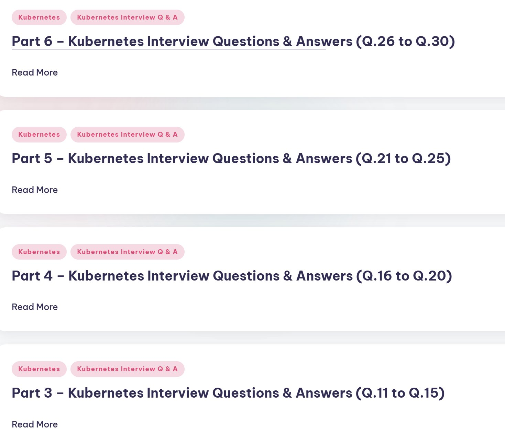
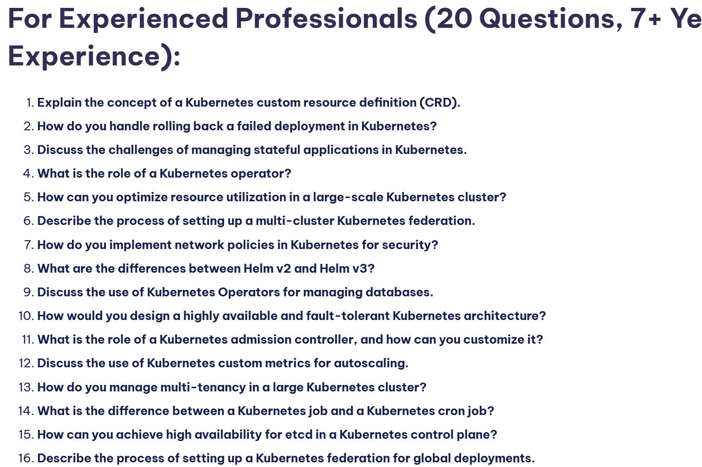
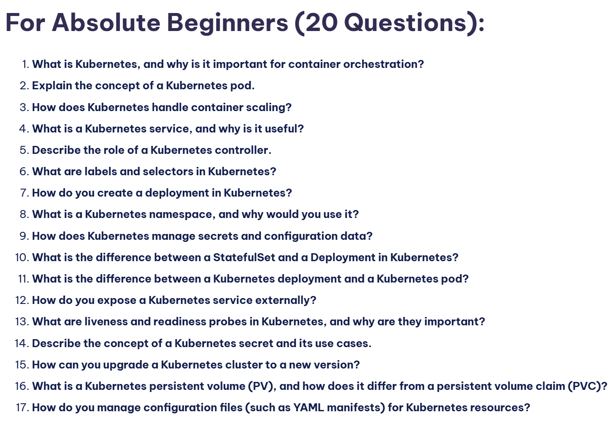
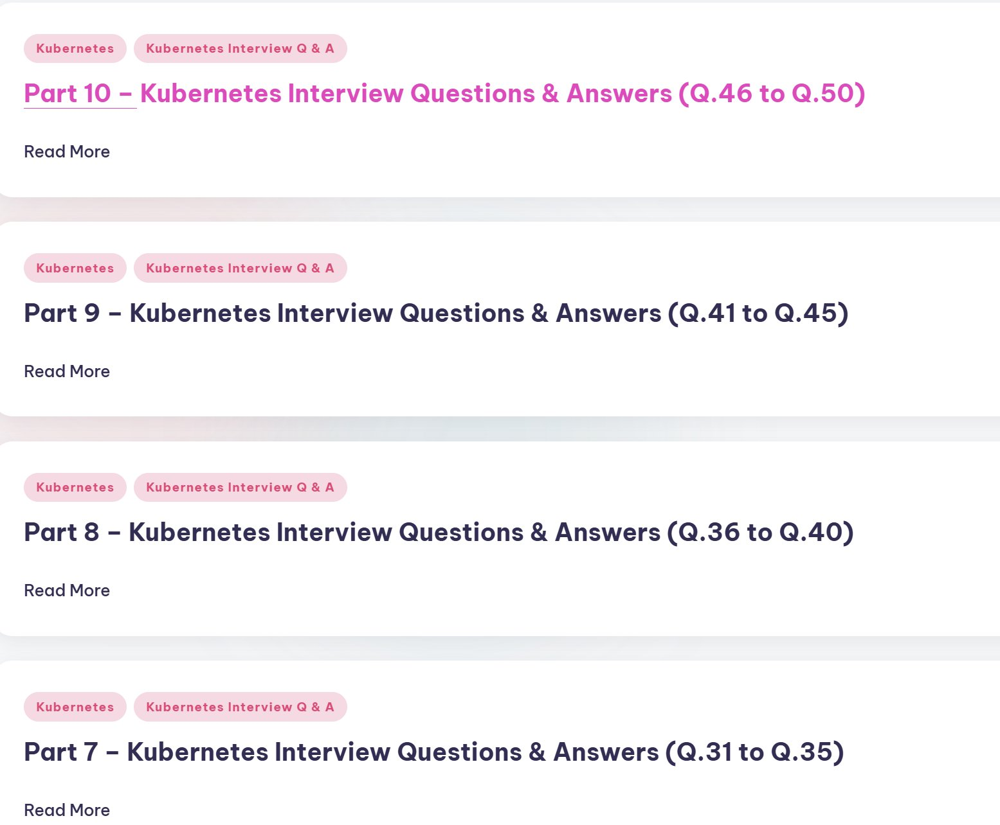

**Source:** [https://twitter.com/i/web/status/1883532099539333208](https://twitter.com/i/web/status/1883532099539333208)
**Original Post Date:** 2025-05-28 05:22:00

# Advanced Kubernetes Networking: Service Mesh Implementation with Istio

## Introduction
Service meshes have become essential for managing microservices communication in production environments. This knowledge base item explores the implementation of Istio as a service mesh solution on top of Kubernetes. We'll examine core concepts like sidecar injection, policy enforcement, traffic routing, and observability patterns. The content is designed for senior engineers looking to implement robust, scalable service meshes.

## Understanding Service Mesh Architecture

A service mesh abstracts the complexity of service-to-service communication by introducing a dedicated infrastructure layer. This allows for centralized control over security, traffic management, and observability without requiring application code changes.

The key components include: sidecars (proxies), control plane, data plane, and service registry. In Istio, Envoy proxy serves as the sidecar, while Pilot provides service discovery and routing.

_Example of a VirtualService configuration for traffic routing._

```yaml
apiVersion: networking.istio.io/v1alpha3
kind: VirtualService
metadata:
  name: frontend-vs
spec:
  hosts:
  - '*'
  gateways:
  - my-gateway
  http:
  - route:
    - destination:
        host: frontend
        port:
          number: 80
```

- Control Traffic Flow with Destination Rules and Virtual Services
- Implement Circuit Breaking and Load Balancing
- Enforce Security Policies at the Service Layer

> **Note/Tip:** Always enable mTLS for all service-to-service communication in production.

> **Note/Tip:** Use namespaces to segregate different service mesh configurations.

## Traffic Management and Routing

Istio provides sophisticated traffic management capabilities through VirtualServices and DestinationRules. These allow fine-grained control over how requests are routed between services.

Canary deployments, A/B testing, and blue-green deployments can be implemented without application code changes.

_Example of a DestinationRule for load balancing and connection pooling._

```yaml
apiVersion: networking.istio.io/v1alpha3
kind: DestinationRule
metadata:
  name: reviews-rb
spec:
  host: reviews
  trafficPolicy:
    loadBalancer:
      simple: ROUND_ROBIN
    connectionPool:
      tcp:
        maxConnections: 100
```

1. Define routing rules in VirtualServices
1. Configure load balancing policies
1. Implement fault injection for testing

## Security Implementation

Istio's security features enable authentication, authorization, and encryption between services. Mutual TLS (mTLS) is enforced by default in production configurations.

The Istio CA automatically generates certificates for all workloads, ensuring secure communication without manual intervention.

- Enable auto-mtls using PeerAuthentication policies
- Configure JWT authentication for external requests
- Implement authorization with AuthorizationPolicies

> **Note/Tip:** Regularly rotate certificates to maintain security.

> **Note/Tip:** Monitor certificate expiration in production clusters.

## Key Takeaways

- Service meshes provide comprehensive control over service communication without modifying application code
- Istio's traffic management capabilities enable sophisticated deployment strategies and load balancing
- Security policies should be strictly enforced using mTLS and proper authorization mechanisms

## Conclusion
Implementing a service mesh with Istio provides significant benefits for managing microservices in production. The architecture enables centralized control over security, traffic flow, and observability. By following best practices and leveraging Istio's features, teams can build more resilient and maintainable distributed systems.

## External References

- [Istio Documentation](https://istio.io/docs/)
- [Kubernetes Service Mesh Comparison](https://kubernetes.io/blog/2018/12/19/service-meshes-in-kubernetes/)


## Media

**Image Description:** The image appears to be a screenshot of a webpage or document that is structured to present a series of sections related to Kubernetes interview questions and answers. Below is a detailed description of the image:

### **Main Subject**
The main subject of the image is a structured list of sections titled "Kubernetes Interview Questions & Answers." Each section is labeled as a part of a larger series, with specific question ranges indicated for each part.

### **Layout and Structure**
1. **Header Tags:**
   - Each section is marked with a heading that includes:
     - A part number (e.g., "Part 3," "Part 4," etc.).
     - A title: "Kubernetes Interview Questions & Answers."
     - A range of questions covered in that part (e.g., "Q.11 to Q.15," "Q.16 to Q.20," etc.).

2. **Tags:**
   - Each section has two tags:
     - The first tag says "Kubernetes."
     - The second tag says "Kubernetes Interview Q & A."

3. **Text Formatting:**
   - The part numbers and titles are in bold, making them stand out.
   - The question ranges are enclosed in parentheses and are part of the main title.
   - The tags are enclosed in rounded rectangular boxes with a light pink background and white text.

4. **Read More Links:**
   - Below each section heading, there is a "Read More" link, suggesting that the full content of each section can be accessed by clicking on it.

5. **Color Scheme:**
   - The background is predominantly white.
   - The tags have a light pink background with white text.
   - The main text is in a dark color (likely black or dark gray), ensuring readability.

6. **Repetition:**
   - The structure is repeated for multiple sections, indicating a consistent format across the document.

### **Content Details**
- **Part 3:**
  - Title: "Part 3 – Kubernetes Interview Questions & Answers (Q.11 to Q.15)."
  - Tags: "Kubernetes" and "Kubernetes Interview Q & A."
  - "Read More" link is present.

- **Part 4:**
  - Title: "Part 4 – Kubernetes Interview Questions & Answers (Q.16 to Q.20)."
  - Tags: "Kubernetes" and "Kubernetes Interview Q & A."
  - "Read More" link is present.

- **Part 5:**
  - Title: "Part 5 – Kubernetes Interview Questions & Answers (Q.21 to Q.25)."
  - Tags: "Kubernetes" and "Kubernetes Interview Q & A."
  - "Read More" link is present.

- **Part 6:**
  - Title: "Part 6 – Kubernetes Interview Questions & Answers (Q.26 to Q.30)."
  - Tags: "Kubernetes" and "Kubernetes Interview Q & A."
  - "Read More" link is present.

### **Technical Details**
1. **HTML/CSS Structure:**
   - The layout suggests the use of HTML for structuring the content and CSS for styling.
   - The tags are likely implemented as `<span>` or `<div>` elements with specific classes for styling.
   - The "Read More" links are likely `<a>` tags with appropriate href attributes.

2. **Responsive Design:**
   - The layout appears clean and organized, suggesting it is designed to be readable on various screen sizes.

3. **Content Organization:**
   - The content is organized in a sequential manner, with each part covering a specific range of questions. This helps users navigate and find the information they need efficiently.

### **Overall Impression**
The image depicts a well-organized and user-friendly resource for individuals preparing for Kubernetes-related interviews. The consistent structure, clear headings, and "Read More" links make it easy to access detailed information about each section. The use of tags and color coding enhances the visual appeal and helps categorize the content effectively.


**Image Description:** The image is a list of interview questions designed for experienced professionals with 7+ years of experience in Kubernetes and related technologies. The questions are technical in nature and focus on various aspects of Kubernetes, including deployment, resource management, security, scalability, and advanced configuration. Below is a detailed breakdown of the content:

### **Main Subject**
The main subject of the image is a set of 20 interview questions aimed at assessing the technical expertise of professionals in Kubernetes. The questions cover a wide range of topics, from fundamental concepts to advanced use cases, indicating that the target audience is highly experienced individuals.

### **Technical Details and Question Breakdown**
1. **Kubernetes Custom Resource Definitions (CRDs):**
   - **Question:** "Explain the concept of a Kubernetes custom resource definition (CRD)."
   - **Details:** This question tests the candidate's understanding of CRDs, which are custom extensions to Kubernetes that allow users to define their own resource types. CRDs are essential for extending Kubernetes functionality to meet specific application needs.

2. **Rolling Back Deployments:**
   - **Question:** "How do you handle rolling back a failed deployment in Kubernetes?"
   - **Details:** This question assesses the candidate's knowledge of Kubernetes deployment strategies, specifically the ability to manage and recover from failed deployments using rollback mechanisms.

3. **Managing Stateful Applications:**
   - **Question:** "Discuss the challenges of managing stateful applications in Kubernetes."
   - **Details:** This question focuses on the complexities of deploying and managing stateful applications, which require persistent storage and ordered deployment/redeployment strategies.

4. **Role of Kubernetes Operators:**
   - **Question:** "What is the role of a Kubernetes operator?"
   - **Details:** This question evaluates the candidate's understanding of Kubernetes Operators, which are custom controllers that extend Kubernetes to manage complex stateful applications.

5. **Optimizing Resource Utilization:**
   - **Question:** "How can you optimize resource utilization in a large-scale Kubernetes cluster?"
   - **Details:** This question tests the candidate's ability to optimize resource allocation and management in large clusters, including techniques like resource quotas, horizontal pod autoscaling, and efficient scheduling.

6. **Setting Up Multi-Cluster Federation:**
   - **Question:** "Describe the process of setting up a multi-cluster Kubernetes federation."
   - **Details:** This question assesses the candidate's knowledge of Kubernetes federation, which allows for the management of multiple Kubernetes clusters as a single entity.

7. **Implementing Network Policies:**
   - **Question:** "How do you implement network policies in Kubernetes for security?"
   - **Details:** This question evaluates the candidate's understanding of Kubernetes Network Policies, which are used to enforce network security rules between pods.

8. **Differences Between Helm v2 and Helm v3:**
   - **Question:** "What are the differences between Helm v2 and Helm v3?"
   - **Details:** This question tests the candidate's familiarity with Helm, a popular package manager for Kubernetes, and the changes introduced in Helm v3, such as the removal of Tiller (the server-side component).

9. **Use of Kubernetes Operators for Managing Databases:**
   - **Question:** "Discuss the use of Kubernetes Operators for managing databases."
   - **Details:** This question assesses the candidate's understanding of how Kubernetes Operators can be used to automate the management of complex database systems.

10. **Designing Highly Available Architectures:**
    - **Question:** "How would you design a highly available and fault-tolerant Kubernetes architecture?"
    - **Details:** This question evaluates the candidate's ability to design robust Kubernetes architectures that ensure high availability and fault tolerance, using techniques like replication, load balancing, and redundancy.

11. **Role of Admission Controllers:**
    - **Question:** "What is the role of a Kubernetes admission controller, and how can you customize it?"
    - **Details:** This question tests the candidate's understanding of Kubernetes Admission Controllers, which enforce policies and modify requests before they are processed by the API server.

12. **Using Custom Metrics for Autoscaling:**
    - **Question:** "Discuss the use of Kubernetes custom metrics for autoscaling."
    - **Details:** This question assesses the candidate's knowledge of custom metrics and how they can be used to trigger autoscaling based on application-specific performance indicators.

13. **Managing Multi-Tenancy:**
    - **Question:** "How do you manage multi-tenancy in a large Kubernetes cluster?"
    - **Details:** This question evaluates the candidate's ability to manage multiple tenants within a single Kubernetes cluster, using techniques like namespaces, resource quotas, and network isolation.

14. **Difference Between Jobs and Cron Jobs:**
    - **Question:** "What is the difference between a Kubernetes job and a Kubernetes cron job?"
    - **Details:** This question tests the candidate's understanding of Kubernetes Jobs and Cron Jobs, which are used for running one-off tasks and scheduled tasks, respectively.

15. **Achieving High Availability for etcd:**
    - **Question:** "How can you achieve high availability for etcd in a Kubernetes control plane?"
    - **Details:** This question assesses the candidate's knowledge of etcd, the distributed key-value store used by Kubernetes, and strategies for ensuring its high availability, such as clustering and replication.

16. **Setting Up a Kubernetes Federation:**
    - **Question:** "Describe the process of setting up a Kubernetes federation for global deployments."
    - **Details:** This question evaluates the candidate's understanding of Kubernetes federation and its role in managing global deployments across multiple clusters.

### **Additional Observations**
- **Repetition:** Some questions are repeated or have slight variations, which might be intentional to emphasize certain topics or could be a formatting error.
- **Focus on Advanced Topics:** The questions cover advanced topics such as CRDs, Operators, and multi-cluster federation, indicating that the target audience is highly experienced professionals.
- **Practical Application:** Many questions are practical and require the candidate to describe processes or strategies, rather than just theoretical knowledge.

### **Conclusion**
The image presents a comprehensive set of interview questions that cover a broad spectrum of Kubernetes-related topics. The questions are designed to test both theoretical understanding and practical application of Kubernetes concepts, making them suitable for evaluating experienced professionals in the field. The repetition of certain questions suggests a focus on key areas of expertise.


**Image Description:** The image is a text-based document that presents a list of **20 questions** designed for **absolute beginners** learning about **Kubernetes**. The content is structured in a clear, numbered format, with each question focusing on a specific concept or feature of Kubernetes. Below is a detailed description of the image:

### **Main Subject**
The main subject of the image is a set of educational questions aimed at introducing beginners to Kubernetes, a popular open-source platform for automating the deployment, scaling, and management of containerized applications. The questions cover fundamental concepts, components, and operations within Kubernetes.

### **Structure and Content**
1. **Title:**
   - The title reads: **"For Absolute Absolute Beginners (20 Questions):"**
     - This indicates that the content is tailored for individuals who are new to Kubernetes and are looking to build a foundational understanding.

2. **List of Questions:**
   - The questions are numbered from **1 to 20** and are presented in a clear, sequential format.
   - Each question is concise and focuses on a specific aspect of Kubernetes.

### **Detailed Breakdown of Questions**
Here is a summary of the questions listed in the image:

1. **What is Kubernetes, and why is it important for container orchestration?**
   - This question introduces Kubernetes and its role in managing containerized applications.

2. **Explain the concept of a Kubernetes pod.**
   - Focuses on the fundamental unit of deployment in Kubernetes, the **pod**, which is a group of one or more containers.

3. **How does Kubernetes handle container scaling?**
   - Discusses Kubernetes' ability to automatically scale containers based on demand.

4. **What is a Kubernetes service, and why is it useful?**
   - Explains the concept of a **service**, which provides a stable endpoint for accessing pods.

5. **Describe the role of a Kubernetes controller.**
   - Introduces **controllers**, which are responsible for maintaining the desired state of Kubernetes resources.

6. **What are labels and selectors in Kubernetes?**
   - Covers the use of **labels** and **selectors** for organizing and identifying resources.

7. **How do you create a deployment in Kubernetes?**
   - Guides the process of creating a **deployment**, which manages the lifecycle of pods.

8. **What is a Kubernetes namespace, and why would you use it?**
   - Explains **namespaces**, which are used to organize and isolate resources within a cluster.

9. **How does Kubernetes manage secrets and configuration data?**
   - Discusses the management of sensitive data and configuration using **secrets** and **config maps**.

10. **What is the difference between a StatefulSet and a Deployment in Kubernetes?**
    - Compares **StatefulSet** (for stateful applications) and **Deployment** (for stateless applications).

11. **What is the difference between a Kubernetes deployment and a Kubernetes pod?**
    - Differentiates between **deployments** (higher-level constructs) and **pods** (the smallest unit of deployment).

12. **How do you expose a Kubernetes service externally?**
    - Explains methods for making services accessible outside the cluster, such as using **Ingress** or **Load Balancers**.

13. **What are liveness and readiness probes in Kubernetes, and why are they important?**
    - Describes **liveness** and **readiness** probes, which monitor the health of containers.

14. **Describe the concept of a Kubernetes secret and its use cases.**
    - Focuses on **secrets**, which are used to store sensitive information securely.

15. **How can you upgrade a Kubernetes cluster to a new version?**
    - Guides the process of upgrading a Kubernetes cluster to a newer version.

16. **What is a Kubernetes persistent volume (PV), and how does it differ from a persistent volume claim (PVC)?**
    - Explains **PVs** (storage resources) and **PVCs** (requests for storage), highlighting their differences.

17. **How do you manage configuration files (such as YAML manifests) for Kubernetes resources?**
    - Discusses the use of **YAML manifests** for defining and managing Kubernetes resources.

### **Technical Details**
- **Kubernetes Components:** The questions cover key components such as **pods**, **services**, **deployments**, **namespaces**, **secrets**, **config maps**, **StatefulSets**, and **controllers**.
- **Concepts:** Important concepts like **container scaling**, **labels and selectors**, **namespaces**, **secrets**, and **probes** are introduced.
- **Operations:** The questions also touch on practical operations, such as creating deployments, exposing services, and upgrading clusters.
- **Storage:** The difference between **PVs** and **PVCs** is highlighted, which is crucial for managing persistent storage in Kubernetes.

### **Visual Presentation**
- **Font and Formatting:**
  - The text is written in a clean, readable font.
  - The title is in bold and larger font size for emphasis.
  - The questions are numbered and listed in a clear, sequential order.
- **Clarity:** The structure ensures that each question is easily identifiable and focused on a specific topic.

### **Purpose**
The image serves as an educational resource for beginners, providing a structured introduction to Kubernetes. It covers essential concepts, components, and operations, making it a valuable starting point for those new to the platform.

### **Overall Impression**
The image is well-organized, concise, and focused on providing foundational knowledge about Kubernetes. It is an excellent tool for learners who are just starting to explore container orchestration and Kubernetes.


**Image Description:** The image appears to be a screenshot of a webpage or document that is structured to present a series of sections related to Kubernetes interview questions and answers. Below is a detailed description of the image:

### **Main Subject**
The main subject of the image is a structured list of sections, each titled as part of a series of Kubernetes interview questions and answers. The content is organized into parts, with each part covering a specific range of questions.

### **Visual Structure**
1. **Header Tags and Titles**:
   - Each section is titled with a heading that includes:
     - The part number (e.g., "Part 7," "Part 8," etc.).
     - A description indicating that it is part of a Kubernetes interview questions and answers series.
     - The range of questions covered in that part (e.g., "Q.31 to Q.35," "Q.36 to Q.40," etc.).

2. **Tags**:
   - Each section has two tags at the top:
     - The first tag says **"Kubernetes"**.
     - The second tag says **"Kubernetes Interview Q & A"**.
   - These tags are enclosed in rounded rectangular boxes with a light pink background and white text.

3. **Text Content**:
   - The text is primarily in a clean, sans-serif font.
   - The titles of the sections are in a bold, dark purple color.
   - The question ranges (e.g., "Q.31 to Q.35") are enclosed in parentheses and are part of the main title.
   - Below each title, there is a link labeled **"Read More"** in a lighter purple color, suggesting that users can click to access more detailed content for that section.

4. **Color Scheme**:
   - The background is predominantly white.
   - The tags have a light pink background with white text.
   - The main titles are in dark purple, and the "Read More" links are in a lighter purple.

5. **Repetition**:
   - The structure is repeated for multiple sections, indicating a consistent format across the document.

### **Technical Details**
1. **HTML/CSS Structure**:
   - The layout suggests an HTML structure with:
     - `<h2>` or similar tags for the main titles.
     - `<a>` tags for the "Read More" links.
     - `<span>` or `<div>` elements for the tags.
   - The use of CSS for styling:
     - Rounded corners for the tags.
     - Color coding for text and background.
     - Consistent spacing and alignment.

2. **Content Organization**:
   - The content is organized in a sequential manner, with each part covering a specific range of questions.
   - This suggests that the full document likely contains multiple parts, each building upon the previous one.

3. **Interactive Elements**:
   - The "Read More" links imply interactivity, allowing users to navigate to more detailed content for each section.

### **Relevant Observations**
- The repetition of the structure across sections indicates a well-organized resource for learning or preparing for Kubernetes interviews.
- The use of tags and clear headings makes the content easy to navigate and understand.
- The color scheme is minimalistic and user-friendly, focusing attention on the content rather than overwhelming visual elements.

### **Summary**
The image depicts a structured and organized resource for Kubernetes interview preparation. It consists of multiple sections, each titled with a part number, a description, and a range of questions. Each section includes tags for categorization and a "Read More" link for further exploration. The design is clean, with a consistent color scheme and layout, making it user-friendly and easy to navigate. The technical details suggest an HTML/CSS implementation with a focus on clarity and interactivity.
