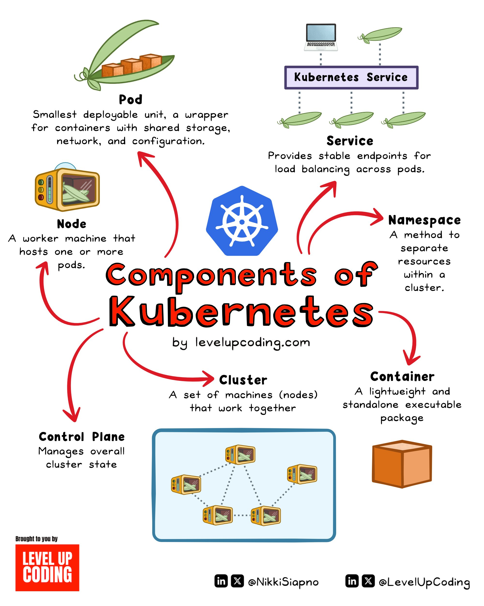

**Source:** [https://twitter.com/i/web/status/1929493382927188177](https://twitter.com/i/web/status/1929493382927188177)
**Original Post Date:** 2025-06-17 12:52:43

# Understanding Core Kubernetes Components and Their Interrelationships

## Introduction
Kubernetes has become the de facto standard for container orchestration. Understanding its fundamental components is crucial for effective system design and management of cloud-native applications. This article breaks down the key building blocks that make up Kubernetes' architecture, focusing on their purposes, relationships, and best practices for implementation.

## Core Building Blocks

Kubernetes operates through a hierarchy of components that form its foundational structure. At the smallest unit level is the Pod, which serves as a wrapper for one or more containers, providing shared resources and network configuration.

Nodes represent physical or virtual machines that host these pods, forming the compute infrastructure layer. Multiple nodes collectively form a cluster, enabling scalable and fault-tolerant application deployment.

- Pods are scheduled onto Nodes based on resource requirements
- Nodes communicate with the Control Plane for pod management
- Clusters provide high availability through node redundancy

> **Note/Tip:** Always consider resource constraints when designing pod specifications

> **Note/Tip:** Node auto-scaling should be configured to match workload patterns

## Orchestration Components and Services

The Control Plane serves as the central management system, maintaining cluster state and ensuring desired configurations are implemented. It works in conjunction with various services that facilitate application communication.

Services provide stable endpoints for load balancing across pods, abstracting the underlying pod instances from consumers. Namespaces enable logical isolation of resources within a cluster, allowing multiple teams to operate independently.

1. Control Plane components include etcd (storage), kube-scheduler (pod placement), and kube-controller-manager (cluster state maintenance)
1. Services can be of type ClusterIP, NodePort, or LoadBalancer based on deployment requirements
1. Namespaces should align with organizational structures for effective resource management

> **Note/Tip:** Implement proper naming conventions in namespaces to avoid conflicts

> **Note/Tip:** Use namespace quotas to prevent resource abuse between teams

## Key Takeaways

- Pods are the smallest deployable units and must be understood for effective container orchestration
- Node management is crucial for ensuring optimal cluster performance and reliability
- Services and namespaces provide essential abstraction layers for scalable applications
- The Control Plane's role in maintaining cluster state cannot be overemphasized

## Conclusion
Mastering these core Kubernetes components enables developers and architects to design robust, scalable containerized systems. Understanding their interactions and proper configuration is key to successful cloud-native application deployment and management.

## External References

- [Kubernetes Official Documentation](https://kubernetes.io/docs/concepts/overview/components/)
- [LevelUpUpCoding.com Kubernetes Guide](https://levelupupcoding.com/kubernetes)

## Media

**Image Description:** This image is an infographic that provides a detailed overview of the **components of Kubernetes**, a popular open-source platform for automating the deployment, scaling, and management of containerized applications. The infographic uses a combination of icons, text, and arrows to illustrate the relationships between the components. Below is a detailed description:

### **Main Subject: Components of Kubernetes**
The infographic is centered around the **Kubernetes ecosystem**, with the title prominently displayed in bold red text: **"Components of Kubernetes"**. The Kubernetes logo (a blue hexagon with a white steering wheel) is placed in the middle, serving as the focal point, from which arrows radiate to connect the various components.

### **Key Components and Their Descriptions**
1. **Pod**
   - **Icon**: A cartoon-style pea pod with small cubes inside, representing containers.
   - **Description**: The smallest deployable unit in Kubernetes. It acts as a wrapper for one or more containers, providing shared storage, network, and configuration.
   - **Purpose**: Pods are the basic building blocks of Kubernetes, ensuring that containers are grouped together for efficient management.

2. **Node**
   - **Icon**: A cartoon-style microwave with a pea pod inside, representing a pod running on the node.
   - **Description**: A worker machine (physical or virtual) that hosts one or more pods.
   - **Purpose**: Nodes are the compute resources where containers run. They are managed by the Kubernetes control plane.

3. **Cluster**
   - **Icon**: A group of interconnected nodes (microwave icons) within a blue box.
   - **Description**: A set of machines (nodes) that work together as a single unit.
   - **Purpose**: Clusters provide the infrastructure for running Kubernetes applications, enabling scalability and fault tolerance.

4. **Control Plane**
   - **Icon**: Not explicitly shown but implied as the central management system.
   - **Description**: Manages the overall state of the cluster, ensuring that the desired state matches the actual state.
   - **Purpose**: The control plane is responsible for orchestrating the cluster, including scheduling pods, managing services, and ensuring high availability.

5. **Container**
   - **Icon**: A simple orange cube, representing a lightweight, standalone executable package.
   - **Description**: A lightweight and portable software package that contains everything needed to run an application.
   - **Purpose**: Containers are the fundamental unit of deployment in Kubernetes, providing isolation and consistency across different environments.

6. **Namespace**
   - **Icon**: Not explicitly shown but implied as a logical grouping mechanism.
   - **Description**: A method to separate resources within a cluster.
   - **Purpose**: Namespaces allow for organizing and isolating resources (e.g., pods, services) within a cluster, enabling multiple teams or projects to share the same cluster.

7. **Service**
   - **Icon**: A laptop connected to multiple pea pods (pods).
   - **Description**: Provides stable endpoints for load balancing across pods.
   - **Purpose**: Services act as an abstraction layer that defines a logical set of pods and a policy by which to access them, enabling communication between pods and external systems.

8. **Kubernetes Service**
   - **Icon**: A laptop connected to multiple pea pods (pods).
   - **Description**: A specific type of service in Kubernetes that provides stable endpoints for load balancing across pods.
   - **Purpose**: Similar to the general "Service" component, it ensures that applications can communicate with each other reliably.

### **Visual Layout and Flow**
- **Arrows**: Red arrows connect the components, illustrating their relationships and dependencies. For example:
  - Nodes host pods.
  - Pods are part of a cluster.
  - The control plane manages the cluster state.
  - Services provide endpoints for pods.
- **Icons**: Each component is represented by a simple, memorable icon (e.g., pea pod for pods, microwave for nodes, orange cube for containers).
- **Text**: Descriptions are concise and placed near each component, providing a brief explanation of its role and purpose.

### **Additional Details**
- **Branding**: The infographic is attributed to **LevelUpUpCoding.com**, as indicated in the bottom left corner.
- **Social Media Handles**: The infographic includes social media links for **@NikkiSiapno** and **@LevelUpUpCoding** on LinkedIn and X (formerly Twitter).
- **Design Style**: The design is clean, colorful, and cartoonish, making it visually appealing and easy to understand.

### **Overall Purpose**
The infographic serves as an educational tool, providing a clear and concise overview of Kubernetes components and their interrelationships. It is designed to help beginners and intermediate users understand the fundamental architecture of Kubernetes and how its components work together to manage containerized applications.

### **Summary**
This infographic effectively breaks down the complex Kubernetes ecosystem into digestible parts, using icons, arrows, and concise descriptions to explain the roles and relationships of key components. The visual design is engaging and educational, making it a valuable resource for learning about Kubernetes.
