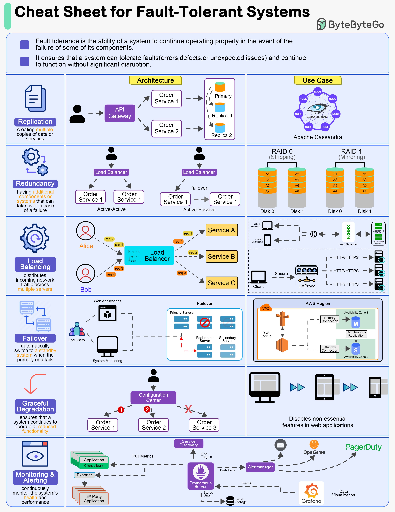

**Source:** [https://twitter.com/i/web/status/1876496495358456111](https://twitter.com/i/web/status/1876496495358456111)
**Original Post Date:** 2025-07-15 11:45:09

# Building Fault-Tolerant Systems: A Comprehensive Guide

## Introduction
Fault tolerance is a critical aspect of system design that ensures the ability to continue operating properly even when some components fail. This guide provides an in-depth analysis of various strategies and tools used to build fault-tolerant systems. We will explore key concepts such as replication, redundancy, load balancing, failover, graceful degradation, and monitoring, along with practical examples and visualizations.

## Replication

Replication involves creating multiple copies of data or services across different nodes. This strategy ensures data availability and system reliability by distributing the load and providing backup in case of failure.

In a replicated system, a primary node handles write operations and propagates changes to replica nodes. Replica nodes can then serve read requests, reducing the load on the primary node and improving overall performance.

- Primary node: Handles write operations and propagates changes to replicas.
- Replica nodes: Serve read requests and provide backup in case of failure.
- API Gateway: Acts as a central entry point for client requests, routing them to the appropriate service.

> **Note/Tip:** Ensure that replica nodes are geographically distributed to protect against regional failures.

> **Note/Tip:** Monitor replication lag to detect and address performance bottlenecks.

## Redundancy

Redundancy involves having additional components or systems that can take over in case of a failure. This strategy ensures continuous operation by providing backup systems.

There are two main types of redundancy architectures: active-active and active-passive. In an active-active architecture, multiple systems operate simultaneously, sharing the load. In an active-passive architecture, one system is active while another stands by, ready to take over in case of failure.

- Active-Active Architecture: Multiple systems operate simultaneously, sharing the load.
- Active-Passive Architecture: One system is active while another stands by, ready to take over in case of failure.

> **Note/Tip:** Consider the trade-offs between complexity and fault tolerance when choosing a redundancy architecture.

> **Note/Tip:** Regularly test failover procedures to ensure that backup systems are functioning correctly.

## Load Balancing

Load balancing involves distributing incoming network traffic across multiple servers. This strategy ensures even distribution of load and prevents overloading of any single server.

A load balancer acts as a central entry point for client requests, routing them to different services based on various algorithms such as round-robin, least connections, or IP hash.

- Load Balancer: Acts as a central entry point for client requests.
- Services: Multiple services that handle specific tasks and are distributed across servers.
- Clients (Alice and Bob): Send requests to the load balancer, which distributes them across services.

> **Note/Tip:** Use health checks to monitor the status of backend servers and route traffic only to healthy ones.

> **Note/Tip:** Consider using a combination of load balancing algorithms to optimize performance for different types of traffic.

## RAID (Redundant Array of Independent Disks)

RAID is a data storage virtualization technology that combines multiple disk drive components into one or more logical units. There are several RAID levels, each offering different trade-offs between performance, redundancy, and capacity.

RAID 0 (Striping) splits data across multiple disks for improved performance but offers no fault tolerance. RAID 1 (Mirroring) mirrors data across multiple disks for redundancy, ensuring that if one disk fails, the data can still be accessed from another.

- RAID 0 (Striping): Data is split across multiple disks for improved performance.
- RAID 1 (Mirroring): Data is mirrored across multiple disks for redundancy.

> **Note/Tip:** Choose the appropriate RAID level based on your specific requirements for performance, redundancy, and capacity.

> **Note/Tip:** Regularly back up data to protect against catastrophic failures that may affect all disks in a RAID array.

## Failover

Failover is the automatic switching to a standby system when the primary one fails. This strategy ensures continuous operation by having backup systems ready to take over.

In a failover setup, primary servers handle the main workload while secondary servers stand by. If a primary server fails, the secondary server takes over seamlessly.

- Primary Servers: Marked as active and handle the main workload.
- Secondary Servers: Marked as redundant and ready to take over in case of failure.
- Redundant Server: Shown as a backup system.

> **Note/Tip:** Test failover procedures regularly to ensure that backup systems are functioning correctly.

> **Note/Tip:** Consider using virtual machines or containers for easier management and deployment of failover systems.

## Graceful Degradation

Graceful degradation ensures that a system continues to operate at reduced functionality when components fail. This strategy maintains essential services while non-essential features are disabled during failures.

In a graceful degradation setup, application services monitor the health of their components and adjust functionality based on available resources. If a component fails, the service may disable non-essential features but continue to provide core functionality.

- Application Services: Shows multiple services (e.g., Service 1, Service 2, Service 3).
- Non-Essential Features: Marked as disabled during degraded mode.

> **Note/Tip:** Design systems with modular components to facilitate graceful degradation.

> **Note/Tip:** Monitor system performance and adjust functionality dynamically based on available resources.

## Monitoring & Alerting

Monitoring involves continuously monitoring the system's performance and health. This strategy detects issues early and alerts operators to take corrective actions.

A comprehensive monitoring setup includes tools for pulling metrics, managing alerts, and visualizing performance data. Prometheus is a popular tool for pulling metrics from services, while Alertmanager manages alerts and notifications.

- Monitoring Tools: Prometheus pulls metrics from services.
- Alerting Tools: PagerDuty, Opsgenie receive alerts and notify operators.
- Visualization Tools: Grafana visualizes system metrics and performance data.

> **Note/Tip:** Set up appropriate thresholds for alerts to avoid alert fatigue.

> **Note/Tip:** Use dashboards to visualize key metrics and identify trends and anomalies.

## Use Case: Apache Cassandra

Apache Cassandra is a distributed database system designed for fault tolerance. It uses a decentralized architecture where data is replicated across multiple nodes.

In a Cassandra setup, nodes are distributed across different locations to protect against regional failures. Data is partitioned and replicated across these nodes, ensuring high availability and fault tolerance.

- Nodes: Distributed across different locations.
- Data Partitioning: Ensures even distribution of data across nodes.
- Replication: Provides redundancy and fault tolerance.

> **Note/Tip:** Regularly monitor and tune Cassandra's performance to ensure optimal operation.

> **Note/Tip:** Consider using managed services like DataStax Enterprise or Amazon Keyspaces for easier management and deployment of Cassandra clusters.

## Conclusion

Building fault-tolerant systems involves a combination of strategies such as replication, redundancy, load balancing, failover, graceful degradation, and monitoring. Each strategy has its own trade-offs and should be chosen based on specific requirements.

Regular testing and monitoring are essential to ensure that the system remains resilient and can recover quickly from failures.

## Key Takeaways

- Replication ensures data availability and system reliability by distributing load across multiple nodes.
- Redundancy provides backup systems ready to take over in case of failure, ensuring continuous operation.
- Load balancing distributes incoming network traffic evenly across multiple servers, preventing overload.
- RAID offers different trade-offs between performance, redundancy, and capacity for data storage.
- Failover ensures seamless switching to backup systems when primary ones fail.
- Graceful degradation maintains essential services while disabling non-essential features during failures.
- Monitoring detects issues early and alerts operators to take corrective actions.

## External References

- [Apache Cassandra Documentation](https://cassandra.apache.org/doc/latest/)
- [Prometheus Monitoring System](https://prometheus.io/)

## Media

**Image Description:** ### Description of the Image: Cheat Sheet for Fault-Tolerant Systems

This image is a comprehensive cheat sheet titled **"Cheat Sheet for Fault-Tolerant Systems"**, designed to provide an overview of key concepts, architectures, and tools used in building fault-tolerant systems. The content is organized into multiple sections, each highlighting a specific aspect of fault tolerance. Below is a detailed breakdown of the image:

---

### **Header**
- **Title**: "Cheat Sheet for Fault-Tolerant Systems"
- **Subtitle**: Defines fault tolerance as the ability of a system to continue operating properly even when some of its components fail.
- **Purpose**: Ensures that a system can tolerate faults (errors, defects, or unexpected issues) and continue to function without significant disruption.

---

### **Main Sections**
The cheat sheet is divided into several sections, each focusing on a different aspect of fault tolerance. Below is a detailed description of each section:

#### **1. Replication**
- **Definition**: Creating multiple copies of data or services.
- **Purpose**: Ensures data availability and system reliability by distributing data across multiple nodes.
- **Visualization**:
  - **Primary and Replica Nodes**: Shows a primary node with replicas (e.g., Replica 1 and Replica 2).
  - **API Gateway**: Acts as a central entry point for requests.
  - **Services**: Multiple services (e.g., Service 1 and Service 2) are shown, each with their own primary and replica nodes.

#### **2. Redundancy**
- **Definition**: Having additional components or systems that can take over in case of a failure.
- **Purpose**: Provides backup systems to ensure continuous operation.
- **Visualization**:
  - **Active-Active Architecture**: Shows two active systems (e.g., Service 1) operating simultaneously.
  - **Active-Passive Architecture**: Shows one active system (e.g., Service 1) and a passive system ready to take over in case of failure.

#### **3. Load Balancing**
- **Definition**: Distributes incoming network traffic across multiple servers.
- **Purpose**: Ensures even distribution of load and prevents overloading of any single server.
- **Visualization**:
  - **Load Balancer**: Acts as a central component that routes requests to different services (e.g., Service A, Service B, Service C).
  - **Clients (Alice and Bob)**: Send requests to the load balancer, which distributes them across services.

#### **4. RAID (Redundant Array of Independent Disks)**
- **RAID 0 (Striping)**:
  - **Description**: Data is split across multiple disks for improved performance.
  - **Visualization**: Shows two disks (Disk 0 and Disk 1) with data striped across them.
- **RAID 1 (Mirroring)**:
  - **Description**: Data is mirrored across multiple disks for redundancy.
  - **Visualization**: Shows two disks (Disk 0 and Disk 1) with identical data for fault tolerance.

#### **5. Failover**
- **Definition**: Automatically switching to a standby system when the primary one fails.
- **Purpose**: Ensures continuous operation by having a backup system ready to take over.
- **Visualization**:
  - **Primary Servers**: Marked as active.
  - **Secondary Servers**: Marked as redundant and ready to take over in case of failure.
  - **Redundant Server**: Shown as a backup system.

#### **6. Graceful Degradation**
- **Definition**: Ensures that a system continues to operate at reduced functionality.
- **Purpose**: Maintains essential services while non-essential features are disabled during failures.
- **Visualization**:
  - **Application Services**: Shows multiple services (e.g., Service 1, Service 2, Service 3).
  - **Non-Essential Features**: Marked as disabled during degraded mode.

#### **7. Monitoring & Alerting**
- **Definition**: Continuously monitors the system's performance and health.
- **Purpose**: Detects issues early and alerts operators to take corrective actions.
- **Visualization**:
  - **Monitoring Tools**:
    - **Prometheus**: Pulls metrics from services.
    - **Alertmanager**: Manages alerts and notifications.
  - **Alerting Tools**:
    - **PagerDuty**, **Opsgenie**: Receives alerts and notifies operators.
  - **Visualization Tools**:
    - **Grafana**: Visualizes system metrics and performance data.

#### **8. Use Case: Apache Cassandra**
- **Description**: A distributed database system designed for fault tolerance.
- **Visualization**:
  - **Nodes**: Shows multiple nodes in a cluster.
  - **Cassandra Architecture**: Highlights the distributed nature of Cassandra, with nodes replicating data for fault tolerance.

#### **9. AWS Region Architecture**
- **Description**: Shows how fault tolerance is achieved in a cloud environment using AWS regions and availability zones.
- **Visualization**:
  - **AWS Region**: Contains multiple availability zones.
  - **Primary and Standby Servers**: Distributed across availability zones for redundancy.
  - **DNS and Load Balancing**: Ensures requests are routed to available servers.

#### **10. Service Discovery**
- **Description**: Automatically discovers and manages services in a distributed system.
- **Visualization**:
  - **Service Discovery Mechanism**: Finds and registers services dynamically.
  - **Targets**: Shows how services are identified and monitored.

---

### **Visual Elements**
- **Icons and Symbols**:
  - **API Gateway**: Represented as a central entry point.
  - **Load Balancer**: Shown as a component distributing traffic.
  - **Disks**: Represented as RAID configurations.
  - **Servers**: Marked as primary, secondary, or redundant.
  - **Alerts**: Shown as notifications to operators.
- **Color Coding**:
  - **Blue**: Used for primary components or services.
  - **Orange**: Used for secondary or redundant components.
  - **Gray**: Used for inactive or disabled components.
- **Arrows and Flow**: Indicates the flow of data, requests, and alerts between components.

---

### **Overall Theme**
The cheat sheet emphasizes the importance of redundancy, replication, load balancing, failover, graceful degradation, and monitoring in building fault-tolerant systems. It provides a visual representation of these concepts using diagrams, icons, and flowcharts, making it easy to understand the interplay between different components in a fault-tolerant architecture.

---

### **Conclusion**
This cheat sheet is a valuable resource for developers and system architects looking to design and implement fault-tolerant systems. It covers a wide range of technical details, from database architectures (e.g., Apache Cassandra) to cloud-based solutions (e.g., AWS regions) and monitoring tools (e.g., Prometheus, Grafana). The use of clear visuals and concise explanations makes it an effective reference guide.
