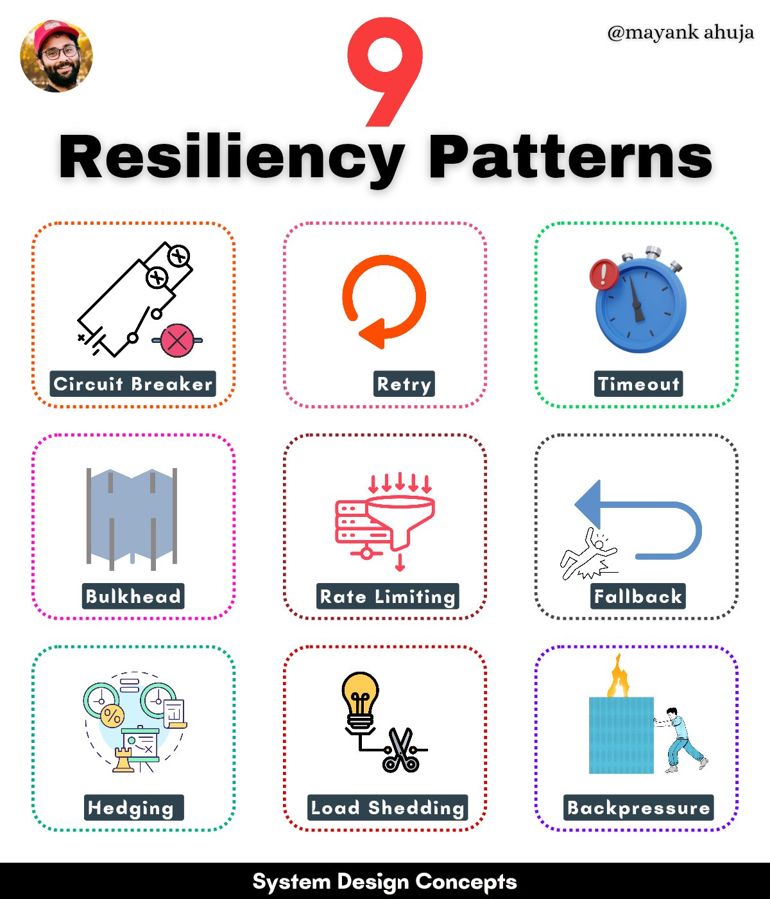

**Source:** [https://twitter.com/i/web/status/1883731027442778402](https://twitter.com/i/web/status/1883731027442778402)
**Original Post Date:** 2025-05-28 05:53:13

# Understanding Resiliency Patterns in System Design: A Comprehensive Guide

## Introduction
In modern distributed systems, resilience is crucial for maintaining service availability during failures. This article explores nine fundamental resiliency patterns that engineers can implement to build robust systems. These patterns are designed to handle various failure scenarios, from transient network issues to sustained system overload. Understanding these patterns enables developers to create more reliable and fault-tolerant applications.

## Failure Handling Patterns

The first group of patterns focuses on handling failures and transient issues effectively:

1. Circuit Breaker: Prevents cascading failures by stopping requests to failing services, allowing them time to recover.

2. Retry: Implements exponential backoff strategies for handling temporary failures with configurable maximum attempts and delay intervals.

_Basic implementation of a circuit breaker pattern with failure counting._

```java
public class CircuitBreaker {
    private int failureCount = 0;
    public boolean allowRequest() {
        return failureCount < 5;
    }
}
```

- Implement retry strategies using exponential backoff
- Set appropriate timeout values based on service latency
- Monitor circuit breaker metrics for optimization

## Load Management Patterns

These patterns focus on managing system load during peak times:

1. Rate Limiting: Controls incoming request rates to prevent system overload.

2. Load Shedding: Proactively drops non-critical requests during high traffic periods.

```python
@RateLimit(max_requests=100, time_window=60)
def handle_request():
    # Process request
    pass
```

## Isolation and Recovery Patterns

Patterns that ensure system isolation and provide fallback mechanisms:

1. Bulkhead: Isolates failures by partitioning resources into independent pools.

2. Fallback: Implements backup services or default behaviors for primary service failures.

## Key Takeaways

- Implement circuit breakers to prevent cascading failures in distributed systems
- Use rate limiting and load shedding together to manage peak traffic effectively
- Combine isolation patterns with fallback mechanisms for robust fault tolerance

## Conclusion
Resiliency patterns are essential tools for building reliable software systems. By understanding and properly implementing these nine patterns, engineers can create applications that gracefully handle failures and maintain service availability under various conditions.

## External References

- [Martin Fowler's Circuit Breaker Pattern](https://martinfowler.com/bliki/CircuitBreaker.html)
- [Netflix Hystrix Documentation](https://github.com/Netflix/Hystrix/wiki)


## Media

**Image Description:** The image is a visually organized infographic titled **"9 Resiliency Patterns"**, which focuses on system design concepts aimed at improving the resilience and reliability of software systems. The main subject of the image is the nine resiliency patterns, each represented by a distinct icon and label. Below is a detailed description of the image:

### **Header Section**
- **Title**: The title "9 Resiliency Patterns" is prominently displayed in bold black text at the top center of the image.
- **Number "9"**: A large red number "9" is placed above the title, emphasizing the count of patterns.
- **Profile Picture**: On the top left, there is a circular profile picture of a person wearing a red cap and glasses.
- **Username**: On the top right, the username **"@mayankankahuja"** is written in black text.

### **Main Body: Resiliency Patterns**
The nine resiliency patterns are arranged in a 3x3 grid, each pattern represented by an icon and a label. Below is a detailed breakdown of each pattern:

#### **Row 1**
1. **Circuit Breaker**
   - **Icon**: A circuit breaker symbol with a red "X" indicating a failure or interruption.
   - **Description**: This pattern prevents cascading failures by stopping requests to a service that is failing or unresponsive.
   - **Color**: Orange border with a dotted outline.

2. **Retry**
   - **Icon**: An orange circular arrow symbolizing a retry mechanism.
   - **Description**: This pattern involves retrying failed requests after a delay to handle transient failures.
   - **Color**: Pink border with a dotted outline.

3. **Timeout**
   - **Icon**: A stopwatch with a red exclamation mark, indicating a time limit.
   - **Description**: This pattern ensures that requests do not wait indefinitely for a response, setting a timeout limit.
   - **Color**: Green border with a dotted outline.

#### **Row 2**
4. **Bulkhead**
   - **Icon**: A ship's bulkhead (a vertical partition) symbolizing isolation.
   - **Description**: This pattern isolates failures by limiting the impact of a failure to a specific part of the system.
   - **Color**: Pink border with a dotted outline.

5. **Rate Limiting**
   - **Icon**: A funnel with downward arrows, indicating controlled flow.
   - **Description**: This pattern restricts the rate of requests to prevent overloading a service.
   - **Color**: Red border with a dotted outline.

6. **Fallback**
   - **Icon**: A person running away from a blue arrow, indicating a fallback mechanism.
   - **Description**: This pattern provides a backup plan or alternative action when the primary service fails.
   - **Color**: Black border with a dotted outline.

#### **Row 3**
7. **Hedging**
   - **Icon**: A combination of a clock, percentage, and a graph, indicating probabilistic decision-making.
   - **Description**: This pattern involves sending multiple requests to different services and using the first successful response.
   - **Color**: Green border with a dotted outline.

8. **Load Shedding**
   - **Icon**: A light bulb with a pair of scissors, symbolizing cutting down load.
   - **Description**: This pattern reduces the load on a system by dropping non-critical requests during high traffic.
   - **Color**: Red border with a dotted outline.

9. **Backpressure**
   - **Icon**: A person pushing against a building with fire coming out, indicating resistance to excessive load.
   - **Description**: This pattern manages load by signaling upstream systems to slow down when the system is overloaded.
   - **Color**: Purple border with a dotted outline.

### **Footer Section**
- **Text**: The footer contains the text **"System Design Design Design Concepts"** in black, repeated for emphasis.
- **Design**: The footer is a black horizontal bar at the bottom of the image.

### **Overall Design**
- **Icons**: Each pattern is represented by a simple, intuitive icon that visually conveys its meaning.
- **Colors**: Different colors are used for the borders of each pattern to distinguish them visually.
- **Layout**: The grid layout is clean and organized, making it easy to scan and understand the patterns.
- **Typography**: The text is clear and legible, with a mix of bold and regular fonts for emphasis.

### **Purpose**
The image serves as an educational tool to introduce and explain nine key resiliency patterns used in system design. These patterns are essential for building robust and fault-tolerant systems that can handle failures gracefully.

### **Summary**
The image is a well-structured infographic that effectively communicates the nine resiliency patterns using a combination of icons, labels, and colors. It is designed to be visually appealing and informative, making it easy for viewers to understand the concepts at a glance.
