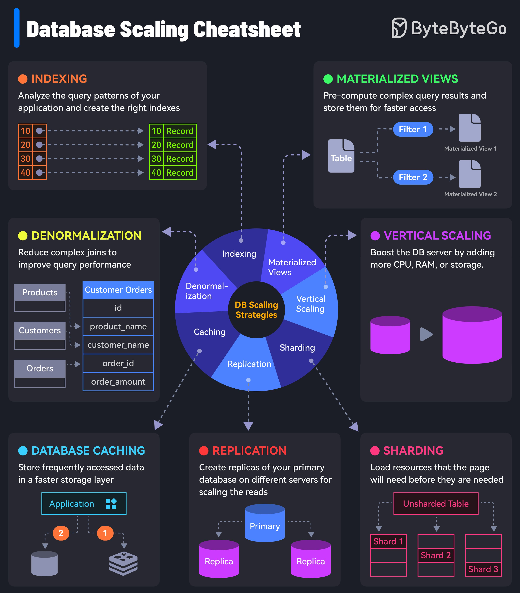

# Database Scaling Guide

## Description
A Quick Reference to Database Scaling...

## Content
A Quick Reference to Database Scaling

## Category Information

- Main Category: system_design
- Sub Category: scalability
- Item Name: database_scaling_guide

## Source

- Original Tweet: [https://twitter.com/i/web/status/1890270505716052419](https://twitter.com/i/web/status/1890270505716052419)
- Date: 2025-02-20 15:36:34

## Media

### Media 1

**Description:** The infographic, titled "Database Scaling Cheatsheet," presents a comprehensive guide to database scaling strategies. The title is displayed in white text at the top left corner of the image.

**Main Points:**

* **Indexing:** This section explains how indexing can be used to analyze query patterns and create optimal indexes for efficient data retrieval.
	+ Statistics: None provided
* **Materialized Views:** This section discusses materialized views as a pre-computed result set that can improve query performance by reducing the need for complex joins or calculations.
	+ Statistics: None provided
* **Denormalization:** This section highlights denormalization as a technique to reduce the number of joins required in queries, improving performance and simplifying data retrieval.
	+ Statistics: None provided
* **Vertical Scaling:** This section explains vertical scaling as a strategy to increase the power of existing hardware by adding more resources such as CPU, RAM, or storage.
	+ Statistics: None provided
* **Sharding:** This section discusses sharding as a technique to distribute data across multiple servers, improving scalability and performance.
	+ Statistics: None provided
* **Replication:** This section explains replication as a strategy to create copies of data on different servers for redundancy and high availability.
	+ Statistics: None provided
* **Caching:** This section highlights caching as a technique to store frequently accessed data in memory, reducing the need for disk I/O operations.
	+ Statistics: None provided

**Summary:**

The infographic provides a comprehensive overview of database scaling strategies, including indexing, materialized views, denormalization, vertical scaling, sharding, replication, and caching. Each section explains the concept and its benefits, making it a valuable resource for database administrators and developers looking to optimize their database performance.

*Last updated: 2025-02-20 15:36:34*