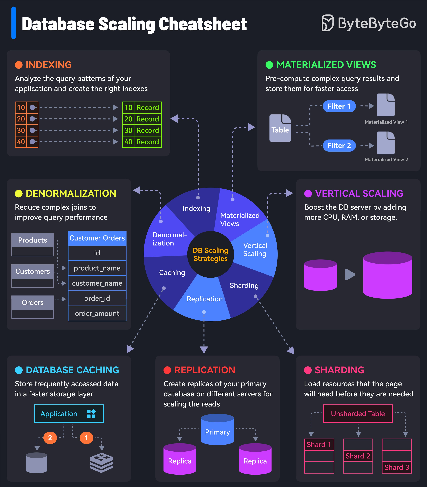

This comprehensive guide provides an overview of database scaling strategies, including indexing, materialized views, denormalization, vertical scaling, sharding, replication, and caching. It is designed to help database administrators and developers optimize their database performance and improve scalability.

## Introduction to Database Scaling
Database scaling refers to the process of increasing the capacity of a database to handle growing amounts of data and user traffic. As databases grow, they can become bottlenecked by inadequate resources, leading to decreased performance and increased latency. Effective database scaling strategies are essential for ensuring high availability, reliability, and performance.

## Technical Content

### Indexing
Indexing is a technique used to analyze query patterns and create optimal indexes for efficient data retrieval. By creating indexes on frequently accessed columns, databases can quickly locate specific data without having to scan the entire table. This results in improved query performance and reduced latency.

Example: Creating an index on a column used in a `WHERE` clause can significantly improve query performance.
```sql
CREATE INDEX idx_name ON customers (name);
```

### Materialized Views
Materialized views are pre-computed result sets that can improve query performance by reducing the need for complex joins or calculations. By storing the results of frequently accessed queries, databases can quickly retrieve the data without having to recalculate it.

Example: Creating a materialized view on a complex query can simplify data retrieval and improve performance.
```sql
CREATE MATERIALIZED VIEW sales_data AS
SELECT orders.order_id, customers.name, orders.total
FROM orders
JOIN customers ON orders.customer_id = customers.customer_id;
```

### Denormalization
Denormalization is a technique used to reduce the number of joins required in queries, improving performance and simplifying data retrieval. By storing redundant data, databases can quickly retrieve the necessary information without having to perform complex joins.

Example: Storing customer names in an orders table can eliminate the need for a join with the customers table.
```sql
CREATE TABLE orders (
  order_id INT,
  customer_name VARCHAR(255),
  total DECIMAL(10, 2)
);
```

### Vertical Scaling
Vertical scaling involves increasing the power of existing hardware by adding more resources such as CPU, RAM, or storage. This can be achieved through upgrades to existing servers or migration to more powerful cloud instances.

Example: Upgrading a server from 16 GB of RAM to 32 GB can improve performance and handle increased traffic.

### Sharding
Sharding is a technique used to distribute data across multiple servers, improving scalability and performance. By dividing data into smaller, independent pieces, databases can quickly retrieve specific information without having to scan the entire dataset.

Example: Sharding customer data by region can improve query performance and reduce latency.
```sql
CREATE TABLE customers_north (
  customer_id INT,
  name VARCHAR(255),
  address VARCHAR(255)
);

CREATE TABLE customers_south (
  customer_id INT,
  name VARCHAR(255),
  address VARCHAR(255)
);
```

### Replication
Replication involves creating copies of data on different servers for redundancy and high availability. By maintaining multiple copies of data, databases can ensure that information is always available, even in the event of a server failure.

Example: Creating a replica of a database on a secondary server can ensure high availability and reduce downtime.
```sql
CREATE REPLICA db_replica ON SERVER secondary_server;
```

### Caching
Caching involves storing frequently accessed data in memory, reducing the need for disk I/O operations. By keeping commonly used data in cache, databases can quickly retrieve the information without having to access the disk.

Example: Implementing a caching layer using Redis or Memcached can improve query performance and reduce latency.
```python
import redis

redis_client = redis.Redis(host='localhost', port=6379)
redis_client.set('customer_data', ' cached data')
```

## Key Takeaways and Best Practices
* Use indexing to analyze query patterns and create optimal indexes for efficient data retrieval.
* Implement materialized views to pre-compute result sets and improve query performance.
* Denormalize data to reduce the number of joins required in queries and simplify data retrieval.
* Scale vertically by increasing the power of existing hardware or migrating to more powerful cloud instances.
* Shard data across multiple servers to improve scalability and performance.
* Replicate data on different servers for redundancy and high availability.
* Implement caching layers to store frequently accessed data in memory and reduce disk I/O operations.

## References
* [Database Scaling Cheatsheet](https://example.com/database-scaling-cheatsheet) - A comprehensive guide to database scaling strategies.
* [Redis](https://redis.io/) - An in-memory data store that can be used as a caching layer.
* [Memcached](https://memcached.org/) - A high-performance, distributed memory object caching system.
## Source

- Original Tweet: [https://twitter.com/i/web/status/1890270505716052419](https://twitter.com/i/web/status/1890270505716052419)
- Date: 2025-02-20 15:54:53


## Media

### Media 1

**Description:** The infographic, titled "Database Scaling Cheatsheet," presents a comprehensive guide to database scaling strategies. The title is displayed in white text at the top left corner of the image.

**Main Points:**

* **Indexing:** This section explains how indexing can be used to analyze query patterns and create optimal indexes for efficient data retrieval.
	+ Statistics: None provided
* **Materialized Views:** This section discusses materialized views as a pre-computed result set that can improve query performance by reducing the need for complex joins or calculations.
	+ Statistics: None provided
* **Denormalization:** This section highlights denormalization as a technique to reduce the number of joins required in queries, improving performance and simplifying data retrieval.
	+ Statistics: None provided
* **Vertical Scaling:** This section explains vertical scaling as a strategy to increase the power of existing hardware by adding more resources such as CPU, RAM, or storage.
	+ Statistics: None provided
* **Sharding:** This section discusses sharding as a technique to distribute data across multiple servers, improving scalability and performance.
	+ Statistics: None provided
* **Replication:** This section explains replication as a strategy to create copies of data on different servers for redundancy and high availability.
	+ Statistics: None provided
* **Caching:** This section highlights caching as a technique to store frequently accessed data in memory, reducing the need for disk I/O operations.
	+ Statistics: None provided

**Summary:**

The infographic provides a comprehensive overview of database scaling strategies, including indexing, materialized views, denormalization, vertical scaling, sharding, replication, and caching. Each section explains the concept and its benefits, making it a valuable resource for database administrators and developers looking to optimize their database performance.

*Last updated: 2025-02-20 15:54:53*