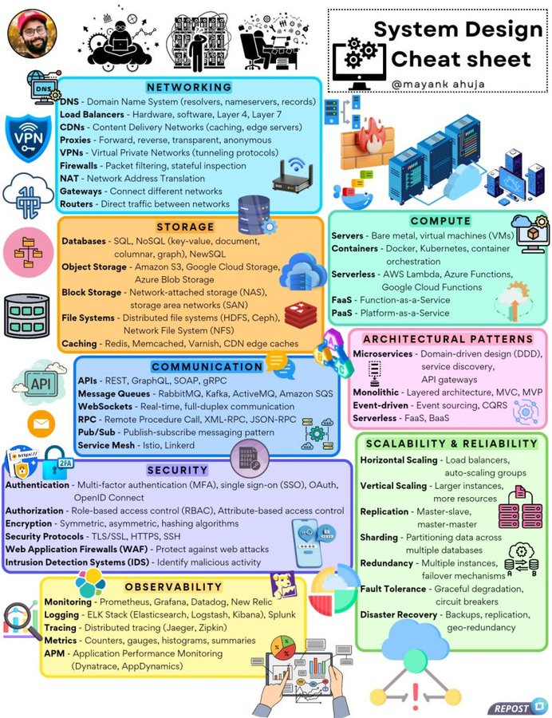

# system_design_cheat_sheet

**Tweet URL:** [https://x.com/techNmak/status/1880603063117070742](https://x.com/techNmak/status/1880603063117070742)

**Tweet Text:** My System Design Cheat Sheet. Enjoy!!

**Image 1 Description:** The image presents a comprehensive "System Design Cheat Sheet" by @mayank ahujaa, providing an overview of various system design concepts and technologies. The cheat sheet is organized into 17 sections, each with its own distinct color scheme and illustrations.

**Main Points:**

* **Networking**
	+ DNS
	+ Load Balancers
	+ CDNs
	+ Proxies
	+ VPNs
	+ Firewalls
	+ NAT
	+ Gateways
	+ Routers
* **Storage**
	+ Databases
	+ Object Storage
	+ Block Storage
	+ File Systems
	+ Caching
* **Compute**
	+ Servers
	+ Containers
	+ Serverless
	+ Function-as-a-Service
* **Communication**
	+ APIs
	+ Message Queues
	+ WebSockets
	+ RPC
	+ Pub/Sub
	+ Service Mesh
* **Security**
	+ Authentication
	+ Authorization
	+ Encryption
	+ Firewalls
	+ Intrusion Detection Systems
* **Observability**
	+ Monitoring
	+ Logging
	+ Tracing
	+ Metrics
* **Scalability and Reliability**
	+ Horizontal Scaling
	+ Vertical Scaling
	+ Replication
	+ Sharding
* **Disaster Recovery**

**Summary:**

The System Design Cheat Sheet provides a concise overview of various system design concepts and technologies, organized into 17 sections with distinct color schemes and illustrations. The cheat sheet covers topics such as networking, storage, compute, communication, security, observability, scalability and reliability, and disaster recovery, making it a valuable resource for system designers and developers.

