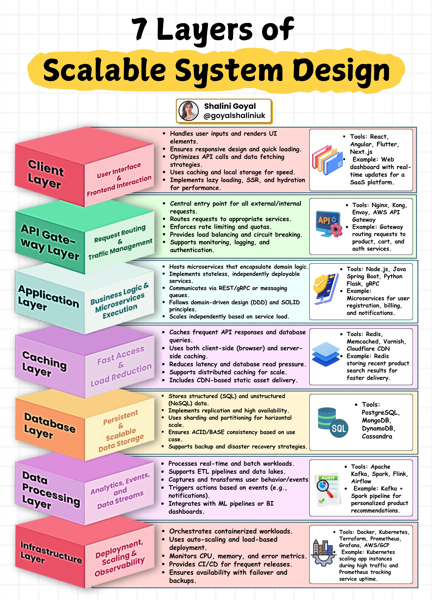

**Source:** [https://twitter.com/i/web/status/1911668241883439353](https://twitter.com/i/web/status/1911668241883439353)
**Original Post Date:** 2025-05-27 21:56:10

# The Seven Layers of Scalable System Design: A Comprehensive Architecture Guide

## Introduction
Building scalable software systems requires a systematic approach to architecture and component interaction. This knowledge base item presents the seven essential layers that form the foundation of modern scalable system design. Each layer addresses specific challenges in user experience, performance, data management, and operational efficiency. Understanding these layers is crucial for architects designing large-scale applications.

## Client Layer: User Interface & Frontend Interaction

The client layer serves as the first point of interaction between users and the system. It's responsible for rendering UI elements, handling user inputs, and optimizing API interactions.

Performance optimization is achieved through caching strategies, lazy loading, and server-side rendering.

- React: Popular choice for component-based interfaces
- Angular: Full-featured framework with strong typing
- Flutter: Cross-platform UI development

> **Note/Tip:** Implement Progressive Web App (PWA) capabilities for offline support and faster loading times.

## API Gateway Layer: Request Routing & Traffic Management

The API gateway acts as the central entry point, routing requests to appropriate services while enforcing security policies and rate limits.

Implement circuit breakers to prevent cascading failures during service outages.

```yaml
service:
  product-service:
    hosts:
      - products.example.com
    port:
      target: 8080
circuit_breaker:
  enabled: true
```

- Nginx: Traditional load balancing with extensive configuration options
- Envoy Proxy: Modern, cloud-native solution
- Kong Gateway: Extensible API management platform

## Database Layer: Persistent & Scalable Data Storage

The database layer manages both structured and unstructured data, implementing strategies for high availability and horizontal scaling.

Consider eventual consistency for distributed systems where strong consistency isn't critical.

- PostgreSQL: Robust relational database with advanced features
- MongoDB: Flexible NoSQL solution for document storage
- DynamoDB: Fully managed NoSQL service by AWS

## Infrastructure Layer: Deployment, Scaling & Observability

The infrastructure layer orchestrates containerized workloads and provides monitoring capabilities.

Implement CI/CD pipelines for continuous delivery of reliable services.

- Kubernetes: Container orchestration platform
- Terraform: Infrastructure as code tool
- Prometheus + Grafana: Monitoring stack

## Key Takeaways

- Layered architecture provides clear separation of concerns and enables independent scaling.
- Performance optimization at each layer contributes to overall system efficiency.
- Monitoring and observability are essential for maintaining system health.

## Conclusion
A well-designed scalable system leverages these seven layers in harmony. Each layer addresses specific challenges while contributing to the system's resilience, performance, and maintainability. Implementing best practices at each level ensures a robust foundation for growing applications.

## External References

- [AWS Well-Architected Framework](https://aws.amazon.com/architecture/well-architected/)
- [Kubernetes Documentation](https://kubernetes.io/docs/home/)


## Media

**Image Description:** The image is an infographic titled **"7 Layers of Scalable System Design"**, which provides a detailed breakdown of the architectural layers required to build a scalable and robust software system. The infographic is structured as a pyramid, with each layer representing a specific component of the system architecture. Below is a detailed description of each layer, focusing on the main subject and relevant technical details:

---

### **1. Client Layer (User Interface & Frontend Interaction)**
- **Description**: This layer handles user inputs and renders the user interface (UI) elements. It ensures responsive design, quick loading, and optimizes API calls and data fetching strategies.
- **Key Features**:
  - Handles user inputs and renders UI elements.
  - Ensures responsive design and quick loading.
  - Optimizes API calls and data fetching strategies.
  - Uses caching and local storage for speed.
  - Implements lazy loading, Server-Side Rendering (SSR), and hydration for performance.
- **Tools**:
  - React, Flutter, Angular, Next.js
- **Example**:
  - Web dashboard with real-time SaaS updates for a platform.

---

### **2. API Gateway Layer (Request Routing & Traffic Management)**
- **Description**: Acts as the central entry point for all external/internal requests. It routes requests to appropriate services, enforces rate limiting, and provides load balancing and circuit breaking.
- **Key Features**:
  - Central entry point for all external/internal requests.
  - Routes requests to appropriate services.
  - Enforces rate limiting and quotas.
  - Provides load balancing and circuit breaking.
  - Supports monitoring, logging, and authentication.
- **Tools**:
  - Nginx, Kong, Envoy, AWS API Gateway
- **Example**:
  - Gateway routing product requests to product, cart, and auth services.

---

### **3. Application Layer (Business Logic & Microservices Execution)**
- **Description**: Hosts microservices that encapsulate domain logic. Implements stateless, independently deployable services that communicate via REST/gRPC or messaging queues.
- **Key Features**:
  - Hosts microservices that encapsulate domain logic.
  - Implements stateless, independently deployable services.
  - Communicates via REST/gRPC or messaging queues.
  - Follows domain-driven design (DDD) and SOLID principles.
  - Scales independently based on service load.
- **Tools**:
  - Node.js, Java, Python, Spring Boot, gRPC, Flask
- **Example**:
  - Microservices for user registration, billing, and notifications.

---

### **4. Caching Layer (Fast Access & Load Reduction)**
- **Description**: Caches frequent API responses and database queries to reduce latency and database read pressure. Supports both client-side and server-side caching.
- **Key Features**:
  - Caches frequent API responses and database queries.
  - Uses both client-side (browser) and server-side caching.
  - Reduces latency and database read pressure.
  - Supports CDN-based static asset delivery.
- **Tools**:
  - Redis, Memcached, Varnish, Cloudflare CDN
- **Example**:
  - Redis for storing recent product search results.

---

### **5. Database Layer (Persistent & Scalable Data Storage)**
- **Description**: Stores structured (SQL) and unstructured (NoSQL) data. Implements replication, high availability, and sharding for scalability.
- **Key Features**:
  - Stores structured (SQL) and unstructured (NoSQL) data.
  - Implements replication and high availability.
  - Uses sharding for horizontal scaling.
  - Ensures ACID/BASE consistency based on use case.
  - Supports backup and disaster recovery strategies.
- **Tools**:
  - PostgreSQL, MongoDB, DynamoDB, Cassandra
- **Example**:
  - SQL database for transactional data, NoSQL for unstructured data.

---

### **6. Data Processing Layer (Analytics, Events, and Data Streams)**
- **Description**: Processes real-time pipelines and supports ETL (Extract, Transform, Load) workflows. Captures and transforms data streams, triggers actions, and integrates with ML and batch data workloads.
- **Key Features**:
  - Processes real-time pipelines.
  - Supports ETL and data transformations.
  - Captures and transforms data streams.
  - Triggers actions based on events (e.g., notifications).
  - Integrates with ML and batch data workloads.
- **Tools**:
  - Apache Kafka, Spark, Flink, Airflow
- **Example**:
  - Kafka + Spark pipeline for personalized product recommendations.

---

### **7. Infrastructure Layer (Deployment, Scaling & Observability)**
- **Description**: Orchestrates containerized workloads, ensures auto-scaling, and provides monitoring and observability for the system.
- **Key Features**:
  - Orchestrates containerized workloads.
  - Uses auto-scaling based on load.
  - Monitors CPU, memory, and error metrics.
  - Provides CI/CD for frequent releases.
  - Ensures availability with failover and backups.
- **Tools**:
  - Docker, Kubernetes, Terraform, Prometheus, Grafana
- **Example**:
  - Kubernetes for scaling high traffic app instances.

---

### **Additional Details**:
- **Visual Design**: The infographic uses a pyramid structure to represent the layers, with each layer represented by a colored cube. The colors help differentiate the layers visually.
- **Author Information**: The infographic is credited to **Shalini Goyal** (@goyalsshaliniuk).
- **Icons and Examples**: Each layer includes relevant icons and examples to illustrate the tools and use cases.
- **Focus on Scalability**: The entire design emphasizes scalability, performance, and robustness, making it suitable for building large-scale systems.

---

This infographic serves as a comprehensive guide for designing scalable systems, covering all essential architectural layers and their technical details.
