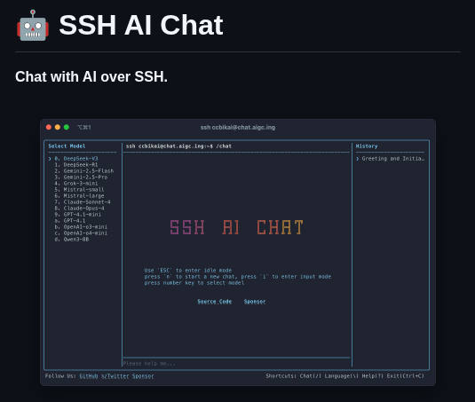

**Source:** [https://twitter.com/i/web/status/1941292365009813911](https://twitter.com/i/web/status/1941292365009813911)
**Original Post Date:** 2025-07-14 20:54:30

# SSH AI Chat: Command Execution in Terminal-Based AI Interaction

## Introduction
The SSH AI Chat application is a terminal-based interface designed for communicating with AI models over an SSH connection. This tool provides users with a robust environment to interact with multiple AI models, including DeepSeek-GPT-3, Claude-4, and GPT-4, among others. The interface is structured into distinct sections for model selection, chat interaction, and history tracking, making it user-friendly for command-line environments.

## Interface Overview

The SSH AI Chat interface is displayed in a terminal window with a dark background and light text. The main components include the title, model selection panel, chat interface, history panel, instructions, shortcuts, and a footer prompt.

The title 'SSH AI Chat' is prominently displayed at the top, followed by a brief description indicating its primary function: chatting with AI over SSH.

- Title and Description: The top section includes the title 'SSH AI Chat' and a brief description.
- Terminal Window: Central part of the interface showing command-line interaction.
- Left Panel (Model Selection): Lists available AI models for selection.
- Middle Panel (Chat Interface): Displays active chat sessions with selected AI models.
- Right Panel (History): Shows history of interactions.
- Instructions and Shortcuts: Provides navigation commands and shortcuts.

## Model Selection

The left panel lists various AI models available for selection. Models include DeepSeek-GPT-3, Claude-4, GPT-4, and others. Users can select a model by pressing the corresponding number key.

- DeepSeek-GPT-3
- DeepSeek-GPT-3.5
- Claude-3
- Claude-3.5
- Claude-4
- GPT-4
- GPT-3.5
- GPT-2
- GPT-1
- Qwen-1
- Qwen-2
- Qwen-2-pk
- Qwen-2-pk-mini
- Qwen-2-pk-mini-08

## Chat Interface and Interaction

The middle panel displays the active chat session with the selected AI model. The prompt '> /chat' indicates that the user is in chat mode, and a placeholder message 'SSH AI CHAT' suggests an idle or loading state.

Users can navigate between different modes using specific commands: 'ESC' to enter idle mode, 'I' to enter input mode, and number keys to select models.

> **Note/Tip:** Ensure that the SSH connection is stable for seamless interaction with AI models.

> **Note/Tip:** Familiarize yourself with the available shortcuts to enhance efficiency in navigating the interface.

## Technical Details

The application integrates SSH for secure and remote communication. It supports multiple AI models, allowing users to interact with various large language models.

The terminal-based design is suitable for environments where graphical user interfaces are not available or preferred.

- SSH Integration: Secure and remote communication over SSH connections.
- AI Model Compatibility: Supports multiple AI models including DeepSeek, Claude, GPT, and Qwen.
- Interactive Modes: Supports idle, chat, and input modes for enhanced user interaction.

## Visual Design

The interface uses a dark background with light text for better readability. The layout is clean and organized, with distinct sections for model selection, chat, and history.

Typography is monospaced, consistent with terminal interfaces.

## Key Takeaways

- SSH AI Chat provides a robust interface for interacting with AI models over SSH connections.
- The application supports multiple AI models, including DeepSeek-GPT-3 and GPT-4.
- Users can navigate between different modes using specific commands like 'ESC' and 'I'.
- The terminal-based design is suitable for environments without graphical user interfaces.

## Conclusion
In summary, the SSH AI Chat application offers a comprehensive and user-friendly interface for interacting with various AI models over an SSH connection. Its well-organized layout, support for multiple AI models, and interactive modes make it a versatile tool for command-line environments.

## External References

- [SSH: Secure Shell](https://www.ssh.com/academy/ssh)
- [AI Models Overview](https://lilianweng.github.io/lil-log/2021/01/19/a-guide-to-deployment-of-machine-learning-models-in-production.html)

## Media

**Image Description:** The image depicts a terminal-based interface for an SSH AI chat application, titled **"SSH AI Chat"**. The interface is designed to facilitate communication with AI models over an SSH connection. Below is a detailed breakdown of the image:

### **Main Subject**
The main subject of the image is the **SSH AI Chat interface**, which is displayed in a terminal window. The interface is structured into several sections, each serving a specific purpose in the chat experience.

---

### **Key Components**

1. **Title and Description**:
   - At the top of the image, the title **"SSH AI Chat"** is prominently displayed in bold white text.
   - Below the title, a brief description reads: **"Chat with AI over SSH."** This indicates the primary function of the application.

2. **Terminal Window**:
   - The terminal window is the central part of the image, showing a command-line interface with a dark background and light text.
   - The terminal is divided into several sections:
     - **Left Panel (Model Selection)**:
       - Lists various AI models available for selection. The models are numbered and include:
         - DeepSeek-GPT-3
         - DeepSeek-GPT-3.5
         - Claude-3
         - Claude-3.5
         - Claude-4
         - GPT-4
         - GPT-3.5
         - GPT-2
         - GPT-1
         - Qwen-1
         - Qwen-2
         - Qwen-2-pk
         - Qwen-2-pk-mini
         - Qwen-2-pk-mini-08
       - Users can select a model by pressing the corresponding number.
     - **Middle Panel (Chat Interface)**:
       - Displays the active chat session with the selected AI model.
       - The prompt **"> /chat"** is visible, indicating the user is in the chat mode.
       - The session appears to be in progress, with a placeholder message **"SSH AI CHAT"** in the center, suggesting a loading or idle state.
     - **Right Panel (History)**:
       - Shows a history of interactions, with the first entry labeled **"Greeting and Initial..."**, indicating the start of the conversation.

3. **Instructions**:
   - Below the terminal window, there are instructions for interacting with the chat:
     - **"Use 'ESC' to enter idle mode"**: This allows users to exit the chat mode.
     - **"Print 'ESC' to start chat mode, press 'I' to enter input mode"**: These commands help users navigate between different modes.
     - **"Press number key to select model"**: Users can choose a model by pressing the corresponding number.

4. **Shortcuts**:
   - At the bottom of the image, a list of shortcuts is provided:
     - **Chat**: Likely to initiate or resume a chat session.
     - **Language**: To switch or configure the language of the chat.
     - **Twitter**: Possibly to share or integrate with Twitter.
     - **Help**: To access help or documentation.
     - **Exit**: To close the application.

5. **Footer**:
   - At the very bottom, there is a prompt that says **"Please help me..."**, indicating that the user can type their query or request.

---

### **Technical Details**
- **SSH Integration**: The interface is designed to work over an SSH connection, as indicated by the title and the terminal-based design.
- **AI Model Selection**: The application supports multiple AI models, including those from DeepSeek, Claude, GPT, and Qwen, showcasing compatibility with various large language models.
- **Interactive Mode**: The interface supports multiple modes (idle, chat, input) to enhance user interaction.
- **Command-Line Interface (CLI)**: The design is purely text-based, making it suitable for environments where graphical user interfaces (GUIs) are not available or preferred.

---

### **Visual Design**
- **Color Scheme**: The terminal uses a dark background with light text, typical of many terminal applications for better readability.
- **Typography**: The text is monospaced, consistent with terminal interfaces.
- **Layout**: The layout is clean and organized, with distinct sections for model selection, chat, and history.

---

### **Overall Impression**
The image portrays a robust and versatile SSH-based AI chat application. It emphasizes functionality and ease of use, catering to users familiar with command-line environments. The inclusion of multiple AI models and clear instructions suggests a flexible and user-friendly tool for interacting with AI over SSH.
