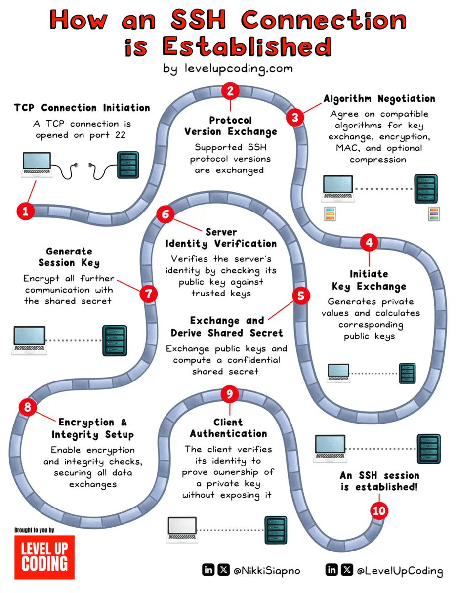

**Source:** [https://twitter.com/i/web/status/1868533790915915879](https://twitter.com/i/web/status/1868533790915915879)
**Original Post Date:** 2025-05-28 03:15:02

# SSH Connection Establishment: A Technical Deep Dive into Secure Shell Protocol

## Introduction
Secure Shell (SSH) protocol is fundamental in modern computing for enabling encrypted communication over unsecured networks. This deep dive explores the intricate process of establishing a secure SSH connection, breaking down each critical phase from initial network handshake through key exchange and authentication. Understanding this sequence provides essential insights into cryptographic protocols, security mechanisms, and practical implementation considerations.

## Initial Connection Establishment

The process begins with a TCP connection on port 22 (default SSH port). This network-level handshake establishes the foundation for all subsequent secure communication steps. The client initiates the connection, and upon successful establishment, prepares to exchange protocol versions.

During this phase, basic network parameters are negotiated, including maximum packet sizes and window sizes, which affect performance characteristics of the connection.

1. TCP handshake (SYN, SYN-ACK, ACK)
1. Port 22 establishment for SSH traffic
1. Network parameter negotiation

## Protocol Negotiation and Key Exchange

The next critical phase involves protocol version exchange and algorithm negotiation. Client and server communicate supported versions (e.g., 2.0) to ensure compatibility. This is followed by cryptographic algorithm selection, including key exchange algorithms (like Diffie-Hellman), MAC algorithms for data integrity, and encryption methods.

Key exchange using asymmetric cryptography establishes a shared secret without exposing it during transmission, providing forward secrecy.

```bash
# Example of key exchange process
ssh -vvv user@server # Verbose output shows protocol negotiation
```

## Authentication and Session Setup

The final phases involve server identity verification, session key generation, and client authentication. The server's public key is checked against known hosts to prevent man-in-the-middle attacks. A session key derived from the shared secret secures all subsequent communication.

Client authentication typically uses private keys, providing strong security compared to password-based methods.

- Server key fingerprint verification
- Session key derivation from shared secret
- Public-private key pair exchange

> **Note/Tip:** Always verify server fingerprints to prevent MITM attacks

> **Note/Tip:** Use strong keys and proper permissions for authentication files

## Key Takeaways

- SSH establishes a secure connection through multiple layers of encryption and authentication.
- Protocol negotiation ensures compatibility while maintaining security standards.
- Asymmetric cryptography provides forward secrecy in key exchange.
- Server verification is crucial to prevent man-in-the-middle attacks.

## Conclusion
Understanding the SSH connection establishment process is essential for securing network communications. This knowledge enables proper implementation of secure protocols, troubleshooting connection issues, and maintaining robust security practices in distributed systems.

## External References

- [RFC 4253: Secure Shell (SSH) Transport Layer Protocol](https://tools.ietf.org/html/rfc4253)
- [Original Infographic Source - levelupcoding.com](https://levelupcoding.com/ssh-connection-establishment/)


## Media

**Image Description:** ### Description of the Image

The image is an infographic titled **"How an SSH Connection is Established"** by **levelupcoding.com**. It provides a step-by-step visual explanation of the process involved in establishing a secure SSH (Secure Shell) connection. The infographic uses a circular flowchart with numbered steps (1 to 10) to illustrate the sequence of events. Each step is accompanied by a brief description and relevant icons or diagrams. Below is a detailed breakdown of the image:

---

### **Main Subject: SSH Connection Establishment Process**

The infographic explains the process of establishing a secure SSH connection between a client and a server. The steps are organized in a circular flowchart, with each step building upon the previous one to ensure a secure and authenticated connection.

---

### **Step-by-Step Breakdown**

#### **1. TCP Connection Connection Initiation**
- **Description**: A TCP connection is opened on port 22 (the default port for SSH).
- **Icon**: A laptop (client) and a server are shown connected via a cable.
- **Technical Detail**: This is the initial network-level connection setup using TCP/IP protocols.

#### **2. Protocol Version Exchange**
- **Description**: The client and server exchange supported SSH protocol versions.
- **Icon**: A laptop and server are shown exchanging data.
- **Technical Detail**: This step ensures compatibility between the client and server regarding the SSH protocol version.

#### **3. Algorithm Negotiation**
- **Description**: The client and server agree on compatible algorithms for key exchange, MAC, encryption, and optional compression.
- **Icon**: A laptop and server are shown exchanging data.
- **Technical Detail**: This step involves selecting cryptographic algorithms to ensure secure communication.

#### **4. Key Exchange**
- **Description**: The client and server generate private-public key pairs and exchange public keys.
- **Icon**: A laptop and server are shown exchanging keys.
- **Technical Detail**: This step uses asymmetric cryptography to establish a shared secret.

#### **5. Shared Secret Derivation**
- **Description**: The client and server compute a shared secret using the exchanged public keys.
- **Icon**: A laptop and server are shown exchanging data.
- **Technical Detail**: This step involves cryptographic computations to derive a shared secret, which is used for further encryption.

#### **6. Server Identity Verification**
- **Description**: The client verifies the server's identity by checking its public key against trusted keys.
- **Icon**: A laptop and server are shown exchanging data.
- **Technical Detail**: This step ensures the server is authentic and not a man-in-the-middle attacker.

#### **7. Session Key Generation**
- **Description**: The client generates a session key using the shared secret.
- **Icon**: A laptop is shown generating a key.
- **Technical Detail**: The session key is used to encrypt all further communication.

#### **8. Encryption & Integrity Setup**
- **Description**: The client enables encryption and integrity checks to secure data exchanges.
- **Icon**: A laptop and server are shown exchanging encrypted data.
- **Technical Detail**: This step ensures data confidentiality and integrity during the session.

#### **9. Client Authentication**
- **Description**: The client proves its identity to the server using a private key.
- **Icon**: A laptop and server are shown exchanging data.
- **Technical Detail**: This step involves the client authenticating itself to the server, often using public-key authentication.

#### **10. SSH Session Establishment**
- **Description**: The SSH session is established securely.
- **Icon**: A laptop and server are shown connected with a secure link.
- **Technical Detail**: At this point, a secure and authenticated SSH session is ready for use.

---

### **Visual Elements**
- **Circular Flowchart**: The steps are arranged in a circular path, emphasizing the sequential nature of the process.
- **Numbered Steps**: Each step is clearly numbered (1 to 10) for easy reference.
- **Icons and Diagrams**: Simple icons (e.g., laptops, servers, keys) are used to illustrate each step.
- **Text Descriptions**: Brief descriptions accompany each step to explain the technical details.

---

### **Additional Details**
- **Title**: The title is prominently displayed at the top in bold red text.
- **Source Attribution**: The infographic is credited to **levelupcoding.com**.
- **Social Media Handles**: Social media links for **@NikkiSiapno** and **@LevelUpCoding** are included at the bottom.
- **Color Scheme**: The infographic uses a clean white background with blue and red accents for clarity.

---

### **Purpose**
The infographic serves as an educational tool to help readers understand the technical process of establishing an SSH connection. It breaks down complex cryptographic and networking concepts into digestible steps, making it accessible for both beginners and experienced users.

---

This detailed description covers the main subject and technical details of the image, ensuring clarity and comprehensiveness.
