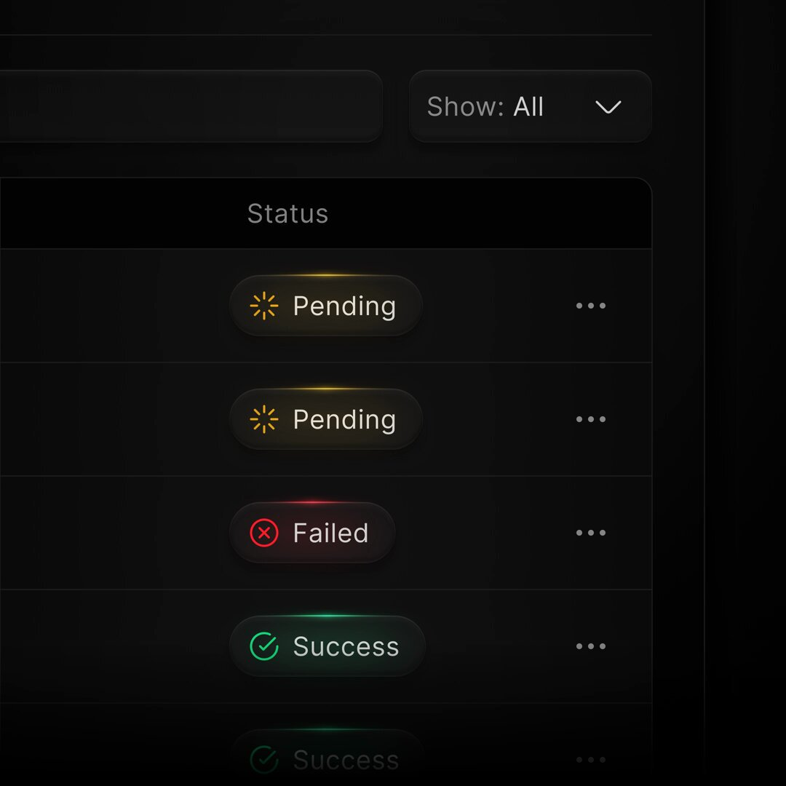

**Source:** [https://twitter.com/i/web/status/1941100364574687440](https://twitter.com/i/web/status/1941100364574687440)
**Original Post Date:** 2025-07-14 20:41:12

# UI Status Indicators Design: A Comprehensive Guide

## Introduction
Status indicators are crucial components in user interfaces (UIs) as they provide users with immediate feedback on the state of various processes or tasks. This knowledge base item delves into the design and functionality of a specific set of status indicators, focusing on their visual representation, interactive elements, and technical details.

## Status Indicators Overview

The image depicts a user interface with a dark theme, showcasing a section labeled 'Status'. This section displays a list of status indicators representing different states: Pending (Yellow), Failed (Red), and Success (Green). Each status indicator is represented by a rounded rectangular button with an icon and text.

The design is clean and modern, with clear visual cues to differentiate between the various statuses. The use of rounded buttons and icons enhances the user experience by providing intuitive feedback.

- Pending (Yellow): Two instances represented by a yellow sunburst icon.
- Failed (Red): One instance represented by a red cross icon.
- Success (Green): Two instances represented by a green checkmark icon.

> **Note/Tip:** Color coding is essential for quickly conveying the status of tasks or processes.

> **Note/Tip:** Icons should be universally recognizable to ensure clarity across different user bases.

## Header Section and Filtering

At the top of the image, there is a header section with a dark background. On the left side, there is a placeholder or empty space, possibly for additional controls or titles.

On the right side, there is a dropdown menu labeled 'Show: All', which allows users to filter or change the view of the statuses displayed.

- The header section provides context and additional controls for managing the status indicators.
- The dropdown menu enhances user experience by allowing customization of the displayed information.

## Design and Layout Principles

The overall design is modern and user-friendly, with a dark theme that enhances readability. The use of contrasting colors (yellow, red, green) helps users quickly identify the status of tasks.

Each status indicator includes three vertical dots (…), suggesting additional options or actions that can be performed on each status.

> **Note/Tip:** Consistent design elements across different statuses improve usability and reduce cognitive load for users.

> **Note/Tip:** Interactive elements like the vertical dots should be clearly visible but not overpowering to maintain a clean interface.

## Technical Details

Color coding is used to differentiate between various statuses: yellow for Pending, red for Failed, and green for Success.

Icons are chosen based on their universal recognition: sunburst for loading, cross for failure, and checkmark for success.

The dropdown menu allows users to filter the displayed statuses, providing a more personalized view.

- Color coding enhances visual differentiation between statuses.
- Icons provide immediate feedback on task states.
- Dropdown menus improve user customization and control over the displayed information.

## Overall Impression

The image depicts a status monitoring interface, likely used in task management or system monitoring applications. The design is intuitive and visually appealing.

The inclusion of interactive elements like the vertical dots suggests a focus on user interaction and control.

## Conclusion
In conclusion, the design of status indicators plays a crucial role in modern applications. By using clear visual cues, color coding, and interactive elements, developers can create intuitive and user-friendly interfaces that provide immediate feedback on task states.

## External References

- [Google Material Design Guidelines](https://material.io/design)
- [Apple Human Interface Guidelines](https://developer.apple.com/design/)

## Media

**Image Description:** The image shows a user interface with a dark theme, likely from a software application or a dashboard. The main focus is on a section labeled **"Status"**, which displays a list of status indicators. Here is a detailed breakdown:

### **Main Subject: Status Indicators**
1. **Pending (Yellow)**
   - There are two instances of the "Pending" status.
   - Each "Pending" indicator is represented by a rounded rectangular button with a **yellow background** and a **yellow sunburst icon** (indicating loading or in-progress status).
   - The text **"Pending"** is displayed in white, aligned to the right of the icon.
   - To the right of each "Pending" button, there are three vertical dots (**...**), likely representing a menu or options for further actions.

2. **Failed (Red)**
   - There is one instance of the "Failed" status.
   - The "Failed" indicator is represented by a rounded rectangular button with a **red background** and a **red cross icon** (indicating an error or failure).
   - The text **"Failed"** is displayed in white, aligned to the right of the icon.
   - Similar to the "Pending" indicators, there are three vertical dots (**...**) to the right, suggesting additional options.

3. **Success (Green)**
   - There are two instances of the "Success" status.
   - Each "Success" indicator is represented by a rounded rectangular button with a **green background** and a **green checkmark icon** (indicating a successful operation).
   - The text **"Success"** is displayed in white, aligned to the right of the icon.
   - As with the other statuses, there are three vertical dots (**...**) to the right, likely for additional options.

### **Header Section**
- At the top of the image, there is a section with a dark background.
  - On the left side, there is a placeholder or empty space, possibly for a title or additional controls.
  - On the right side, there is a dropdown menu labeled **"Show: All"** with a downward arrow, indicating that the user can filter or change the view of the statuses.

### **Design and Layout**
- The overall design is clean and modern, with a dark theme and contrasting colors (yellow, red, green) to visually differentiate the statuses.
- The use of rounded buttons and icons provides a sleek and user-friendly interface.
- The vertical dots (**...**) next to each status suggest interactivity, allowing users to access more details or perform actions related to each status.

### **Technical Details**
- **Color Coding**: 
  - **Yellow** for "Pending" indicates an in-progress or loading state.
  - **Red** for "Failed" indicates an error or unsuccessful operation.
  - **Green** for "Success" indicates a completed and successful operation.
- **Icons**: 
  - Sunburst icon for "Pending" suggests loading or waiting.
  - Cross icon for "Failed" suggests an error or failure.
  - Checkmark icon for "Success" suggests completion.
- **Dropdown Menu**: The "Show: All" dropdown likely allows users to filter the statuses displayed (e.g., show only "Pending," "Failed," or "Success").

### **Overall Impression**
The image depicts a status monitoring interface, likely used in a task management, workflow, or system monitoring application. The design is intuitive, with clear visual cues for different statuses, and the inclusion of options (via the vertical dots) suggests a focus on user interaction and control. The dark theme enhances readability and provides a modern aesthetic.
