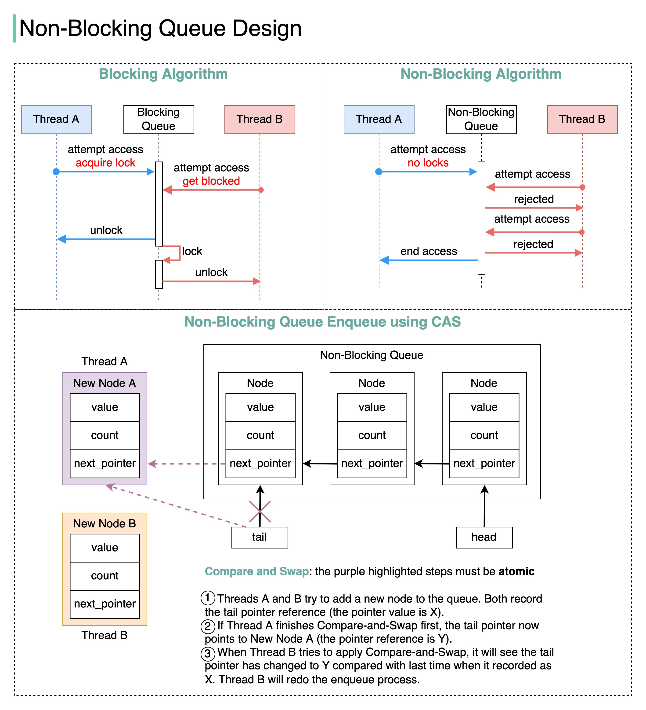

**Source:** [https://twitter.com/i/web/status/1869694441549676982](https://twitter.com/i/web/status/1869694441549676982)
**Original Post Date:** 2025-05-27 16:33:03

# Blocking vs Non-Blocking Queue Designs: Implementing CAS-Based Synchronization

## Introduction
Thread-safe queue implementations are fundamental to concurrent programming systems. This article examines two key approaches - blocking queues using explicit locks and non-blocking queues utilizing atomic operations like Compare-and-Swap (CAS). Understanding these designs is crucial for building efficient, scalable concurrent applications that handle high throughput without unnecessary contention.

## Blocking Queue Design

A blocking queue uses explicit locking mechanisms to ensure mutual exclusion. When a thread attempts to access the queue, it first acquires an exclusive lock (mutex or semaphore). If the queue is locked by another thread, subsequent threads are forced into a blocked state until the lock is released.

This approach guarantees thread safety but introduces potential deadlocks and reduced throughput due to waiting times.

```java
public synchronized void enqueue(T item) {
    while (isFull()) { wait(); }
    queue.add(item);
    notifyAll();
}
```

## Non-Blocking Queue Design with CAS

The non-blocking approach eliminates explicit locks by using atomic operations. Threads attempt operations and retry on failure, reducing contention but requiring careful handling of retries.

Using CAS operations ensures thread-safe updates without blocking other threads, making it ideal for high-concurrency scenarios.

```cpp
bool enqueue(T item) {
    Node* newNode = new Node(item);
    while (true) {
        Node* tail = this->tail;
        Node* next = tail->next;
        if (tail == this->tail) {
            if (next == nullptr) {
                if (CAS(tail->next, nullptr, newNode)) {
                    CAS(this->tail, tail, newNode);
                    return true;
                }
            } else {
                CAS(this->tail, tail, next);
            }
        }
    }
}
```

- Atomic operations ensure thread safety without locks
- Retry mechanism handles concurrent access attempts
- No waiting state for threads on failure

## Implementation Considerations

Visual representation of the queue structure using head and tail pointers is crucial. The CAS operation relies on comparing expected values with current states before performing updates.

Color coding (blue for Thread A, red for Thread B) clearly illustrates thread interactions in the queue.

> **Note/Tip:** Ensure proper memory ordering when implementing atomic operations

> **Note/Tip:** Monitor retry count to prevent infinite loops

> **Note/Tip:** Consider system load when choosing between blocking and non-blocking approaches

## Key Takeaways

- Blocking queues provide simplicity but introduce potential deadlocks and reduced throughput
- Non-blocking queues using CAS offer better scalability at the cost of increased complexity
- The choice between designs depends on specific use cases, with non-blocking preferred in high-concurrency scenarios

## Conclusion
Understanding both blocking and non-blocking queue implementations is essential for designing efficient concurrent systems. While blocking queues offer simplicity, non-blocking approaches using CAS provide better scalability in highly concurrent environments. The trade-off lies between implementation complexity and system throughput.

## External References

- [The Art of Multiprocessor Programming](https://www.amazon.com/Art-Multiprocessor-Programming-Revised-Edition/dp/0123973374)
- [Java Concurrency in Practice](https://www.oreilly.com/library/view/java-concurrency-in/0321349601/)


## Media

**Image Description:** The image is a detailed diagram comparing **Blocking Queue** and **Non-Blocking Queue** designs, with a focus on their behavior in a multi-threaded environment. It also explains the implementation of a **Non-Blocking Queue** using the **Compare-and-Swap (CAS)** operation. Below is a detailed breakdown:

---

### **1. Title and Overview**
The title of the image is **"Non-Blocking Queue Queue Design Design"**, which appears to be a repetition but focuses on the design of a non-blocking queue. The diagram is divided into two main sections:
- **Blocking Algorithm**
- **Non-Blocking Algorithm**

Additionally, there is a detailed explanation of **Non-Blocking Queue Enqueue using CAS**.

---

### **2. Blocking Algorithm Section**
This section illustrates the behavior of a **Blocking Queue** in a multi-threaded environment.

#### **Key Components:**
- **Thread A** and **Thread B**: Two threads attempting to access the queue.
- **Blocking Queue**: The shared resource being accessed.

#### **Sequence of Events:**
1. **Thread A attempts access**:
   - Thread A attempts to access the queue.
   - It **acquires a lock** on the queue, preventing other threads from accessing it.
2. **Thread B attempts access**:
   - Thread B also attempts to access the queue.
   - Since the queue is locked by Thread A, Thread B is **blocked** and must wait.
3. **Thread A unlocks the queue**:
   - After Thread A finishes its operation, it **releases the lock**.
   - Thread B can now proceed to access the queue.

#### **Key Observations:**
- The blocking queue uses explicit locking (e.g., mutex or semaphore) to ensure mutual exclusion.
- Thread B is forced to wait (block) until Thread A releases the lock.

---

### **3. Non-Blocking Algorithm Section**
This section illustrates the behavior of a **Non-Blocking Queue** in a multi-threaded environment.

#### **Key Components:**
- **Thread A** and **Thread B**: Two threads attempting to access the queue.
- **Non-Blocking Queue**: The shared resource being accessed.

#### **Sequence of Events:**
1. **Thread A attempts access**:
   - Thread A attempts to access the queue.
   - Since there are **no locks**, Thread A proceeds without blocking.
2. **Thread B attempts access**:
   - Thread B also attempts to access the queue.
   - If the queue is already being accessed by Thread A, Thread B is **rejected** and must retry.
3. **Thread A ends access**:
   - After Thread A finishes its operation, it releases the queue.
   - Thread B can now retry accessing the queue.

#### **Key Observations:**
- The non-blocking queue avoids explicit locking.
- Instead of blocking, threads are rejected and must retry, which can lead to reduced contention but may require additional retries.

---

### **4. Non-Blocking Queue Enqueue using CAS**
This section provides a detailed explanation of how a **Non-Blocking Queue** can be implemented using the **Compare-and-Swap (CAS)** operation.

#### **Key Components:**
- **Thread A** and **Thread B**: Two threads attempting to enqueue nodes into the queue.
- **Non-Blocking Queue**: The shared queue structure.
- **New Node A** and **New Node B**: Nodes being enqueued by Thread A and Thread B, respectively.
- **head** and **tail**: Pointers to the front and back of the queue.
- **CAS Operation**: A atomic operation used to ensure thread-safe updates.

#### **Detailed Steps:**
1. **Initial State**:
   - The queue has existing nodes, and the **tail** pointer points to the last node in the queue.
   - Both Thread A and Thread B attempt to enqueue new nodes (New Node A and New Node B).

2. **Thread A's Operation**:
   - Thread A records the current value of the **tail** pointer (let's say it is `X`).
   - Thread A uses the **CAS** operation to attempt to update the **tail** pointer to point to New Node A.
   - If the **CAS** operation succeeds, the **tail** pointer is updated to point to New Node A, and the operation completes.

3. **Thread B's Operation**:
   - Thread B also records the current value of the **tail** pointer (which is `X` at this point).
   - Thread B attempts to use the **CAS** operation to update the **tail** pointer to point to New Node B.
   - However, by the time Thread B performs the **CAS** operation, the **tail** pointer has already been updated by Thread A to point to New Node A (now `Y`).
   - Since the recorded value (`X`) does not match the current value (`Y`), the **CAS** operation fails for Thread B.

4. **Retry by Thread B**:
   - Thread B detects the failure of the **CAS** operation and retries the process.
   - It re-records the current value of the **tail** pointer (now `Y`) and attempts the **CAS** operation again.

#### **Key Observations:**
- The **CAS** operation ensures atomicity, preventing race conditions.
- If the **CAS** operation fails, the thread must retry, which is a key characteristic of non-blocking algorithms.
- The **tail** pointer is updated only when the **CAS** operation succeeds, ensuring consistency.

---

### **5. Summary of CAS Steps**
The diagram explicitly highlights the steps involved in the **CAS** operation:
1. **Record the current value of the tail pointer**.
2. **Attempt to update the tail pointer using CAS**.
3. **If CAS fails, retry the process**.

---

### **6. Visual Elements**
- **Color Coding**:
  - **Blue**: Represents actions performed by Thread A.
  - **Red**: Represents actions performed by Thread B.
  - **Purple**: Highlights the atomic steps in the CAS operation.
- **Arrows and Dashed Lines**: Indicate the flow of operations and retries.
- **Nodes and Pointers**: Clearly illustrate the structure of the queue and the movement of pointers.

---

### **Conclusion**
The image provides a comprehensive comparison between **Blocking Queues** and **Non-Blocking Queues**, with a detailed explanation of how a Non-Blocking Queue can be implemented using the **CAS** operation. The use of atomic operations ensures thread safety without the need for explicit locks, although it may require retries in some cases. This design is particularly useful in high-concurrency environments where minimizing blocking is critical.
