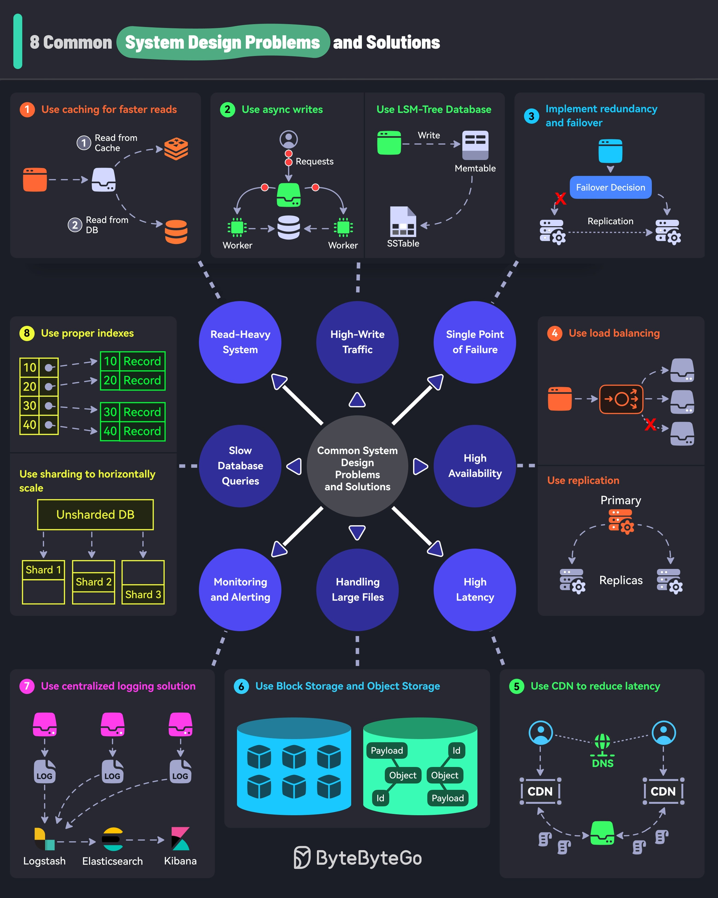

**Source:** [https://twitter.com/i/web/status/1869613641097756741](https://twitter.com/i/web/status/1869613641097756741)
**Original Post Date:** 2025-05-27 16:54:29

# Common System Design Challenges: Scalable Solutions for Modern Architecture

## Introduction
System design challenges are fundamental obstacles in building scalable software architectures. This knowledge base addresses eight common problems faced by engineers and provides practical solutions used in production environments.

From handling massive traffic loads to ensuring system reliability, each challenge is paired with a battle-tested solution that has been implemented across various high-traffic applications.

## Read-Heavy Systems: Optimizing Read Performance

Systems dominated by read operations often face performance bottlenecks when relying solely on database queries. The caching layer acts as a first-hop response mechanism, significantly reducing latency and database load.

Implementation involves placing a cache (e.g., Redis or Memcached) between clients and the database to serve frequently accessed data directly from memory.

- Cache-aside pattern: Check cache first, fallback to database if needed
- Time-based invalidation for ensuring data consistency
- Write-through caching to maintain cache-database synchronization

> **Note/Tip:** Monitor cache hit rates and adjust TTLs based on access patterns

> **Note/Tip:** Consider distributed caching for horizontal scalability

## High Availability: Eliminating Single Points of Failure

Single points of failure can bring down entire systems during critical operations. Implementing redundancy ensures continuous operation even when components fail.

A three-tiered approach includes primary servers, replicas, and automated failover mechanisms.

1. Deploy multiple identical instances across availability zones
1. Implement health checks for automatic failure detection
1. Configure automatic failover to replica systems

## Latency Reduction: Content Delivery Networks

High latency due to geographical distance impacts user experience. CDNs solve this by caching content at edge locations closer to users.

Global distribution of servers ensures rapid content delivery from the nearest possible location.

## Key Takeaways

- Implementing caching layers is crucial for read-heavy systems, reducing database load and improving response times
- Redundancy and failover mechanisms are essential for achieving high availability in distributed systems
- CDNs effectively reduce latency by placing content closer to end users through edge server distribution

## Conclusion
Mastering these system design solutions is critical for building robust, scalable applications. Each challenge requires careful consideration of trade-offs between performance, reliability, and cost.

## External References

- [ByteByteGo System Design Challenges](https://bytebybytego.com/system-design)
- [CDN Architecture Guide](https://developers.cloudflare.com/learning/cdn/what-is-a-cdn/)

## Media

**Image Description:** ### Description of the Image

The image is a comprehensive infographic titled **"8 Common System Design Problems and Solutions"**. It provides a structured overview of common challenges encountered in system design and offers solutions to address these issues. The infographic is visually organized into a central theme with eight distinct problem-solution pairs, each represented in a box with detailed diagrams and explanations.

---

### **Central Theme: Common System Design Problems and Solutions**
The central part of the infographic is a circular diagram with a dark gray circle labeled **"Common System Design Problems and Solutions"**. This central theme is connected to eight problem categories, each represented by a blue circle. These categories are:

1. **Read-Heavy System**
2. **High-Write Traffic**
3. **Single Point of Failure**
4. **High Availability**
5. **High Latency**
6. **Handling Large Files**
7. **Monitoring and Alerting**
8. **Slow Database Queries**

Each of these categories is connected to a corresponding solution box, which is detailed below.

---

### **Problem-Solution Pairs**

#### **1. Use Caching for Faster Reads**
- **Problem**: **Read-Heavy System**
  - A system where read operations are frequent and dominate the workload.
- **Solution**: Implement caching.
  - **Diagram**: 
    - A database (orange icon) is shown.
    - A cache (white icon) is placed between the database and the client.
    - The flow shows:
      1. Read request → Check cache.
      2. If data is in cache, serve from cache.
      3. If not in cache, read from the database and populate the cache.
  - **Key Concept**: Reduces database load and improves read performance.

#### **2. Use Async Writes**
- **Problem**: **High-Write Traffic**
  - A system with a high volume of write operations.
- **Solution**: Use asynchronous writes.
  - **Diagram**:
    - A worker (green icon) receives write requests.
    - The worker processes the requests asynchronously.
    - Writes are handled in the background, reducing latency for the client.
  - **Key Concept**: Decouples write operations from the main thread, improving system responsiveness.

#### **3. Implement Redundancy and Failover**
- **Problem**: **Single Point of Failure**
  - A system where a single component failure can bring down the entire system.
- **Solution**: Implement redundancy and failover mechanisms.
  - **Diagram**:
    - A primary server (blue icon) is shown.
    - Replicas (blue icons) are connected to the primary.
    - A failover decision process is depicted, where if the primary fails, one of the replicas takes over.
  - **Key Concept**: Ensures system availability by distributing responsibilities across multiple components.

#### **4. Use Load Balancing**
- **Problem**: **High Availability**
  - Ensuring the system remains available even under heavy load or partial failures.
- **Solution**: Use load balancing.
  - **Diagram**:
    - A load balancer (orange icon) distributes incoming requests across multiple servers.
    - Servers are shown handling requests in parallel.
  - **Key Concept**: Distributes traffic evenly, preventing any single server from becoming a bottleneck.

#### **5. Use CDN to Reduce Latency**
- **Problem**: **High Latency**
  - Delays in data delivery due to geographical distance or network congestion.
- **Solution**: Use Content Delivery Network (CDN).
  - **Diagram**:
    - A CDN (green icons) is shown with multiple edge servers distributed globally.
    - Requests are routed to the nearest CDN server, reducing latency.
  - **Key Concept**: Brings content closer to users, improving response times.

#### **6. Use Block Storage and Object Storage**
- **Problem**: **Handling Large Files**
  - Managing and storing large files efficiently.
- **Solution**: Use block storage and object storage.
  - **Diagram**:
    - Block storage (blue cubes) is shown for structured data.
    - Object storage (green cubes) is shown for unstructured data.
    - Payloads are stored in object storage, with metadata managed separately.
  - **Key Concept**: Optimizes storage for different types of data, improving scalability and performance.

#### **7. Use Centralized Logging Solution**
- **Problem**: **Monitoring and Alerting**
  - Tracking system behavior and detecting issues in real-time.
- **Solution**: Use a centralized logging solution.
  - **Diagram**:
    - Logstash (green icon) collects logs from various sources.
    - Elasticsearch (black icon) indexes and stores the logs.
    - Kibana (pink icon) provides a visualization interface for analysis.
  - **Key Concept**: Centralizes log data for monitoring, alerting, and debugging.

#### **8. Use Proper Indexes and Sharding**
- **Problem**: **Slow Database Queries**
  - Slow performance due to inefficient database queries.
- **Solution**: Use proper indexes and sharding.
  - **Diagram**:
    - An unsharded database (yellow box) is shown.
    - Sharding is implemented, distributing data across multiple shards (yellow boxes).
    - Indexes are used to optimize query performance.
  - **Key Concept**: Improves query speed by distributing data and optimizing access patterns.

---

### **Visual and Structural Details**
- **Color Coding**: Each problem-solution pair is color-coded for clarity.
- **Icons and Diagrams**: Visual elements like databases, servers, caches, and storage systems are represented with icons and flow diagrams.
- **Flow Arrows**: Arrows indicate the flow of data or processes, making the solutions easy to follow.
- **Central Theme**: The central circular diagram ties all the problems together, showing their interconnected nature.

---

### **Footer**
- The infographic is credited to **ByteByteGo**, as indicated by the logo at the bottom.

---

### **Overall Purpose**
The infographic serves as an educational resource for system designers and developers, providing practical solutions to common challenges in building scalable, reliable, and efficient systems. Each solution is accompanied by a clear explanation and visual representation, making it accessible and easy to understand.
