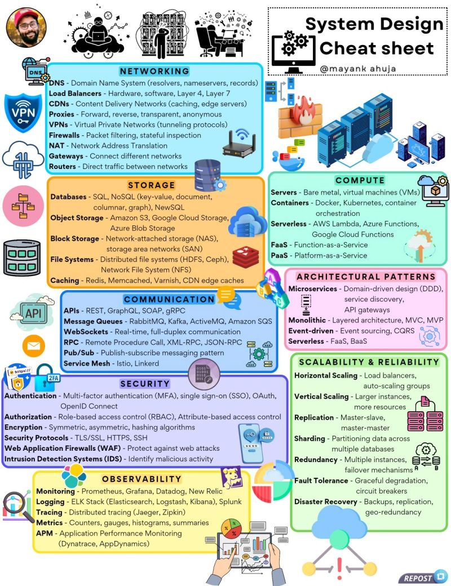

**Source:** [https://twitter.com/i/web/status/1880603063117070742](https://twitter.com/i/web/status/1880603063117070742)
**Original Post Date:** 2025-05-27 23:16:59

# System Design Cheat Sheet: Essential Architecture & Scalability Patterns

## Introduction
Modern system architecture demands a holistic understanding of interconnected components. This knowledge base consolidates critical concepts across key domains to address common system design challenges.

Engineers face recurring questions about scalable architectures, resilient services, efficient data storage, and secure communications. This guide synthesizes practical patterns and best practices for building production-grade distributed systems.

## Networking Fundamentals

DNS resolution forms the backbone of web accessibility, converting domain names to IP addresses through resolvers and authoritative name servers. The system employs various record types (A, CNAME, MX) for different use cases.

Load balancers distribute traffic across server pools to optimize resource utilization and enhance availability. They operate at Layer 4 (transport layer) or Layer 7 (application layer), making critical decisions about request routing.

- DNS Components: Resolvers, Authoritative Servers, Caching
- Load Balancing Types: Round-robin, Least-connections, IP hash
- Proxy Variants: Forward, Reverse, Transparent

> **Note/Tip:** Consider geographical distribution for global traffic handling

> **Note/Tip:** Layer 7 load balancers enable application-aware routing

## Storage Architecture

Modern storage solutions span SQL/NoSQL databases, object stores, and distributed file systems. Each serves distinct use cases based on data model, scalability needs, and access patterns.

Caching layers like Redis/Memcached significantly improve performance by reducing database load for frequently accessed data.

- Database Models: SQL (relational), NoSQL (document, key-value)
- Storage Options: Block storage (SAN/NAS), Object stores (S3)
- Caching Strategies: Local cache, distributed cache

> **Note/Tip:** Use event sourcing for audit trails in write-heavy systems

> **Note/Tip:** Consider eventual consistency trade-offs with sharding

## Compute & Containerization

Container orchestration platforms like Kubernetes enable efficient resource utilization and automated deployment. Serverless architectures abstract infrastructure management while maintaining cost efficiency.

Platform-as-a-Service (PaaS) environments simplify application deployment by managing underlying infrastructure.

- Container Orchestration: Docker, Kubernetes
- Serverless Platforms: AWS Lambda, Google Cloud Functions
- Infrastructure as Code Tools: Terraform, CloudFormation

## Security & Observability

Authentication/authorization mechanisms secure system access through multi-factor authentication (MFA), Single Sign-On (SSO), and role-based access control (RBAC).

Monitoring tools provide visibility into system health, performance metrics, and error rates, enabling proactive issue resolution.

- Security Protocols: TLS/SSL, OAuth 2.0, OpenID Connect
- Monitoring Solutions: Prometheus, Grafana, Datadog
- Logging Frameworks: ELK Stack, Splunk

> **Note/Tip:** Implement circuit breakers for fault tolerance

> **Note/Tip:** Use distributed tracing for microservice debugging

## Architectural Patterns & Scalability

Microservices architecture decomposes monolithic applications into independent services, enabling scalable and maintainable systems.

Horizontal scaling distributes load across multiple instances while vertical scaling enhances individual instance capabilities.

- Scalability Strategies: Horizontal (scaling out), Vertical (scaling up)
- Data Partitioning: Sharding, Replication
- Event-Driven Patterns: Pub/Sub, CQRS

> **Note/Tip:** Use service discovery for dynamic microservice communication

> **Note/Tip:** Implement event sourcing with message queues for resilience

## Key Takeaways

- Design systems with failure in mind using redundancy and circuit breakers
- Layer caching strategically to optimize performance bottlenecks
- Choose appropriate architectural patterns based on specific business requirements
- Implement comprehensive monitoring and logging from the start
- Balance availability, consistency, and partition tolerance according to CAP theorem

## Conclusion
System design requires careful consideration of trade-offs across multiple dimensions. This guide provides essential patterns and principles for building scalable, secure, and maintainable distributed systems.

## Media

**Image Description:** This image is a comprehensive "System Design Cheat Sheet" that provides an overview of various technical concepts and tools used in system design, architecture, and operations. The cheat sheet is organized into several sections, each covering a specific domain of system design. Below is a detailed breakdown of the image:

---

### **Header**
- **Title**: "System Design Cheat Sheet"
- **Author**: "@mayankahuja" (indicated in the top-right corner).
- **Visual Elements**: 
  - A cartoon-style illustration of a computer with gears, symbolizing system design and architecture.
  - A circular profile picture of a person wearing a red cap and a beard, likely the creator of the cheat sheet.

---

### **Main Sections**
The cheat sheet is divided into several key sections, each color-coded for easy navigation. Below is a detailed description of each section:

#### **1. Networking**
- **DNS (Domain Name System)**:
  - Resolvers, nameservers, records.
- **Load Balancers**:
  - Hardware, software, Layer 4, Layer 7.
- **CDNs (Content Delivery Networks)**:
  - Caching, edge servers.
- **Proxies**:
  - Forward, reverse, transparent, anonymous.
- **VPNs (Virtual Private Networks)**:
  - Tunneling protocols.
- **Firewalls**:
  - Packet filtering, stateful inspection.
- **NAT (Network Address Translation)**:
  - IP address translation.
- **Gateways**:
  - Connect different networks.
- **Routers**:
  - Direct traffic between networks.

#### **2. Storage**
- **Databases**:
  - SQL, NoSQL (key-value, document, graph, etc.), NewSQL.
- **Object Storage**:
  - Amazon S3, Google Cloud Storage, Azure Blob Storage.
- **Block Storage**:
  - SAN (Storage Area Network), NAS (Network Attached Storage).
- **File Systems**:
  - Distributed file systems (HDFS, Ceph), NFS (Network File System).
- **Caching**:
  - Redis, Memcached, Varnish, CDN edge caches.

#### **3. Compute**
- **Servers**:
  - Bare metal, virtual machines (VMs).
- **Containers**:
  - Docker, Kubernetes, container orchestration.
- **Serverless**:
  - AWS Lambda, Google Cloud Functions, Azure Functions.
- **FaaS (Function-as-a-Service)**:
  - AWS Lambda, Google Cloud Functions, Azure Functions.
- **PaaS (Platform-as-a-Service)**:
  - Heroku, Google App Engine, AWS Elastic Beanstalk.

#### **4. Communication**
- **APIs**:
  - REST, GraphQL, SOAP, gRPC.
- **Message Queues**:
  - RabbitMQ, Kafka, ActiveMQ, Amazon SQS.
- **WebSockets**:
  - Real-time, full-duplex communication.
- **RPC (Remote Procedure Call)**:
  - XML-RPC, JSON-RPC.
- **Pub/Sub (Publish-Subscribe)**:
  - Messaging pattern (e.g., RabbitMQ, Kafka).
- **Service Mesh**:
  - Istio, Linkerd.

#### **5. Security**
- **Authentication**:
  - MFA (Multi-factor authentication), SSO (Single Sign-On), OAuth, OpenID Connect.
- **Authorization**:
  - RBAC (Role-Based Access Control), ABAC (Attribute-Based Access Control).
- **Encryption**:
  - Symmetric, asymmetric, hashing algorithms.
- **Security Protocols**:
  - TLS/SSL, HTTPS, SSH.
- **Web Application Firewalls (WAF)**:
  - Protect against web attacks.
- **Intrusion Detection Systems (IDS)**:
  - Identify malicious activity.

#### **6. Observability**
- **Monitoring**:
  - Prometheus, Datadog, New Relic.
- **Logging**:
  - ELK Stack (Elasticsearch, Logstash, Kibana), Splunk.
- **Tracing**:
  - Jaeger, Zipkin.
- **Metrics**:
  - Counters, gauges, histograms, summaries.
- **APM (Application Performance Monitoring)**:
  - Dynatrace, AppDynamics.

#### **7. Architectural Patterns**
- **Microservices**:
  - Domain-driven design (DDD), service discovery, API gateways.
- **Monolithic**:
  - Single-tier architecture.
- **Event-driven**:
  - Layered architecture, MVC, MVP.
- **Serverless**:
  - FaaS, BaaS.

#### **8. Scalability & Reliability**
- **Horizontal Scaling**:
  - Load balancers, auto-scaling groups.
- **Vertical Scaling**:
  - Larger instances, more resources.
- **Replication**:
  - Master-slave, master-master.
- **Sharding**:
  - Partitioning data across multiple databases.
- **Redundancy**:
  - Multiple instances, failover mechanisms.
- **Fault Tolerance**:
  - Graceful degradation, circuit breakers.
- **Disaster Recovery**:
  - Backups, replication, geo-redundancy.

---

### **Visual Elements**
- **Icons and Logos**:
  - Popular tools and services are represented with their respective logos (e.g., AWS, Kubernetes, Docker, Prometheus, etc.).
- **Color Coding**:
  - Each section is color-coded for easy navigation:
    - Networking: Blue.
    - Storage: Orange.
    - Compute: Green.
    - Communication: Yellow.
    - Security: Purple.
    - Observability: Light blue.
    - Architectural Patterns: Pink.
    - Scalability & Reliability: Dark green.
- **Illustrations**:
  - Simple icons and diagrams are used to represent concepts (e.g., gears for architecture, servers for compute, etc.).

---

### **Footer**
- **Repost Button**:
  - A "Repost" button is present in the bottom-right corner, indicating that this is likely a shareable resource.

---

### **Overall Purpose**
This cheat sheet serves as a quick reference guide for system designers, developers, and architects. It covers a broad range of topics essential for building scalable, secure, and reliable systems, from networking and storage to security and observability. The visual organization and inclusion of popular tools and patterns make it a valuable resource for both beginners and experienced professionals.
