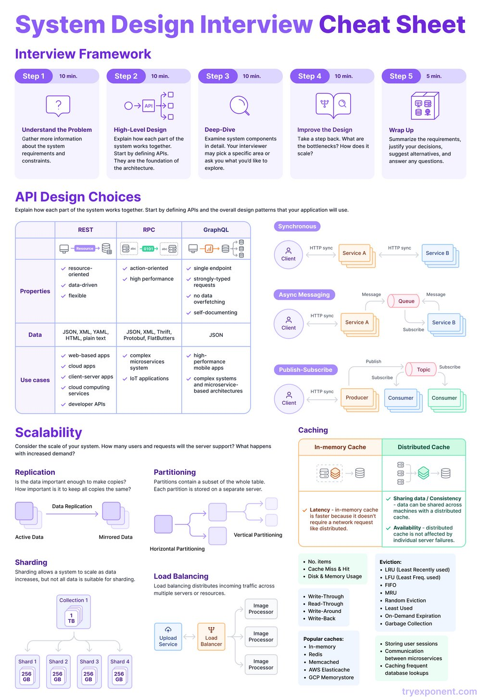

**Source:** [https://twitter.com/i/web/status/1941077897059418443](https://twitter.com/i/web/status/1941077897059418443)
**Original Post Date:** 2025-07-14 21:02:24

# System Design Interview Cheat Sheet: Comprehensive Guide

## Introduction
System design interviews are a critical part of the technical hiring process. This cheat sheet provides a structured approach to tackle these interviews effectively. It covers various aspects such as understanding the problem, high-level design, deep-dive analysis, improving the design, and wrapping up. Additionally, it delves into API design choices like REST, RPC, and GraphQL, scalability techniques including replication and sharding, and caching strategies for in-memory and distributed systems.

## Interview Framework

The interview framework outlines a step-by-step approach to system design interviews, divided into five stages: understanding the problem, high-level design, deep-dive analysis, improving the design, and wrapping up. Each stage has specific objectives and icons representing them.

Step 1 focuses on gathering information about the system requirements and constraints by asking questions and clarifying requirements. Step 2 involves explaining how the system works together at a high level, defining APIs and overall architecture. Step 3 examines system components in detail, exploring bottlenecks, scalability, and performance. Step 4 refines and optimizes the system design, while Step 5 summarizes the decisions made and addresses any remaining questions.

- Step 1: Understand the Problem (10 min.) - Gather information about system requirements and constraints.
- Step 2: High-Level Design (10 min.) - Explain how the system works together at a high level.
- Step 3: Deep-Dive (10 min.) - Examine system components in detail.
- Step 4: Improve the Design (10 min.) - Refine and optimize the system design.
- Step 5: Wrap Up (5 min.) - Summarize the design and address any remaining questions.

> **Note/Tip:** Focus on understanding the problem thoroughly before moving to high-level design.

> **Note/Tip:** Use diagrams and flowcharts to explain system architecture effectively.

> **Note/Tip:** Always justify your design choices with concrete examples and data.

## API Design Choices

This section discusses the design of APIs and compares three popular API types: REST, RPC, and GraphQL. Each type has its properties, data formats, and use cases.

REST is resource-oriented and flexible, using various data formats like JSON, XML, and YAML. It's ideal for web-based apps and cloud applications. RPC is action-oriented and high-performance, suitable for complex systems and IoT applications. GraphQL offers a single endpoint with strongly-typed requests, making it perfect for high-performance mobile apps and microservices-based architectures.

- REST: Resource-oriented, flexible, uses JSON, XML, YAML.
- RPC: Action-oriented, high performance, uses Thrift, Protocol Buffers.
- GraphQL: Single endpoint, strongly-typed requests, self-documenting.

> **Note/Tip:** Choose the API type based on your system's specific requirements and constraints.

> **Note/Tip:** Consider the trade-offs between flexibility and performance when selecting an API design.

## Scalability

This section focuses on how to scale a system to handle increased demand. Techniques like replication, sharding, and load balancing are discussed in detail.

Replication involves copying data across multiple servers to ensure availability and fault tolerance. Horizontal partitioning divides data across multiple servers, while vertical partitioning splits data by attributes or columns. Sharding divides data into smaller chunks (shards) to distribute load effectively.

- Replication: Copying data across multiple servers for availability and fault tolerance.
- Sharding: Dividing data into smaller chunks to distribute load.
- Load Balancing: Distributing incoming traffic across multiple servers or resources.

> **Note/Tip:** Plan for scalability from the beginning of your system design process.

> **Note/Tip:** Monitor and analyze performance metrics to identify bottlenecks and optimize accordingly.

## Caching

This section discusses caching strategies to improve system performance. In-memory cache provides fast access with low latency, while distributed cache offers shared data across multiple machines.

Eviction policies like LRU (Least Recently Used) and LFU (Least Frequently Used) are used to manage cache memory effectively. Write strategies include write-through, write-around, and write-back.

- In-Memory Cache: Fast access, low latency.
- Distributed Cache: Shared data across multiple machines.
- Eviction Policies: LRU (Least Recently Used), LFU (Least Frequently Used).

> **Note/Tip:** Use caching to reduce response times and improve user experience.

> **Note/Tip:** Monitor cache hit ratios and adjust eviction policies as needed.

## Additional Technical Details

This section covers additional technical details such as load balancing, sharding, and caching. Load balancing distributes incoming traffic across multiple servers or resources.

Sharding divides data into smaller chunks to scale horizontally. Caching improves performance by storing frequently accessed data in memory or distributed systems.

> **Note/Tip:** Combine multiple techniques for optimal system performance.

> **Note/Tip:** Regularly review and update your system design based on changing requirements and technologies.

## Key Takeaways

- Understand the problem thoroughly before moving to high-level design.
- Choose API types based on specific system requirements and constraints.
- Plan for scalability from the beginning of the system design process.
- Use caching to reduce response times and improve user experience.
- Combine multiple techniques for optimal system performance.

## Conclusion
This cheat sheet provides a comprehensive guide to system design interviews, covering various aspects such as interview frameworks, API design choices, scalability techniques, and caching strategies. By following the structured approach outlined in this guide, you can effectively tackle system design interviews and build scalable and efficient systems.

## External References

- [System Design Interview Volume 1 & 2 by Alex Xu](https://github.com/donnemartin/system-design-primer)
- [Grokking the System Design Interview](https://www.educative.io/courses/grokking-the-system-design-interview)

## Media

**Image Description:** This image is a comprehensive cheat sheet titled **"System Design Interview Cheat Sheet"**, designed to help individuals prepare for system design interviews. The content is structured into several sections, each focusing on different aspects of system design, API design, scalability, caching, and related technical concepts. Below is a detailed breakdown of the image:

---

### **1. Interview Framework**
The framework outlines a step-by-step approach to system design interviews, divided into five stages:

- **Step 1: Understand the Problem (10 min.)**
  - **Objective**: Gather information about the system requirements and constraints.
  - **Icon**: A question mark (?).
  - **Description**: Focus on understanding the problem by asking questions and clarifying requirements.

- **Step 2: High-Level Design (10 min.)**
  - **Objective**: Explain how the system works together at a high level.
  - **Icon**: A flowchart with API and system components.
  - **Description**: Define APIs and the overall architecture, focusing on how different parts of the system interact.

- **Step 3: Deep-Dive (10 min.)**
  - **Objective**: Examine system components in detail.
  - **Icon**: A magnifying glass.
  - **Description**: Explore specific areas of the system, such as bottlenecks, scalability, and performance.

- **Step 4: Improve the Design (10 min.)**
  - **Objective**: Refine and optimize the system design.
  - **Icon**: Two gears and a magnifying glass.
  - **Description**: Take a step back to identify areas for improvement, such as scalability, performance, and reliability.

- **Step 5: Wrap Up (5 min.)**
  - **Objective**: Summarize the design and address any remaining questions.
  - **Icon**: A folder with a checklist.
  - **Description**: Summarize the decisions made, justify the choices, and answer any remaining questions.

---

### **2. API Design Choices**
This section discusses the design of APIs and the choice of communication patterns. It compares three popular API types: **REST**, **RPC**, and **GraphQL**.

#### **REST (Representational State Transfer)**
- **Properties**:
  - Resource-oriented
  - Data-driven
  - Flexible
- **Data Formats**: JSON, XML, YAML, HTML, plain text, Protocol Buffers, Thrift
- **Use Cases**: Web-based apps, cloud apps, client-server apps, client computing apps

#### **RPC (Remote Procedure Call)**
- **Properties**:
  - Action-oriented
  - High performance
- **Data Formats**: JSON, XML, Thrift, Protocol Buffers
- **Use Cases**: Complex systems, FlatBuffers, IoT applications

#### **GraphQL**
- **Properties**:
  - Single endpoint
  - Strongly-typed requests
  - Self-documenting
- **Data Formats**: JSON
- **Use Cases**: High-performance mobile apps, complex systems, microservices-based architectures

#### **Communication Patterns**
- **Synchronous**: Direct communication between client and service (e.g., HTTP).
- **Async Messaging**: Asynchronous communication using queues (e.g., RabbitMQ, Kafka).
- **Publish-Subscribe**: Event-driven communication using topics (e.g., Kafka, MQTT).

---

### **3. Scalability**
This section focuses on how to scale a system to handle increased demand.

#### **Replication**
- **Active Data vs. Mirrored Data**: Replicating data to ensure availability and fault tolerance.
- **Horizontal Partitioning**: Dividing data across multiple servers.
- **Vertical Partitioning**: Splitting data by attributes or columns.

#### **Sharding**
- **Definition**: Dividing data into smaller, manageable chunks (shards) to distribute load.
- **Example**: A 1 TB collection is divided into 4 shards, each 256 GB.

#### **Load Balancing**
- **Definition**: Distributing incoming traffic across multiple servers or resources.
- **Example**: A load balancer distributes requests to multiple image processors.

---

### **4. Caching**
This section discusses caching strategies to improve system performance.

#### **In-Memory Cache**
- **Advantages**: Fast access, low latency.
- **Eviction Policies**: LRU (Least Recently Used), LFU (Least Frequently Used), FIFO (First In, First Out).
- **Write Strategies**: Write-through, write-around, write-back.

#### **Distributed Cache**
- **Advantages**: Shared data across multiple machines, high availability.
- **Consistency**: Ensuring data consistency across distributed nodes.
- **Eviction Policies**: Similar to in-memory cache (LRU, LFU, etc.).

#### **Popular Caches**
- **In-memory caches**: Redis, Memcached, AWS ElastiCache, GCP Memorystore.
- **Distributed caches**: Apache Ignite, Hazelcast.

---

### **5. Additional Technical Details**
- **Load Balancing**: Distributes incoming traffic across multiple servers or resources.
- **Sharding**: Divides data into smaller chunks to scale horizontally.
- **Caching**: Improves performance by storing frequently accessed data in memory or distributed systems.

---

### **Visual Elements**
- **Icons and Flowcharts**: Used to illustrate concepts like APIs, communication patterns, and caching strategies.
- **Color Coding**: Different sections are color-coded for clarity (e.g., purple for interview framework, blue for API design, green for caching).
- **Examples and Diagrams**: Visual representations of replication, sharding, and load balancing.

---

### **Overall Structure**
The cheat sheet is well-organized, with clear headings, icons, and diagrams to aid understanding. It provides a comprehensive overview of system design concepts, making it a valuable resource for interview preparation or system architecture planning.

---

### **Key Takeaways**
- **Interview Framework**: A structured approach to system design interviews.
- **API Design**: Comparison of REST, RPC, and GraphQL, along with communication patterns.
- **Scalability**: Techniques like replication, sharding, and load balancing.
- **Caching**: Strategies for in-memory and distributed caching, including eviction policies.

This cheat sheet is an excellent resource for anyone preparing for system design interviews or working on building scalable and efficient systems.
