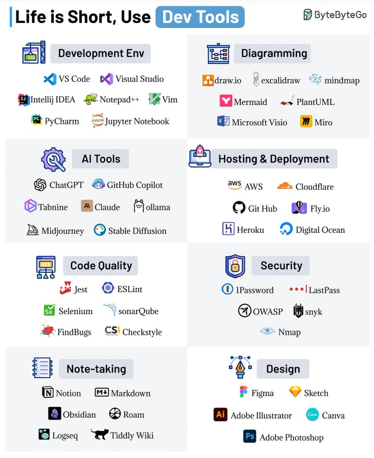

# life_short_tools_right

**Tweet URL:** [https://x.com/bytebytego/status/1881934073058431112](https://x.com/bytebytego/status/1881934073058431112)

**Tweet Text:** Life is Short, Use Dev Tools 
 
The right dev tool can save you precious time, energy, and perhaps the weekend as well. 
 
Here are our favorite dev tools: 
 
1 - Development Environment 
A good local dev environment is a force multiplier. Powerful IDEs like VSCode, IntelliJ IDEA, Notepad++, Vim, PyCharm & Jupyter Notebook can make your life easy. 
 
2 - Diagramming 
Showcase your ideas visually with diagramming tools like DrawIO, Excalidraw, mindmap, Mermaid, PlantUML, Microsoft Visio, and Miro 
 
3 - AI Tools 
AI can boost your productivity. Don’t ignore tools like ChatGPT, GitHub Copilot, Tabnine, Claude, Ollama, Midjourney, and Stable Diffusion. 
 
4 - Hosting and Deployment 
For hosting your applications, explore solutions like AWS, Cloudflare, GitHub, Fly, Heroku, and Digital Ocean. 
 
5 - Code Quality 
Quality code is a great differentiator. Leverage tools like Jest, ESLint, Selenium, SonarQube, FindBugs, and Checkstyle to ensure top-notch quality. 
 
6 - Security 
Don’t ignore the security aspects and use solutions like 1Password, LastPass, OWASP, Snyk, and Nmap. 
 
7 - Note-taking 
Your notes are a reflection of your knowledge. Streamline your note-taking with Notion, Markdown, Obsidian, Roam, Logseq, and Tiddly Wiki. 
 
8 - Design 
Elevate your visual game with design tools like Figma, Sketch, Adobe Illustrator, Canva, and Adobe Photoshop. 
 
Over to you: Which dev tools do you use? 
 
– 
Subscribe to our weekly newsletter to get a Free System Design PDF (158 pages): [https://bit.ly/3KCnWXq](https://bit.ly/3KCnWXq)

**Image 1 Description:** The image presents a comprehensive overview of various software development tools, categorized into 12 distinct sections. Each section is accompanied by a list of relevant tools, providing a valuable resource for developers seeking to streamline their workflows.

*   **Development Environment**
    *   VS Code
    *   Visual Studio
*   **Diagramming**
    *   draw.io
    *   excalidraw
    *   mindmap
*   **AI Tools**
    *   ChatGPT
    *   GitHub Copilot
*   **Hosting & Deployment**
    *   AWS
    *   Cloudflare
*   **Code Quality**
    *   Jest
    *   ESLint
    *   Selenium
    *   SonarQube
*   **Security**
    *   1Password
    *   LastPass
*   **Note-taking**
    *   Notion
    *   Markdown
    *   Obsidian
    *   Roam Research
*   **Design**
    *   Figma
    *   Sketch
    *   Adobe Illustrator
    *   Canva

In summary, the image provides a diverse range of software development tools, covering areas such as development environment, diagramming, AI tools, hosting and deployment, code quality, security, note-taking, and design. This comprehensive list can serve as a valuable resource for developers looking to optimize their workflows and improve productivity.

