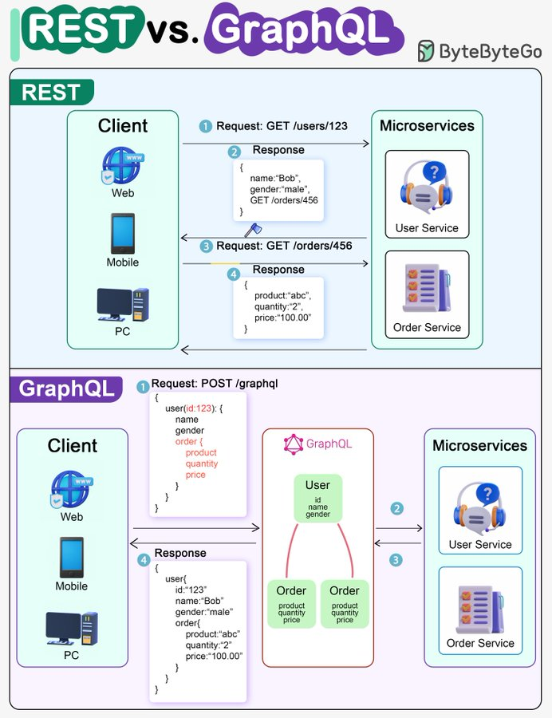

# rest_graphql_when_comes

**Tweet URL:** [https://x.com/bytebytego/status/1867435631171055638](https://x.com/bytebytego/status/1867435631171055638)

**Tweet Text:** REST API Vs. GraphQL 
 
When it comes to API design, REST and GraphQL each have their own strengths and weaknesses. 
 
REST 
- Uses standard HTTP methods like GET, POST, PUT, DELETE for CRUD operations. 
- Works well when you need simple, uniform interfaces between separate services/applications. 
- Caching strategies are straightforward to implement. 
- The downside is it may require multiple roundtrips to assemble related data from separate endpoints. 
 
GraphQL 
- Provides a single endpoint for clients to query for precisely the data they need. 
- Clients specify the exact fields required in nested queries, and the server returns optimized payloads containing just those fields. 
- Supports Mutations for modifying data and Subscriptions for real-time notifications. 
- Great for aggregating data from multiple sources and works well with rapidly evolving frontend requirements. 
- However, it shifts complexity to the client side and can allow abusive queries if not properly safeguarded 
- Caching strategies can be more complicated than REST. 
 
The best choice between REST and GraphQL depends on the specific requirements of the application and development team. GraphQL is a good fit for complex or frequently changing frontend needs, while REST suits applications where simple and consistent contracts are preferred. 

--
Subscribe to our weekly newsletter to get a Free System Design PDF (158 pages): [https://bit.ly/bbg-social](https://bit.ly/bbg-social)

**Image 1 Description:** The image presents a comparison between REST (Representational State Transfer) and GraphQL, two popular web service architectures. The infographic is divided into two main sections: "REST" and "GraphQL", each illustrating how these technologies handle client requests.

*   **REST**
    *   **Client**: 
        *   Web
        *   Mobile
        *   PC
    *   **Request**:
        *   GET /users/123
            *   Request GET request to retrieve user data with ID 123.
    *   **Response**:
        *   {name: "Bob", gender: "male"}
            *   Response from the server containing Bob's user information.
*   **GraphQL**
    *   **Client**: 
        *   Web
        *   Mobile
        *   PC
    *   **Request**:
        *   POST /graphql
            *   Request to execute a GraphQL query on the server.
    *   **Response**:
        *   {user: {name: "Bob", gender: "male"}, products: [...]}
            *   Response from the server containing Bob's user information and product data.

In summary, the infographic effectively illustrates the key differences between REST and GraphQL architectures in handling client requests. While REST uses a GET request to retrieve specific resources, GraphQL employs a POST request to execute queries on the server, returning relevant data in a single response. This visual representation provides a clear understanding of how these technologies approach data retrieval and manipulation.

