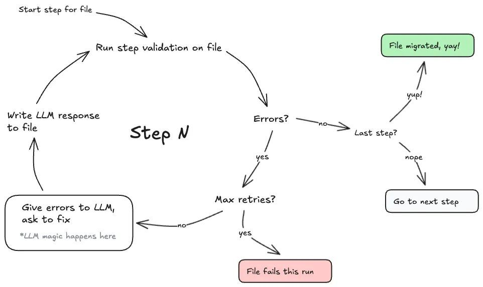

**Source:** [https://twitter.com/i/web/status/1911343729694175647](https://twitter.com/i/web/status/1911343729694175647)
**Original Post Date:** 2025-05-27 16:11:57

# Airbnb's Test Migration Using Large Language Models: A Structured Approach

## Introduction
Automated testing infrastructure requires robust file migration processes to maintain reliability. This knowledge base item examines Airbnb's innovative approach that integrates Large Language Models (LLMs) into the migration workflow. The system combines automated validation, dynamic error handling via AI-driven solutions, and iterative retry mechanisms to ensure reliable test artifact migration.

## Overview of Migration Process Architecture

The migration process operates in a circular flow structure with three main components: validation steps, LLM interaction for error resolution, and conditional loops for retries. This architecture ensures that each file undergoes thorough validation while maintaining flexibility through AI-driven problem solving.

1. Initial validation to detect structural issues
1. LLM integration for error resolution
1. Conditional retry mechanism with maximum attempts

## Core Process Components and Workflow

The process begins with file initialization, followed by systematic validation. Upon encountering errors, the system engages an LLM to generate fixes, implementing those changes before revalidation.

Each decision point (error detection, retry limits, final validation) ensures robust control flow while maintaining flexibility through iterative processing.

```python
def validate_file_step(file):
    errors = []
    # Validation logic here
    return len(errors) == 0,
           errors if not validation_passed else None
```

## Error Handling and Retry Mechanism

The error handling system uses a maximum retry limit to prevent infinite loops. Each iteration involves LLM consultation for potential fixes, creating a dynamic problem-solving approach.

- Maximum 3 retries per file
- LLM provides context-aware solutions
- Validation occurs after each fix attempt

> **Note/Tip:** Implement exponential backoff between retry attempts to prevent system overload.

> **Note/Tip:** Log all LLM interactions for audit and improvement purposes.

## LLM Integration Details

The LLM component acts as an intelligent problem solver, analyzing validation errors and proposing context-specific fixes. This integration represents a shift from traditional error handling to AI-driven dynamic resolution.

```python
def llm_resolve_errors(error_list):
    prompt = f'Fix the following test file issues: {error_list}'
    response = llm_client.generate(prompt)
    return process_llm_fix(response)
```

## Key Takeaways

- Integration of AI-driven error resolution enhances automated testing reliability.
- Circular workflow with retry mechanisms ensures thorough validation.
- Dynamic problem-solving through LLMs reduces manual intervention.

## Conclusion
This structured migration approach combines traditional validation techniques with modern AI capabilities, creating a robust system for test artifact management. The architecture's emphasis on iterative improvement and error resolution significantly enhances the reliability of automated testing infrastructure.

## External References

- [Airbnb Engineering Blog - Test Migration Patterns](https://medium.com/airbnb-engineering/test-migration-patterns)
- [Large Language Model Integration in CI/CD](https://docs.llm-integration.dev/cicd-best-practices)


## Media

**Image Description:** The image depicts a flowchart that outlines a process for migrating a file through a series of steps, involving validation, error handling, and interaction with a Large Language Model (LLM). The flowchart is designed to illustrate a systematic approach to file migration, with decision points and loops to handle errors and retries. Below is a detailed description of the flowchart:

### **Main Subject**
The main subject of the flowchart is the **file migration process**, which involves multiple steps to validate and process a file. The process includes error handling, retries, and interaction with an LLM to resolve issues dynamically.

### **Flowchart Structure**
The flowchart is organized as a circular process with decision points and loops, indicating iterative steps until the file is successfully migrated or fails after retries.

### **Key Components and Steps**

1. **Start Step for File**
   - The process begins with the initiation of the file migration process.
   - This is the entry point into the flowchart.

2. **Run Step Validation on File**
   - The file is validated at each step to ensure it meets the required criteria.
   - This step checks for any errors or issues in the file.

3. **Errors?**
   - After validation, the process checks if any errors were encountered.
   - **Yes**: If errors are found, the process proceeds to the error handling section.
   - **No**: If no errors are found, the process checks if it is the last step.

4. **Give Errors to LLM, Ask to Fix**
   - If errors are detected, the errors are passed to the LLM.
   - The LLM is expected to provide a response or fix for the errors.
   - This step is marked with a note: "*LLM magic happens here*," indicating that the LLM dynamically resolves issues.

5. **Write LLM Response to File**
   - The response from the LLM is applied to the file, attempting to fix the errors.

6. **Max Retries?**
   - After applying the LLM's fix, the process checks if the maximum number of retries has been reached.
   - **Yes**: If the maximum retries are exceeded, the file fails for this run.
   - **No**: If retries are still available, the process loops back to the validation step to recheck the file.

7. **Last Step?**
   - If no errors are found after validation, the process checks if it is the last step in the migration process.
   - **Yes**: If it is the last step, the file is successfully migrated.
   - **No**: If it is not the last step, the process moves to the next step.

8. **File Migrated, Yay!**
   - If the file passes all validations and reaches the last step without errors, it is successfully migrated.

9. **File Fails This Run**
   - If the maximum number of retries is reached and the file still has errors, the file fails for this run.

### **Decision Points**
- **Errors?**: Determines whether the file has errors after validation.
- **Max Retries?**: Checks if the maximum number of retries has been exceeded.
- **Last Step?**: Determines if the current step is the final step in the migration process.

### **Loops and Iterations**
- The flowchart includes loops to handle errors and retries. If errors are found, the process loops back to the LLM for a fix and then revalidates the file.
- This iterative process continues until either the file is successfully migrated or the maximum number of retries is reached.

### **Notes and Annotations**
- The note "*LLM magic happens here*" emphasizes the role of the LLM in dynamically resolving errors.
- The flowchart uses arrows to indicate the direction of the process flow, making it easy to follow the sequence of steps.

### **Visual Elements**
- **Green Box**: Indicates a successful outcome ("File migrated, yay!").
- **Pink Box**: Indicates a failure outcome ("File fails this run").
- **Arrows**: Guide the flow of the process, showing the direction of movement between steps.
- **Text Labels**: Clearly describe each step and decision point.

### **Overall Purpose**
The flowchart is designed to illustrate a robust and dynamic file migration process that leverages an LLM to handle errors and retries, ensuring that the file is migrated successfully or fails only after exhausting all possible attempts.

This structured approach ensures that the file migration process is thorough, error-tolerant, and capable of handling complex issues dynamically.
