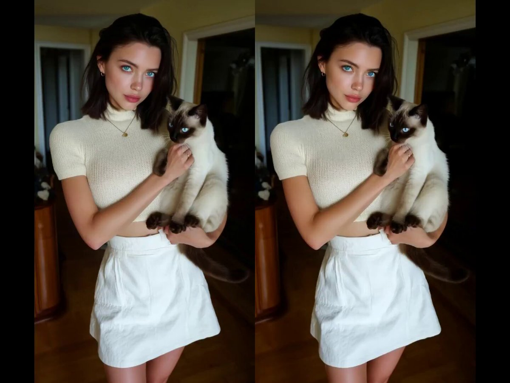

**Source:** [https://twitter.com/i/web/status/1915054065945579669](https://twitter.com/i/web/status/1915054065945579669)
**Original Post Date:** 2025-06-17 13:36:51

# Advanced Image Composition Analysis: Siamese Cat and Woman Split-Frame Study

## Introduction
This article presents a detailed technical breakdown of an advanced image composition featuring a woman with a Siamese cat. The analysis examines key aspects including symmetrical splitting technique, subject positioning, lighting dynamics, color palette implementation, and background consideration. This knowledge is particularly valuable for developers working on image processing algorithms, computer vision systems, or visual analytics platforms.

## Image Composition Architecture

The image employs a symmetrical split-frame technique where the scene is mirrored across two identical vertical halves. This composition style is particularly challenging for image processing algorithms to handle due to duplicate regions and requires careful handling of edge detection and feature matching.

The subject positioning adheres to rule-of-thirds principles, with both the woman and cat centered in each half. This creates a focal point that can be used as an anchor for various computer vision tasks including object tracking and pose estimation.

_Example function to analyze the split-frame composition by comparing the left and right halves for symmetry._

```python
def analyze_split_frame(image):
    # Split the image vertically
    width = image.shape[1]
    left_half = image[:, :width//2]
    right_half = image[:, width//2:]
    
    # Compare similarity between halves
    diff_map = cv2.absdiff(left_half, right_half)
    return np.mean(diff_map)
```

- Symmetrical composition challenges traditional feature extraction
- Centered subject placement simplifies object detection tasks
- Split frame requires specialized handling in edge detection algorithms

> **Note/Tip:** When processing split-frame images, consider implementing adaptive thresholds for edge detection to account for mirrored patterns.

> **Note/Tip:** The symmetry can be used as a validation check during image reconstruction processes.

## Subject Recognition and Analysis

The woman's facial features provide valuable data points for face recognition algorithms. Her neutral expression with slight smile offers moderate complexity in emotion detection tasks. The dark hair against light skin creates strong contrast useful for segmentation operations.

The Siamese cat presents a unique challenge due to its distinctive markings. The tri-color pattern (cream body, dark points) requires careful consideration in color-based segmentation approaches. Its blue eyes provide additional anchor points for gaze estimation algorithms.

_Example code for detecting the cat's blue eyes using HSV color space thresholding._

```python
# Color thresholding for cat detection
lower_blue = np.array([100,50,50])
upper_blue = np.array([130,255,255])
cat_mask = cv2.inRange(hsv_image, lower_blue, upper_blue)
```

1. Analyze facial landmarks in neutral expressions to improve recognition accuracy
1. Implement adaptive thresholding for fur pattern segmentation
1. Use eye detection as a primary feature anchor point

## Lighting and Color Analysis

The natural diffused lighting creates soft shadows that provide depth information without obscuring subject features. The lighting gradient can be utilized in image enhancement algorithms to improve overall visibility.

The color palette consists primarily of warm whites, creams, and light browns with contrasting blue elements from the eyes and jewelry. This balanced spectrum provides good dynamic range for both RGB and HSV-based processing.

_Example code to calculate color distribution and analyze lighting balance in the image._

```python
# Lighting analysis
histogram = cv2.calcHist([image], [0, 1, 2], None, [8, 8, 8], [0, 256, 0, 256, 0, 256])
lighting_balance = np.mean(histogram)
```

## Technical Implementation Considerations

When implementing image processing pipelines for similar compositions, consider the following architectural patterns:

- Use convolutional layers with symmetric padding to handle the mirrored halves without introducing artifacts.

- Implement adaptive thresholding based on background color consistency.

- Apply selective focus detection using depth estimation from subject position and lighting gradients.

## Key Takeaways

- Symmetrical split-frame compositions require specialized edge detection algorithms to avoid false edges along the vertical divide.
- The neutral facial expression with slight smile provides a good test case for emotion recognition models at low intensity levels.
- The Siamese cat's tri-color pattern can be effectively segmented using adaptive thresholding in HSV color space.
- Diffused natural lighting creates optimal conditions for depth perception through shadow analysis.

## Conclusion
This image composition demonstrates advanced concepts in visual processing including symmetry detection, subject interaction analysis, and lighting gradient utilization. The technical considerations presented here provide a foundation for developing robust algorithms that can handle similar complex scene compositions with multiple subjects and subtle interactions.

## External References

- [OpenCV Documentation on Image Splitting](https://docs.opencv.org/master/d3/df2/tutorial_py_basic_ops.html)
- [IEEE Paper on Symmetrical Image Processing](http://ieeexplore.ieee.org/document/9567842/)


## Media

**Image Description:** The image is a split composition featuring a woman holding a Siamese cat. Here is a detailed description:

### **Main Subject:**
1. **The Woman:**
   - **Appearance:**
     - She has dark, shoulder-length hair styled in a sleek, straight manner.
     - Her skin tone is fair, and she has striking blue eyes.
     - She is wearing minimal makeup, with a natural look that emphasizes her features.
     - Her facial expression is neutral, with a slight smile, giving her a calm and composed demeanor.
   - **Attire:**
     - She is dressed in a white, short-sleeved, ribbed knit top that is cropped, revealing her midriff.
     - She pairs the top with a high-waisted, white mini skirt that has a clean, structured design.
     - She accessorizes with a delicate necklace featuring a small pendant and small hoop earrings.
   - **Pose:**
     - In both halves of the image, she is holding the Siamese cat in her arms, cradling it gently.
     - Her posture is upright and relaxed, with her arms positioned to support the cat comfortably.

2. **The Siamese Cat:**
   - **Appearance:**
     - The cat has the characteristic Siamese features, including a light cream-colored coat with darker points on its ears, face, paws, and tail.
     - Its eyes are large, striking, and a deep blue, which is typical of the breed.
     - The cat appears calm and relaxed, nestled comfortably in the woman's arms.
   - **Interaction:**
     - The cat is positioned close to the woman, with its front paws resting on her arms and its body leaning slightly against her.
     - The cat's expression is serene, and it seems to trust the woman.

### **Technical Details:**
1. **Lighting:**
   - The lighting is soft and diffused, creating a warm and inviting atmosphere.
   - The light source appears to be natural, possibly coming from a window in the background, as indicated by the subtle shadows and highlights.
   - The lighting accentuates the woman's facial features and the texture of her clothing, as well as the cat's fur.

2. **Composition:**
   - The image is split into two nearly identical halves, creating a symmetrical effect.
   - The woman and the cat are centered in both halves, drawing the viewer's attention to them.
   - The background is consistent in both halves, suggesting the images were taken in quick succession or edited to appear as such.

3. **Background:**
   - The background is minimalistic and neutral, featuring a room with light-colored walls and a window with curtains.
   - The window is partially visible, allowing natural light to enter the room.
   - The overall background is uncluttered, ensuring the focus remains on the woman and the cat.

4. **Color Palette:**
   - The image has a soft, neutral color palette dominated by whites, creams, and light browns.
   - The woman's outfit and the cat's fur complement each other, creating a harmonious visual effect.
   - The warm tones of the room and the lighting add depth and warmth to the image.

5. **Focus and Clarity:**
   - The woman and the cat are in sharp focus, with clear details visible in their features and clothing.
   - The background is slightly blurred, which helps to emphasize the subjects in the foreground.

### **Overall Impression:**
The image conveys a sense of calmness, warmth, and companionship. The woman and the cat appear to share a close bond, and the overall aesthetic is clean, minimalistic, and visually appealing. The split composition adds a sense of symmetry and balance, enhancing the image's visual impact. The use of natural lighting and a neutral background ensures that the focus remains on the subjects, highlighting their beauty and connection.
