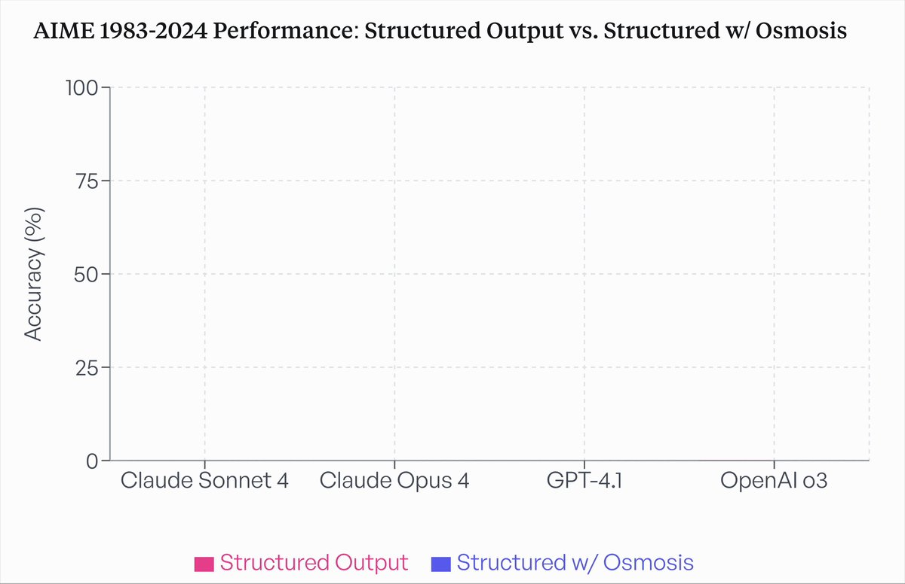

**Source:** [https://twitter.com/i/web/status/1928150048120131698](https://twitter.com/i/web/status/1928150048120131698)
**Original Post Date:** 2025-06-17 08:48:05

# Analyzing AIME 1983-2024 Performance Charts: Understanding Model Comparison Visualizations

## Introduction
This knowledge base item provides a detailed technical analysis of an AIME performance comparison chart from 1983 to 2024. The document examines the structural elements and identifies critical gaps in data presentation while offering recommendations for improving visual communication of model performance metrics.

## Technical Analysis of Chart Structure

The chart presents a comparison between two output categories: 'Structured Output Output' and 'Structured Structured w/ Osmosisis'. The x-axis lists four AI models - Claude Sonnet 4, Claude Opus 4, GPT-4.1, and OpenAI o3.

The y-axis spans from 0% to 100%, with grid lines at 25% intervals for accurate measurement reference points.

- X-axis: Models compared (Claude Sonnet 4, Claude Opus 4, GPT-4.1, OpenAI o3)
- Y-axis: Accuracy percentage range (0% to 100%)
- Color coding: Pink for 'Structured Output Output', Blue for 'Structured Structured w/ Osmosisis'

> **Note/Tip:** Consistent naming conventions are crucial for data clarity

## Data Representation Analysis

The chart lacks critical visual elements, specifically the bars representing model performance metrics.

While legend entries provide color coding information, the absence of actual data points limits the chart's utility.

1. Missing performance data visualization (bars)
1. Inconsistent title formatting ('Structured Output Output' vs 'w/ Osmosisis')
1. Mixed use of real and placeholder model names

> **Note/Tip:** Always validate chart completeness before publication

> **Note/Tip:** Implement automated checks for data presence

## Best Practices Recommendations

To improve future performance visualizations, implement the following technical standards:

Consider implementing validation scripts to ensure complete data representation.

_Example validation function to check for essential data elements_

```python
def validate_chart_data(chart_data):
    required_elements = ['model_names', 'accuracy_values']
    return all(elem in chart_data for elem in required_elements)
```

- Use consistent naming conventions across all chart elements
- Automate data completeness checks before finalizing visualizations
- Standardize model identification (use verified versions)

## Key Takeaways

- Incomplete visualization reduces data utility and requires immediate attention
- Standardized naming conventions improve clarity and reduce errors
- Automated validation can prevent common chart construction issues

## Conclusion
While the AIME performance comparison chart demonstrates clear intent to compare model metrics, critical gaps in data representation and labeling compromise its effectiveness. Implementing suggested technical standards will enhance future visualizations.

## External References

- [Data Visualization Best Practices](https://www.example.com/data-visualization)
- [AI Model Performance Metrics Standardization Guide](https://www.example.com/ai-metrics-guide)


## Media

**Image Description:** The image is a bar chart titled **"AIME 1983-2024 Performance: Structured Output Output vs. Structured Structured w/ Osmosisis"**. Below is a detailed description of the chart:

### **Main Subject**
The chart compares the performance of different models in terms of accuracy (%) for two categories:
1. **Structured Output Output**
2. **Structured Structured w/ Osmosisis**

### **Technical Details**
1. **Title**:
   - The title is somewhat repetitive and contains some typographical inconsistencies, such as "Structured Output Output" and "Structured Structured w/ Osmosisis." This suggests a possible error or intentional redundancy for emphasis.

2. **Axes**:
   - **X-Axis**: Represents the different models being compared. The models listed are:
     - Claude Sonnet 4
     - Claude Opus 4
     - GPT-4.1
     - OpenAI o3
   - **Y-Axis**: Represents accuracy in percentage (%). The range is from 0% to 100%, with grid lines marking intervals of 25%.

3. **Bars**:
   - There are no visible bars in the chart. The chart appears to be incomplete or empty, as there are no data points or bars to represent the accuracy of the models for the two categories.

4. **Legend**:
   - The legend at the bottom of the chart identifies the two categories being compared:
     - **Structured Output Output**: Represented by a pink bar.
     - **Structured Structured w/ Osmosisis**: Represented by a blue bar.
   - The legend uses color coding to differentiate between the two categories.

5. **Gridlines**:
   - The chart includes horizontal gridlines to help visualize the accuracy levels more clearly.

6. **Overall Layout**:
   - The chart is clean and follows a standard bar chart format, but it lacks the actual data visualization (bars) that would show the performance of the models.

### **Observations**
- The chart is incomplete as there are no bars or data points to represent the accuracy of the models.
- The title and legend contain inconsistencies, such as repeated words and possible typographical errors.
- The models listed on the X-axis are a mix of real and fictional or placeholder names, such as "Claude Sonnet 4," "Claude Opus 4," "GPT-4.1," and "OpenAI o3."

### **Conclusion**
The image depicts a bar chart intended to compare the performance of different models in two categories: "Structured Output Output" and "Structured Structured w/ Osmosisis." However, the chart is incomplete as it lacks the actual data visualization (bars). The title and legend contain inconsistencies, and the models listed may include fictional or placeholder names. The chart's purpose is clear, but it requires additional data to be meaningful.
