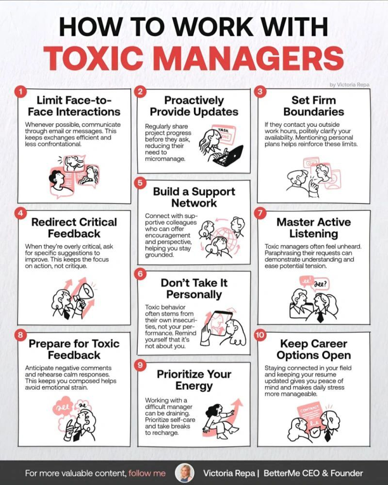

**Source:** [https://twitter.com/i/web/status/1869225323583402328](https://twitter.com/i/web/status/1869225323583402328)
**Original Post Date:** 2025-07-12 21:20:27

# Analyzing an Infographic on Managing Toxic Managers: A Technical Breakdown

## Introduction
The image under analysis is an infographic titled 'HOW TO WORK WITH TOXIC MANAGERS' created by Victoria Repa. This infographic provides a structured guide with ten key strategies for effectively managing interactions with toxic managers. The analysis focuses on the visual organization, content breakdown, and design principles of the infographic.

## Media Descriptions
**Image Description:** ### Description of the Image

The image is an infographic titled **"HOW TO WORK WITH TOXIC MANAGERS"** by Victoria Repa. It provides a structured guide with **10 key strategies** for effectively managing interactions with toxic managers. The infographic is visually organized into a grid of 10 sections, each numbered and accompanied by a brief explanation and a simple illustration. The color scheme is primarily **white, black, and red**, with red used for emphasis on key phrases and titles. The illustrations are minimalistic, using simple line drawings to convey the concepts.

---

### **Detailed Breakdown of Each Section**

#### **1. Limit Face-to-Face Interactions**
- **Description**: Whenever possible, communicate through email or messages. This keeps exchanges efficient and less confrontational.
- **Illustration**: Two people are shown with speech bubbles, indicating communication through text rather than in-person interaction.

#### **2. Proactively Provide Updates**
- **Description**: Regularly share project progress before they ask, reducing their need to micromanage.
- **Illustration**: A person is shown working on a laptop with a task list, symbolizing proactive communication.

#### **3. Set Firm Boundaries**
- **Description**: If they contact you outside work hours, politely clarify your availability. Mentioning personal plans helps reinforce these limits.
- **Illustration**: A person is shown setting boundaries with another person, using a speech bubble to indicate a polite response.

#### **4. Redirect Critical Feedback**
- **Description**: When they're overly critical, ask for specific suggestions to improve. This keeps the focus on action, not critique.
- **Illustration**: A person is shown holding a megaphone, symbolizing critical feedback, while another person listens and responds constructively.

#### **5. Build a Support Network**
- **Description**: Connect with supportive colleagues who can offer encouragement and perspective, helping you stay grounded.
- **Illustration**: A group of people is shown in a circle, representing a support network.

#### **6. Don’t Take It Personally**
- **Description**: Toxic behavior often stems from their own insecurities, not your performance. Remind yourself that it’s not about you.
- **Illustration**: A person is shown holding a mirror, symbolizing self-reflection and understanding that the behavior is not personal.

#### **7. Master Active Listening**
- **Description**: Paraphrasing managers’ requests can help them feel heard and ease potential tension.
- **Illustration**: Two people are shown in conversation, with one person actively listening and responding.

#### **8. Prepare for Toxic Feedback**
- **Description**: Anticipate negative comments and rehearse calm responses. This keeps you composed and helps avoid emotional strain.
- **Illustration**: A person is shown rehearsing responses, with speech bubbles indicating prepared remarks.

#### **9. Prioritize Your Energy**
- **Description**: Working with a difficult manager can be draining. Prioritize and take self-care breaks to recharge.
- **Illustration**: A person is shown taking a break, with an upward arrow symbolizing energy renewal.

#### **10. Keep Career Options Open**
- **Description**: Stay connected in your field and keep your resume updated. This gives you peace of mind and makes daily stress more manageable.
- **Illustration**: A person is shown updating their resume, with a contract icon symbolizing career opportunities.

---

### **Design and Layout**
- **Title**: The title is prominently displayed at the top in bold, black and red text.
- **Sections**: Each section is numbered and includes:
  - A **heading** in bold black text.
  - A **brief explanation** in smaller black text.
  - A **simple illustration** in black and red, providing visual context.
- **Footer**: At the bottom, there is a call to action to follow the creator, Victoria Repa, along with her social media handle and title ("BetterMe CEO & Founder").

---

### **Technical Details**
- **Color Scheme**: The infographic uses a clean, minimalistic design with a **white background**, **black text**, and **red accents** for emphasis.
- **Typography**: The font is clear and legible, with a mix of bold and regular weights for headings and descriptions.
- **Illustrations**: The illustrations are simple line drawings, using minimal details to convey the message effectively.
- **Structure**: The grid layout ensures that the content is easy to scan and understand.

---

### **Purpose**
The infographic aims to provide practical advice for individuals dealing with toxic managers, offering strategies to maintain professionalism, manage stress, and protect their career. The visual elements and concise text make the information accessible and easy to digest. 

---

### **Overall Impression**
The infographic is well-organized, visually appealing, and informative, making it a valuable resource for anyone navigating challenging work environments. The use of illustrations enhances the clarity of each point, making the advice more relatable and actionable.

The image is an infographic titled 'HOW TO WORK WITH TOXIC MANAGERS' by Victoria Repa. It provides a structured guide with ten key strategies for effectively managing interactions with toxic managers. The infographic is visually organized into a grid of ten sections, each numbered and accompanied by a brief explanation and a simple illustration. The color scheme is primarily white, black, and red, with red used for emphasis on key phrases and titles. The illustrations are minimalistic, using simple line drawings to convey the concepts.

- The infographic is titled 'HOW TO WORK WITH TOXIC MANAGERS' by Victoria Repa.
- It provides a structured guide with ten key strategies for managing toxic managers.
- The infographic is visually organized into a grid of ten sections, each numbered and accompanied by a brief explanation and a simple illustration.
- The color scheme is primarily white, black, and red, with red used for emphasis on key phrases and titles.
- The illustrations are minimalistic, using simple line drawings to convey the concepts.

## Detailed Breakdown of Each Section

The infographic is divided into ten sections, each focusing on a specific strategy for managing toxic managers. The following breakdown provides detailed information about each section.

1. Limit Face-to-Face Interactions: Whenever possible, communicate through email or messages to keep exchanges efficient and less confrontational.
1. Proactively Provide Updates: Regularly share project progress before they ask, reducing their need to micromanage.
1. Set Firm Boundaries: If they contact you outside work hours, politely clarify your availability. Mentioning personal plans helps reinforce these limits.
1. Redirect Critical Feedback: When they're overly critical, ask for specific suggestions to improve. This keeps the focus on action, not critique.
1. Build a Support Network: Connect with supportive colleagues who can offer encouragement and perspective, helping you stay grounded.
1. Don’t Take It Personally: Toxic behavior often stems from their own insecurities, not your performance. Remind yourself that it’s not about you.
1. Master Active Listening: Paraphrasing managers’ requests can help them feel heard and ease potential tension.
1. Prepare for Toxic Feedback: Anticipate negative comments and rehearse calm responses. This keeps you composed and helps avoid emotional strain.
1. Prioritize Your Energy: Working with a difficult manager can be draining. Prioritize and take self-care breaks to recharge.
1. Keep Career Options Open: Stay connected in your field and keep your resume updated. This gives you peace of mind and makes daily stress more manageable.

> **Note/Tip:** Each section is accompanied by a simple illustration that visually represents the strategy described.

> **Note/Tip:** The illustrations are minimalistic, using black and red colors to convey the concepts effectively.

## Design and Layout

The infographic follows a clean and organized design with a white background, black text, and red accents for emphasis.

The title is prominently displayed at the top in bold, black and red text.

Each section is numbered and includes a heading in bold black text, a brief explanation in smaller black text, and a simple illustration in black and red.

At the bottom, there is a call to action to follow the creator, Victoria Repa, along with her social media handle and title ('BetterMe CEO & Founder').

- Title: Prominently displayed at the top in bold, black and red text.
- Sections: Each section is numbered and includes a heading in bold black text, a brief explanation in smaller black text, and a simple illustration in black and red.
- Footer: At the bottom, there is a call to action to follow the creator, Victoria Repa, along with her social media handle and title ('BetterMe CEO & Founder').

## Technical Details

The infographic uses a clean, minimalistic design with a white background, black text, and red accents for emphasis.

The typography is clear and legible, with a mix of bold and regular weights for headings and descriptions.

The illustrations are simple line drawings, using minimal details to convey the message effectively.

The grid layout ensures that the content is easy to scan and understand.

- Color Scheme: The infographic uses a clean, minimalistic design with a white background, black text, and red accents for emphasis.
- Typography: The font is clear and legible, with a mix of bold and regular weights for headings and descriptions.
- Illustrations: The illustrations are simple line drawings, using minimal details to convey the message effectively.
- Structure: The grid layout ensures that the content is easy to scan and understand.

## Purpose

The infographic aims to provide practical advice for individuals dealing with toxic managers, offering strategies to maintain professionalism, manage stress, and protect their career.

The visual elements and concise text make the information accessible and easy to digest.

## Overall Impression

The infographic is well-organized, visually appealing, and informative, making it a valuable resource for anyone navigating challenging work environments.

The use of illustrations enhances the clarity of each point, making the advice more relatable and actionable.

## Key Takeaways

- The infographic provides ten key strategies for managing toxic managers, each accompanied by a brief explanation and a simple illustration.
- The design and layout are clean and organized, with a white background, black text, and red accents for emphasis.
- Each section is numbered and includes a heading, brief explanation, and illustration to convey the message effectively.
- The infographic aims to provide practical advice for maintaining professionalism, managing stress, and protecting one's career in challenging work environments.

## Conclusion
In conclusion, the infographic 'HOW TO WORK WITH TOXIC MANAGERS' by Victoria Repa offers a structured guide with ten key strategies for effectively managing interactions with toxic managers. The clean design, clear typography, and effective use of illustrations make it an accessible and valuable resource for individuals navigating challenging work environments.

## External References

- [Victoria Repa's official website](https://victoriarepa.com)
- [BetterMe CEO & Founder - Victoria Repa](https://www.betterme.world)