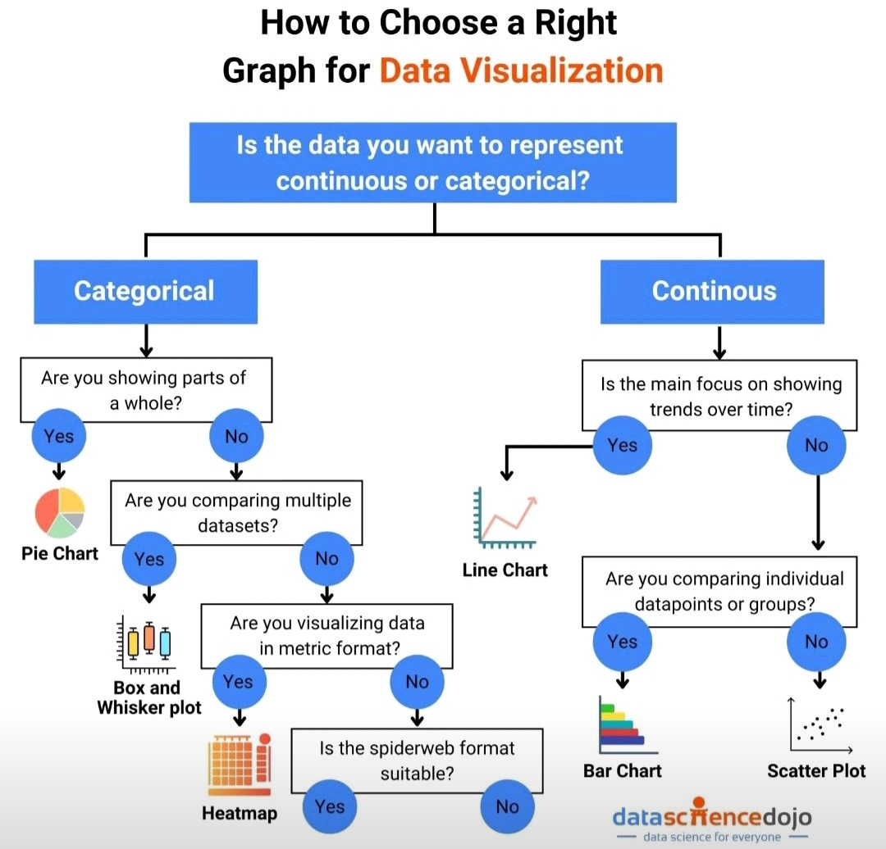

**Source:** [https://twitter.com/i/web/status/1929212517458251818](https://twitter.com/i/web/status/1929212517458251818)
**Original Post Date:** 2025-06-17 10:39:29

# Choosing the Right Graph for Data Visualization: A Decision Tree Approach

## Introduction
Data visualization is crucial for effective communication of insights, yet choosing the right graph type can be challenging. This knowledge base item presents a systematic approach through a decision tree framework, enabling analysts to select optimal visualizations based on their specific data characteristics and analytical goals.

## Categorical Data Visualization

Categorical data represents distinct groups or categories. The decision tree for categorical data follows four key questions:

1. Parts of a whole: Use pie charts when visualizing proportions within a single dataset, such as market share distributions.

2. Multiple dataset comparison: Box and whisker plots are ideal for comparing distributions across different groups, showing medians, quartiles, and outliers.

3. Metric format visualization: Heatmaps effectively represent matrix-based data with color variations, useful for correlation coefficients or cross-tabulations.

4. Multi-variable comparison: Radar charts are suitable for comparing multiple quantitative variables within the same dataset.

- Pie Chart - Proportional distribution of categories
- Box Plot - Distribution comparison across groups
- Heatmap - Matrix-based metric visualization
- Radar Chart - Multi-variable group comparisons

> **Note/Tip:** Avoid using pie charts for more than 7-8 categories to maintain clarity.

> **Note/Tip:** Consider heatmap color schemes carefully to ensure accessibility.

## Continuous Data Visualization

Continuous data requires different visualization approaches based on temporal and relational characteristics:

1. Time-based trends: Line charts excel at showing changes over time, ideal for stock prices or sales forecasts.

2. Individual comparisons: Bar charts are optimal for comparing discrete values across categories, such as monthly sales figures.

3. Variable relationships: Scatter plots reveal correlations between two continuous variables, essential for statistical analysis.

- Line Chart - Time series and trend analysis
- Bar Chart - Discrete value comparisons
- Scatter Plot - Bivariate relationships

> **Note/Tip:** Ensure line chart scales are appropriate to avoid misinterpretation.

> **Note/Tip:** Use scatter plot colors or symbols to encode additional dimensions.

## Implementation Considerations

When implementing this decision tree approach, consider the following technical aspects:

1. Data preprocessing requirements for each graph type.

2. Tool-specific implementation considerations (e.g., Python libraries: matplotlib, seaborn; JavaScript libraries: D3.js).

3. Performance implications when handling large datasets.

## Key Takeaways

- Decision trees provide a systematic approach to selecting appropriate visualization types based on data characteristics.
- Understanding the nature of your data (categorical vs. continuous) is crucial for effective visualization selection.
- Each graph type has specific use cases and limitations that must be considered during implementation.

## Conclusion
This structured decision tree approach provides a clear methodology for selecting appropriate visualizations, making it accessible to analysts at all levels while maintaining technical rigor. By following this framework, professionals can ensure their data visualizations effectively communicate insights.

## External References

- [Data Science Dojo](https://dataschience.dojo)

## Media

**Image Description:** ### Description of the Image

The image is a flowchart titled **"How to Choose the Right Graph for Data Visualization."** It provides a step-by-step guide to help users determine the most appropriate type of graph or chart for visualizing their data based on the nature of the data and the intended purpose of the visualization. The flowchart is structured in a decision tree format, with questions leading to different types of graphs depending on the answers provided.

#### **Main Title and Theme**
- The title is prominently displayed at the top: **"How to Choose the Right Graph for Data Visualization."**
- The theme revolves around data visualization techniques, specifically selecting the correct graph type for different types of data and visualization goals.

#### **Structure of the Flowchart**
The flowchart is divided into two main branches based on the type of data:
1. **Categorical Data**
2. **Continuous Data**

Each branch further splits into sub-questions to guide the user toward the appropriate graph type.

---

### **1. Categorical Data Branch**
This branch deals with data that falls into distinct categories or groups.

#### **Step 1: Are you showing parts of a whole?**
- **Yes**: Leads to a **Pie Chart**.
  - A pie chart is suitable when the data represents proportions or percentages of a whole.
  - Example: Showing the market share of different companies in an industry.
- **No**: Moves to the next question.

#### **Step 2: Are you comparing multiple datasets?**
- **Yes**: Leads to a **Box and Whisker Plot**.
  - A box plot is useful for comparing distributions of multiple datasets, showing median, quartiles, and outliers.
  - Example: Comparing test scores across different classes.
- **No**: Moves to the next question.

#### **Step 3: Are you visualizing data in metric format?**
- **Yes**: Leads to a **Heatmap**.
  - A heatmap is ideal for visualizing data in a matrix format, where values are represented by colors.
  - Example: Showing correlation coefficients between variables.
- **No**: Moves to the next question.

#### **Step 4: Is the spiderweb format suitable?**
- **Yes**: Leads to a **Spiderweb Chart (Radar Chart)**.
  - A radar chart is used to compare multiple quantitative variables for one or more groups.
  - Example: Comparing performance metrics across different products.
- **No**: No further options are provided in this branch.

---

### **2. Continuous Data Branch**
This branch deals with data that can take on any value within a range.

#### **Step 1: Is the main focus on showing trends over time?**
- **Yes**: Leads to a **Line Chart**.
  - A line chart is ideal for showing trends and changes over time.
  - Example: Tracking stock prices over a year.
- **No**: Moves to the next question.

#### **Step 2: Are you comparing individual data points or groups?**
- **Yes**: Leads to a **Bar Chart**.
  - A bar chart is useful for comparing discrete categories or groups.
  - Example: Comparing sales figures across different months.
- **No**: Leads to a **Scatter Plot**.
  - A scatter plot is used to show the relationship between two continuous variables.
  - Example: Plotting height vs. weight for a group of people.

---

### **Visual Elements**
- **Text and Labels**: 
  - Clear and concise questions and answers guide the user through the decision-making process.
  - Graph types are clearly labeled (e.g., Pie Chart, Line Chart, Bar Chart, etc.).
- **Icons and Examples**:
  - Small icons or examples of each graph type are provided to help users visualize the output.
  - For example:
    - Pie Chart: A pie chart icon is shown.
    - Line Chart: A line graph icon is shown.
    - Bar Chart: A bar chart icon is shown.
    - Scatter Plot: A scatter plot icon is shown.
- **Color Coding**:
  - Blue is used consistently for decision points and questions.
  - Graph types are highlighted in blue circles for easy identification.

---

### **Footer**
- The footer includes the logo and branding of **"dataschience.dojo"**, along with the tagline: **"Data Science for Everyone."**
- This indicates that the flowchart is part of an educational resource aimed at making data science accessible to a broader audience.

---

### **Key Technical Details**
1. **Decision Tree Structure**:
   - The flowchart uses a decision tree format, where each question leads to a binary decision (Yes/No).
   - This structure ensures a logical and systematic approach to selecting the right graph.

2. **Graph Types Covered**:
   - **Categorical Data**:
     - Pie Chart
     - Box and Whisker Plot
     - Heatmap
     - Spiderweb Chart (Radar Chart)
   - **Continuous Data**:
     - Line Chart
     - Bar Chart
     - Scatter Plot

3. **Purpose of Each Graph**:
   - The flowchart provides context for when each graph is most appropriate, based on the nature of the data and the visualization goal.

---

### **Overall Purpose**
The flowchart serves as a practical guide for individuals looking to choose the right graph for their data visualization needs. It simplifies the decision-making process by breaking it down into clear, step-by-step questions, making it accessible for both beginners and experienced data analysts. 

---

### **Summary**
This flowchart is a well-organized, visually appealing guide that helps users select the appropriate graph type for their data visualization needs. It covers both categorical and continuous data, providing clear decision points and examples for each graph type. The structured approach ensures that users can efficiently determine the best visualization method for their specific data and goals.
