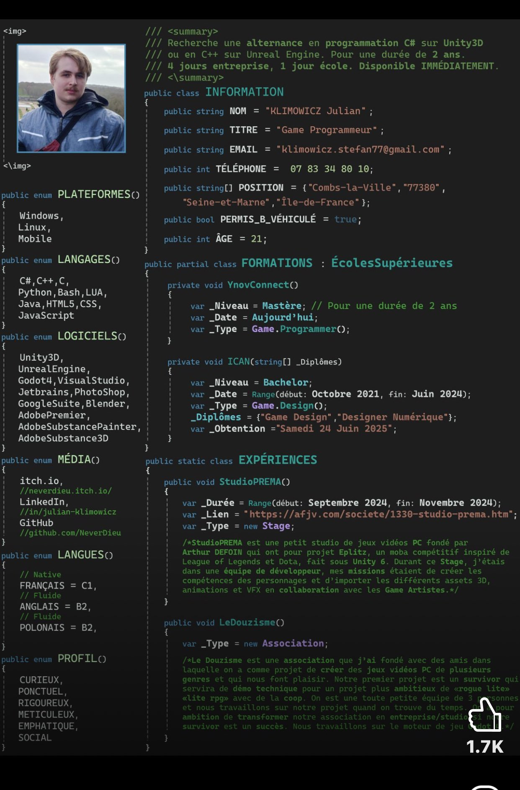

**Source:** [https://twitter.com/i/web/status/1939736438314053695](https://twitter.com/i/web/status/1939736438314053695)
**Original Post Date:** 2025-07-14 20:38:03

# Creative C# Resume Analysis: Game Programmer's Unconventional CV

## Introduction
In the competitive field of game development, standing out is crucial. This analysis explores an innovative resume presented as a C# code file by Julian Klimowicz, a Game Programmer. The resume leverages programming syntax to organize information creatively and technically relevant to the industry. We'll break down its structure, technical details, and visual elements, providing insights into how unconventional formats can effectively showcase skills and personality.

## Main Subject

The main subject of this resume is Julian Klimowicz, a Game Programmer seeking a 2-year internship in game programming using C# on Unity3D or C++ on Unreal Engine. The resume is formatted as a C# code file, making it both visually striking and technically relevant to the field of game development.

## Technical Details and Structure

The resume is structured as a class-based program with various sections represented as classes, enums, and methods. The top of the file includes a comment block that serves as a summary, describing the candidate's search for an internship and immediate availability.

- The `INFORMATION` class contains basic personal information such as name, title, email, phone number, location, driving license, and age.
- The `PLATEFORMES`, `LANGAGES`, `LOGICIELS`, `MÉDIA`, and `LANGUES` enums list the platforms, programming languages, software tools, online platforms, and languages spoken by the candidate.
- The `PROFIL` enum describes the candidate's personality traits.
- The `FORMATIONS` class details the candidate's educational background.
- The `EXPÉRIENCES` class lists the candidate's work experience.

## Visual Elements

The resume includes a profile picture in the top-left corner and uses syntax highlighting to differentiate between comments, classes, enums, strings, and other elements. Specific links to LinkedIn, itch.io, and GitHub are included for direct access to the candidate's online presence.

## Overall Impression

The resume is highly creative and tailored to the field of game development. By using C# code as the format, it showcases the candidate's technical skills and familiarity with programming languages and tools. The inclusion of personality traits and a mix of professional and personal projects demonstrates a well-rounded profile.

## Engagement Metrics

The image has 1.7K interactions (likes, shares, etc.), indicating that it resonated well with the audience due to its unique and professional presentation.

## Key Takeaways

- Unconventional resumes can effectively showcase skills and personality by leveraging relevant technical formats.
- The use of classes, enums, and methods in a resume can highlight familiarity with programming concepts and tools.
- Including personality traits and personal projects provides a well-rounded view of the candidate.
- Creative presentation can increase engagement and make a resume stand out in a competitive field.

## Conclusion
Julian Klimowicz's unconventional C# resume is a testament to the power of creativity and technical relevance in showcasing skills. By leveraging programming syntax, it effectively communicates the candidate's expertise and personality, making it a standout piece in the game development industry.

## External References

- [LinkedIn Profile](https://www.linkedin.com/in/julianklimowicz)
- [GitHub Profile](https://github.com/julianklimowicz)

## Media

**Image Description:** The image depicts a creative and unconventional resume presented in the form of a C# code file. The resume is structured as a class-based program, with various sections represented as classes, enums, and methods. Below is a detailed breakdown of the image:

### **Main Subject**
The main subject of the image is a resume for a **Game Programmer** named **Julian Klimowicz**. The resume is formatted as a C# code file, which is both visually striking and technically relevant to the field of game development.

### **Technical Details and Structure**
1. **Header Section**:
   - The top of the file includes a comment block (`///`) that serves as a summary. It describes the candidate's search for a 2-year internship in game programming, specifically using **C# on Unity3D** or **C++ on Unreal Engine**. The internship involves a 4:1 work-to-school ratio, and the candidate is immediately available.

2. **Class: INFORMATION**:
   - This class contains basic personal information:
     - **Name**: Julian Klimowicz
     - **Title**: Game Programmer
     - **Email**: `klimowicz.stefan77@gmail.com`
     - **Phone Number**: `07 33 43 80 10`
     - **Location**: Combs-la-Ville, 77380, Seine-et-Marne, Île-de-France
     - **Driving License**: B (with a vehicle)
     - **Age**: 21

3. **Enum: PLATEFORMES**:
   - Lists the platforms the candidate is familiar with:
     - Windows
     - Linux
     - Mobile

4. **Enum: LANGAGES**:
   - Lists programming languages and tools:
     - C#, C++, C
     - Python, Java, HTML5, LUA
     - JavaScript

5. **Enum: LOGICIELS**:
   - Lists software tools and game engines:
     - Unity3D, Unreal Engine
     - Visual Studio, Photoshop
     - Godot4, JetBrains, Blender
     - Adobe Premiere, Adobe Substance Painter, Adobe Substance 3D

6. **Enum: MÉDIA**:
   - Lists online platforms and social media:
     - itch.io, LinkedIn, GitHub
     - Specific links are provided for LinkedIn and GitHub profiles.

7. **Enum: LANGUES**:
   - Lists languages spoken:
     - Français (C1)
     - Anglais (B2)
     - Polonais (B2)

8. **Enum: PROFIL**:
   - Describes the candidate's personality traits:
     - Curieux (Curious)
     - Ponctuel (Punctual)
     - Ponctuel (Punctual)
     - Rigoureux (Rigorous)
     - Méthodique (Methodical)
     - Empathique (Empathetic)
     - Social

9. **Class: FORMATIONS**:
   - Details the candidate's educational background:
     - **YnovConnect**:
       - Level: Master's degree
       - Duration: 2 years
       - Type: Game Programmer
     - **ICAN**:
       - Level: Bachelor's degree
       - Duration: October 2021 to June 2024
       - Type: Game Design
       - Diplomas: Game Design, Digital Designer

10. **Class: EXPÉRIENCES**:
    - Lists the candidate's work experience:
      - **StudioPREMA**:
        - Duration: September 2024 to November 2024
        - Type: Internship
        - Description: Worked on a Unity 6 project called "Eplitz," a MOBA game inspired by League of Legends and Dota. Responsibilities included creating character competencies, importing 3D assets, animations, and VFX.
      - **Le Douzisme**:
        - Type: Association
        - Description: Founded an association with friends to create PC video games across multiple genres. The first project is a survival game with a co-op mode, using a "lite RPG" engine. The team is small (3 people) and works on the project when time allows.

### **Visual Elements**
- **Profile Picture**: A small image of the candidate is included in the top-left corner.
- **Code Syntax Highlighting**: The code uses syntax highlighting to differentiate between comments, classes, enums, strings, and other elements, making it visually organized and easy to read.
- **Links**: Specific links to LinkedIn, itch.io, and GitHub are included, providing direct access to the candidate's online presence.

### **Overall Impression**
The resume is highly creative and tailored to the field of game development. By using C# code as the format, it showcases the candidate's technical skills and familiarity with programming languages and tools. The use of enums, classes, and methods to organize information is both innovative and relevant to the industry. The inclusion of personality traits and a mix of professional and personal projects demonstrates a well-rounded profile. 

### **Engagement Metrics**
- The image has **1.7K interactions** (likes, shares, etc.), indicating that it resonated well with the audience, likely due to its unique and professional presentation.

This resume effectively combines technical expertise with creative presentation, making it stand out in a competitive field.
