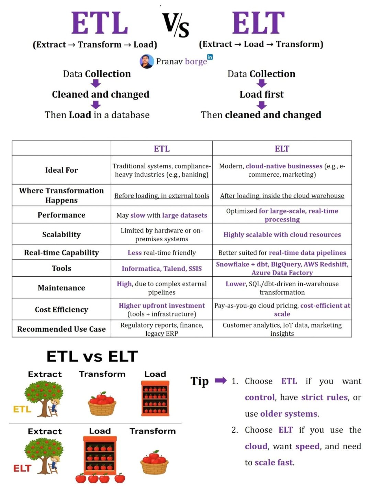

**Source:** [https://twitter.com/i/web/status/1918709562497986962](https://twitter.com/i/web/status/1918709562497986962)
**Original Post Date:** 2025-05-28 09:37:15

# Data Processing Methodologies: ETL vs ELT - A Technical Analysis

## Introduction
Data integration is fundamental to modern systems architecture, with two dominant methodologies: ETL and ELT. This analysis provides an in-depth comparison of their technical implementations, optimal use cases, and architectural implications. Understanding these differences helps engineers make informed decisions about data pipeline design and implementation strategies.

## Core Process Comparison

ETL (Extract, Transform, Load) follows a sequential process where raw data is extracted from source systems, transformed into the required format through cleaning and standardization, then loaded into a destination database.

ELT (Extract, Load, Transform) reverses this approach by first loading raw data directly into storage before performing transformations within the warehouse environment.

1. ETL: Data is transformed before storage
1. ELT: Storage occurs first, followed by transformation

## Technical Implementation Details

ETL requires significant preprocessing, using tools like Informatica or Talend to perform transformations externally. This approach can introduce performance bottlenecks with large datasets.

ELT leverages modern data warehouses' capabilities, performing transformations in-place after loading. This architecture is inherently more scalable and cost-effective for cloud-native applications.

- ETL Tools: Informatica, Talend, SSIS
- ELT Solutions: Snowflake + dbt, BigQuery, AWS Redshift

> **Note/Tip:** Consider data volume and real-time requirements when choosing between ETL and ELT.

## Performance and Scalability

ETL performance can degrade with increasing dataset sizes due to the preprocessing step. This makes it less suitable for real-time processing scenarios.

ELT's post-loading transformation approach excels in handling large-scale data and supports more efficient parallel processing within cloud environments.

- ETL: Limited by on-premises hardware capabilities
- ELT: Highly scalable with cloud resources

## Cost Considerations and Maintenance

ETL requires significant upfront investment in tools and infrastructure, making it cost-prohibitive for some implementations.

ELT offers pay-as-you-go pricing models with cloud providers, reducing initial costs while scaling efficiently.

- ETL: Higher maintenance due to complex external pipelines
- ELT: Lower maintenance through SQL/dbt-driven transformations

## Use Case Recommendations

ETL remains valuable for industries with strict compliance requirements, such as finance and healthcare.

ELT is ideal for modern applications requiring real-time processing and large-scale data analysis.

- ETL: Regulatory reporting, legacy ERP systems
- ELT: Customer analytics, IoT data processing

## Key Takeaways

- ETL excels in compliance-heavy industries with structured data requirements.
- ELT provides superior scalability and performance for cloud-native applications.
- Choose based on real-time needs, dataset size, and existing infrastructure constraints.

## Conclusion
The choice between ETL and ELT significantly impacts system architecture, maintenance costs, and operational efficiency. Understanding these methodologies' technical aspects enables informed decisions aligned with business requirements and technical constraints.

## External References

- [Pranav Borge's LinkedIn Profile]([LinkedIn Profile URL])

## Media

**Image Description:** The image is a detailed comparison between two data processing methodologies: **ETL (Extract, Transform, Load)** and **ELT (Extract, Load, Transform)**. It provides a comprehensive overview of their differences, ideal use cases, technical aspects, and recommendations. Below is a detailed breakdown:

---

### **Main Title and Overview**
- The image is titled **"ETL vs ELT"**.
- It compares the two methodologies:
  - **ETL**: Extract → Transform → Load
  - **ELT**: Extract → Load → Transform

---

### **Visual Representation**
1. **ETL Process**:
   - **Extract**: Data is collected from various sources.
   - **Transform**: Data is cleaned, changed, and prepared before loading.
   - **Load**: The transformed data is then loaded into a database.
   - **Visual**: A tree with apples represents the data source, a basket represents the transformation step, and a shelf represents the database where data is stored.

2. **ELT Process**:
   - **Extract**: Data is collected from various sources.
   - **Load**: Data is loaded into a database or data warehouse first.
   - **Transform**: Data is cleaned and transformed after being loaded.
   - **Visual**: Similar to ETL, but the transformation step occurs after loading, represented by the basket being placed after the shelf.

---

### **Comparison Table**
The table compares ETL and ELT across several key dimensions:

#### **1. Ideal For**
- **ETL**: Traditional systems, compliance-heavy industries (e.g., banking).
- **ELT**: Modern, cloud-native businesses (e.g., e-commerce, marketing).

#### **2. Where Transformation Happens**
- **ETL**: Before loading, in external tools.
- **ELT**: After loading, inside the cloud warehouse.

#### **3. Performance**
- **ETL**: May slow with large datasets.
- **ELT**: Optimized for large-scale, real-time processing.

#### **4. Scalability**
- **ETL**: Limited by hardware or on-premises systems.
- **ELT**: Highly scalable with cloud resources.

#### **5. Real-time Capability**
- **ETL**: Less real-time friendly.
- **ELT**: Better suited for real-time data pipelines.

#### **6. Tools**
- **ETL**: Informatica, Talend, SSIS.
- **ELT**: Snowflake + dbt, BigQuery, AWS Redshift, Azure Data Factory.

#### **7. Maintenance**
- **ETL**: High, due to complex external pipelines.
- **ELT**: Lower, SQL/dbt-driven in-warehouse processing.

#### **8. Cost Efficiency**
- **ETL**: Higher upfront investment (tools + infrastructure).
- **ELT**: Pay-as-you-go cloud pricing, cost-efficient at scale.

#### **9. Recommended Use Case**
- **ETL**: Regulatory reports, finance, legacy ERP.
- **ELT**: Customer analytics, IoT data, marketing insights.

---

### **Tips**
1. **Choose ETL if**:
   - You want strict control.
   - You have strict rules or older systems.
2. **Choose ELT if**:
   - You use the cloud.
   - You want speed and need to scale fast.

---

### **Visual Elements**
- **Icons and Illustrations**:
  - A tree with apples represents the data source.
  - A basket represents the transformation step.
  - A shelf represents the database or data warehouse.
- **Color Coding**:
  - Purple is used for ETL.
  - Green is used for ELT.
  - Black and white are used for neutral elements.

---

### **Additional Notes**
- The image is attributed to **Pranav Borge** (LinkedIn profile link included).
- The comparison is presented in a clear, structured format with contrasting colors to highlight differences.

---

### **Conclusion**
The image effectively contrasts ETL and ELT methodologies, providing a detailed comparison across multiple dimensions. It uses visuals and clear text to explain the processes, tools, and use cases for each approach, making it easy to understand the key differences and when to use each methodology.
