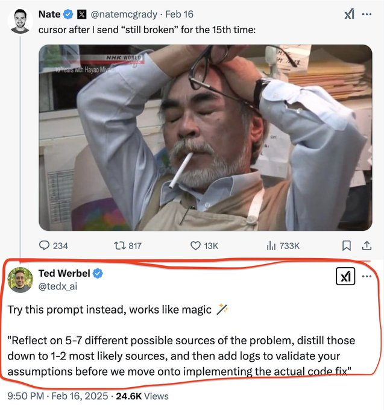

**Source:** [https://twitter.com/i/web/status/1918333258909000088](https://twitter.com/i/web/status/1918333258909000088)
**Original Post Date:** 2025-06-17 13:20:30

# Humor in Technical Troubleshooting: Analyzing a Viral Thread for Practical Insights

## Introduction
Technical frustrations often transcend individual issues to become universal experiences. This analysis deconstructs a popular tweet thread that juxtaposes exasperation with structured problem-solving approaches, revealing valuable lessons for software engineers dealing with persistent technical challenges.

The content provides insights into transforming emotional responses into methodical troubleshooting strategies, emphasizing the importance of systematic validation before implementation.

## Understanding Developer Frustration in Technical Support

Nate's tweet exemplifies a common scenario where repeated issue reporting without resolution leads to emotional exhaustion. The image effectively communicates this through visual cues: the raised hands, clenched glasses, and smoking cigarette all signal escalating frustration.

The office setting with papers scattered around and computer monitors suggests an environment of ongoing technical challenges, making the scenario immediately relatable to software engineers dealing with persistent bugs.

> **Note/Tip:** Acknowledge emotional fatigue in technical support interactions

> **Note/Tip:** Consider visual communication for conveying urgency and frustration

## Structured Troubleshooting Framework Analysis

Ted's reply introduces a systematic approach to troubleshooting that transforms chaos into order. The framework consists of three key steps: identification, prioritization, and validation.

The process encourages engineers to avoid premature solutions by first identifying multiple potential causes before implementing fixes.

_Demonstrates how to systematically identify and categorize potential issues before attempting fixes._

```javascript
// Example of structured issue identification
const possibleCauses = [
  'Network latency issues',
  'Database connection problems',
  'API endpoint errors',
  'Caching conflicts',
  'Configuration mismatches'
];

// Prioritize based on impact and probability
function prioritizeIssues(issues) {
  return issues.sort((a, b) => 
    // Add prioritization logic here
  );
}
```

1. Identify 5-7 potential problem sources
1. Prioritize based on likelihood and impact
1. Implement targeted logging for validation

## Implementation of Systematic Validation

The suggested approach emphasizes logging as a critical validation step. This prevents the cycle of trial-and-error fixes that often leads back to square one.

Proper instrumentation and structured validation create a feedback loop that improves both problem resolution and future debugging efforts.

## Key Takeaways

- Transform emotional responses into systematic problem-solving frameworks
- Implement structured validation through logging before attempting fixes
- Use humor as a communication tool to humanize technical challenges
- Prioritize potential causes based on impact and likelihood

## Conclusion
The tweet thread effectively demonstrates how combining empathy with structure creates more effective troubleshooting approaches. By adopting systematic methods for issue identification, prioritization, and validation, engineers can break the cycle of repeated fixes without resolution.

This approach not only improves problem-solving efficiency but also contributes to a healthier team culture where technical challenges are met with methodical solutions rather than frustration.


## Media

**Image Description:** The image is a screenshot of a Twitter thread featuring a humorous and relatable post about dealing with technical issues. Here's a detailed breakdown:

### **Main Components:**

1. **Top Post by Nate McGradly:**
   - **Profile Picture:** A small circular profile picture of a person with short hair.
   - **Username:** `@natemcgradly`
   - **Date:** February 16, 2025.
   - **Content:** 
     - The tweet reads: *"cursor after I send 'still broken' for the 15th time:"*
     - Accompanied by an image of a man in a state of frustration or exasperation.
   - **Image Description:**
     - The man appears to be middle-aged with a beard and mustache.
     - He is wearing a light blue shirt and a beige vest.
     - He has his hands raised to his head, holding a pair of glasses, suggesting frustration or exhaustion.
     - He is smoking a cigarette, which adds to the stressed or overwhelmed vibe.
     - The background shows a cluttered office environment with papers, a computer monitor, and other office supplies.

2. **Reply by Ted Werbel:**
   - **Profile Picture:** A small circular profile picture of a person with short hair.
   - **Username:** `@ted_x_ai`
   - **Date:** February 16, 2025, at 9:50 PM.
   - **Content:**
     - The reply suggests an alternative approach to troubleshooting technical issues.
     - The text reads:
       > *"Try this prompt instead, works like magic ✨"*
     - The suggested prompt is:
       > *"Reflect on 5-7 different possible sources of the problem, distill those down to 1-2 most likely sources, and then add logs to validate your assumptions before implementing the actual code fix."*
   - **Engagement Metrics:**
     - The reply has received 24.6K views, indicating significant engagement.

### **Technical Details:**
- **Twitter Interface:**
  - The tweet and reply are displayed in the standard Twitter format, with engagement metrics (likes, retweets, comments) visible.
  - The reply is highlighted with a red box, emphasizing its importance or relevance in the context of the image.
- **Image Quality:**
  - The image of the frustrated man is clear and detailed, showing his facial expression and body language effectively.
  - The background is slightly blurred, focusing attention on the man.
- **Text Formatting:**
  - The text in the tweet and reply is clear and legible.
  - The suggested prompt is formatted as a block of text, making it easy to read and follow.

### **Overall Context:**
The image humorously captures the frustration of repeatedly reporting a technical issue without resolution. The reply offers a constructive suggestion for troubleshooting, contrasting the exasperation in the original post with a more methodical approach. The combination of the image and the text creates a relatable scenario for anyone who has dealt with persistent technical problems.
