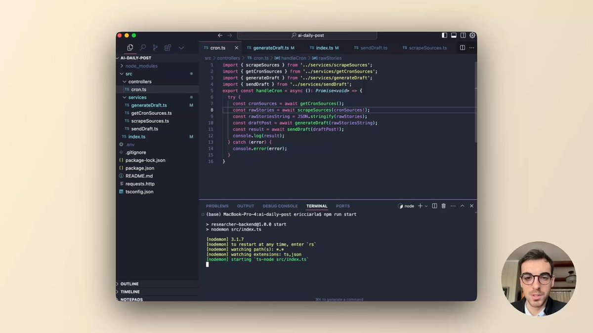

**Source:** [https://twitter.com/i/web/status/1874145916116222198](https://twitter.com/i/web/status/1874145916116222198)
**Original Post Date:** 2025-07-23 06:25:36

# Node.js TypeScript Project Analysis: AI-DAILY-POST Application Structure

## Introduction
The image depicts a Node.js application written in TypeScript, specifically focusing on a project named AI-DAILY-POST. This project appears to involve scraping data from various sources, generating draft posts, and sending them automatically using cron jobs. The code editor shown is Visual Studio Code (VS Code), with the main file being handleCron.ts. The terminal window indicates that the application is running using nodemon for automatic restarts during development.

## Project Overview

The project, named AI-DAILY-POST, is structured as a Node.js application using TypeScript. The main focus appears to be on automating the process of scraping data from various sources, generating draft posts, and sending them automatically.

The code editor shows a file named handleCron.ts, which contains an asynchronous function that orchestrates these tasks by importing and utilizing several utility functions from other modules.

- Scraping sources for data.
- Generating draft posts based on the scraped data.
- Sending the draft posts automatically using cron jobs.

## Code Structure and Imports

The handleCron.ts file imports several utility functions from other modules, including scrapeSources, getCronSources, generateDraft, and sendDraft. These functions are likely responsible for the core operations of scraping data, retrieving cron sources, generating draft posts, and sending them respectively.

The use of async/await syntax indicates that these operations are asynchronous and rely on promises to handle their results.

_These import statements bring in the necessary utility functions for scraping sources, retrieving cron sources, generating draft posts, and sending them._

```typescript
import { scrapeSources } from '../rawStories/scrapeSources';
import { getCronSources } from '../services/getCronSources';
import { generateDraft } from '../services/getGeneratedDraft';
import { sendDraft } from '../services/sendDraft';
```

## Main Functionality: handleCron

The handleCron function is the main entry point for the application's core functionality. It retrieves cron sources using getCronSources, scrapes raw stories from these sources with scrapeSources, converts them to a JSON string, generates a draft post using generateDraft, and finally sends the draft post via sendDraft.

The function also includes error handling to log any issues that may arise during execution.

_This function orchestrates the entire process of scraping, generating, and sending draft posts._

```typescript
async function handleCron() {
  const cronSources = await getCronSources();
  const rawStories = await scrapeSources(cronSources);
  const jsonString = JSON.stringify(rawStories);
  const draftPost = await generateDraft(jsonString);
  await sendDraft(draftPost);
  console.log('Result:', result || error);
}
```

## Project File Structure

The project follows a typical Node.js/TypeScript structure with clear separation of concerns. The src directory contains controllers and services, which are common in well-organized projects.

Key directories include node_modules for dependencies, src for source code, and other configuration files like package.json, README.md, .gitignore, and tsconfig.json.

- node_modules: Contains project dependencies.
- src: Contains the main source code with subdirectories for controllers and services.
- package.json: Manages project dependencies and scripts.
- README.md: Provides project documentation.
- .gitignore: Specifies files to ignore in version control.
- tsconfig.json: Configures TypeScript settings.

## Terminal and Development Setup

The terminal window shows that the application is running using nodemon, which automatically restarts the server when code changes are detected. This is a common setup for development environments.

The command executed in the terminal is npm run start, which likely starts the application with ts-node to run TypeScript files directly without compilation.

_This command starts the application using nodemon and ts-node for development purposes._

```bash
npm run start
```

## Additional Elements

The image also shows a profile picture in the bottom-right corner, suggesting that this might be from a live coding session or presentation.

The background is neutral, providing a clear focus on the editor window and its contents.

## Key Takeaways

- The project AI-DAILY-POST is structured as a Node.js application using TypeScript.
- The main functionality involves scraping data from sources, generating draft posts, and sending them automatically using cron jobs.
- The code editor shows the use of async/await for asynchronous operations and nodemon for development.
- The project follows best practices with clear separation of concerns in its directory structure.

## Conclusion
This analysis provides a comprehensive overview of the AI-DAILY-POST project, highlighting its structure, functionality, and development setup. The use of TypeScript and modern tools like nodemon underscores a professional approach to building scalable applications.

## External References

- [Node.js Official Documentation](https://nodejs.org/en/docs/)
- [TypeScript Official Documentation](https://www.typescriptlang.org/docs/)


## Media

**Image Description:** The image depicts a computer screen displaying a code editor, likely Visual Studio Code (VS Code), with a project focused on a Node.js application. The main subject is the code editor interface, which shows a TypeScript (`.ts`) file being edited. Below is a detailed breakdown of the image:

### **Main Subject: Code Editor Interface**
1. **Editor Window**:
   - The editor is open to a file named `handleCron.ts`, which is part of a project titled `ai-daily-post`.
   - The file contains TypeScript code, as indicated by the `.ts` extension and the syntax highlighting.
   - The code is structured as an asynchronous function `handleCron` that performs several tasks:
     - Imports functions from other modules (`scrapeSources`, `getCronSources`, `generateDraft`, `sendDraft`).
     - Uses `async/await` to handle asynchronous operations.
     - Logs results and errors to the console.

2. **Code Content**:
   - The file imports several utility functions from other modules:
     - `scrapeSources` from `../rawStories/scrapeSources`.
     - `getCronSources` from `../services/getCronSources`.
     - `generateDraft` from `../services/getGeneratedDraft`.
     - `sendDraft` from `../services/sendDraft`.
   - The `handleCron` function:
     - Calls `getCronSources` to retrieve cron sources.
     - Uses `scrapeSources` to fetch raw stories based on the cron sources.
     - Converts the raw stories to a JSON string.
     - Generates a draft post using `generateDraft`.
     - Sends the draft post using `sendDraft`.
     - Logs the result or error to the console.

3. **File Structure**:
   - The left sidebar shows the project's file structure:
     - The project is named `AI-DAILY-POST`.
     - Key directories include:
       - `node_modules`: Likely contains dependencies.
       - `src`: Contains the source code.
         - `controllers`: Contains controller files.
         - `services`: Contains service files.
     - Specific files visible:
       - `cron.ts`: Likely handles cron job logic.
       - `generateDraft.ts`: Likely generates draft posts.
       - `index.ts`: Likely the entry point of the application.
       - `sendDraft.ts`: Likely sends draft posts.
       - `scrapeSources.ts`: Likely scrapes sources for data.
     - Other files:
       - `package.json`: Manages project dependencies.
       - `README.md`: Likely contains project documentation.
       - `.gitignore`: Specifies files to ignore in version control.
       - `tsconfig.json`: Configures TypeScript settings.

4. **Terminal Window**:
   - The bottom section of the editor shows a terminal window.
   - The terminal is running a Node.js application using `nodemon`, a tool for automatically restarting the server when code changes.
   - The command executed is:
     ```
     npm run start
     ```
   - The terminal output indicates:
     - `nodemon` is watching for changes in `.ts` and `.json` files.
     - The application is starting with `ts-node src/index.ts`.

5. **Tabs and Navigation**:
   - The top of the editor shows several open tabs:
     - `cron.ts`
     - `generateDraft.ts`
     - `index.ts`
     - `sendDraft.ts`
     - `scrapeSources.ts`
   - The sidebar also shows navigation options like "Problems," "Output," "Debug Console," "Terminal," "Ports," etc.

### **Additional Elements**
1. **Profile Picture**:
   - In the bottom-right corner, there is a circular profile picture of a person, likely the developer or presenter. The individual is wearing glasses and appears to be speaking or presenting.

2. **Background**:
   - The background is a light beige or off-white color, providing a neutral backdrop for the editor window.

### **Technical Details**
- **Language**: TypeScript (`.ts` files).
- **Framework/Tools**:
  - Node.js: Used for running the application.
  - `nodemon`: Used for development to monitor and restart the server.
  - `ts-node`: Used to run TypeScript files without compilation.
- **Project Structure**: Follows a typical Node.js/TypeScript structure with clear separation of concerns (controllers, services, etc.).
- **Version Control**: The presence of `.gitignore` suggests the use of Git for version control.
- **Dependencies**: The `package.json` file indicates managed dependencies, though specific dependencies are not visible in the image.

### **Summary**
The image shows a developer working on a Node.js application using TypeScript. The project, named `AI-DAILY-POST`, appears to involve scraping sources, generating draft posts, and sending them, likely as part of a cron job. The code editor is Visual Studio Code, and the terminal shows the application running with `nodemon`. The profile picture suggests the image might be from a live coding session or presentation. The overall setup is professional and organized, adhering to best practices for modern web development.
