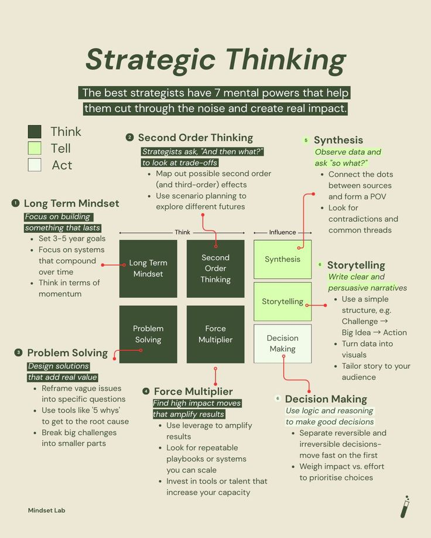

**Source:** [https://twitter.com/i/web/status/1929605248781635670](https://twitter.com/i/web/status/1929605248781635670)
**Original Post Date:** 2025-06-17 13:05:20

# Strategic Thinking Framework Analysis - 7 Mental Powers of Effective Strategists

## Introduction
This infographic presents a structured approach to strategic thinking, breaking down complex decision-making into seven essential mental powers. The framework emphasizes sequential progression from foundational thinking processes to advanced communication and decision-making skills. Through careful design elements like color coding and directional arrows, it provides a clear visual roadmap for developing strategic capabilities.

## Foundational Thinking Processes

The first four mental powers form the bedrock of strategic thinking:

1. Long Term Mindset establishes sustainable goals and systems that compound over time

2. Second Order Thinking encourages consideration of cascading effects through scenario planning

3. Problem Solving provides tools for root cause analysis using frameworks like '5 Whys'

4. Force Multiplier focuses on leveraging repeatable processes and scalable solutions

- Focus on 3-5 year strategic goals
- Develop systems with compounding benefits
- Map out second-order effects systematically
- Utilize root cause analysis techniques

> **Note/Tip:** Visualized in green boxes to emphasize foundational nature

> **Note/Tip:** Sequential progression indicated by red arrows between components

## Communication and Decision-Making

The final three mental powers transition to advanced strategic capabilities:

5. Synthesis connects disparate data points into coherent narratives

6. Storytelling transforms complex information into compelling narratives

7. Decision Making provides frameworks for prioritizing irreversible choices

- Identify patterns and contradictions in data
- Structure stories using challenge → idea → action format
- Evaluate impact vs effort to prioritize decisions

> **Note/Tip:** Visualized in yellow boxes to distinguish from foundational elements

> **Note/Tip:** Flow indicated by arrows showing progression to decision-making stage

## Design Elements and Implementation

The infographic employs a minimalist design with clean typography on light beige background, utilizing green for foundational thinking processes and yellow for communication/decision-making stages. Red directional arrows guide the viewer through the logical progression of strategic development.

> **Note/Tip:** Color coding aids rapid information processing

> **Note/Tip:** Visual hierarchy supports sequential learning

## Key Takeaways

- Strategic thinking can be broken down into seven distinct mental powers with clear applications
- Foundational processes must precede advanced communication and decision-making skills
- Visualization elements enhance understanding of complex strategic frameworks
- Each mental power builds upon previous ones to form a comprehensive approach

## Conclusion
This framework provides a structured methodology for developing strategic capabilities. By following the progression from foundational thinking through advanced decision-making, individuals can systematically improve their ability to cut through noise and create meaningful impact in any domain.

## Media

**Image Description:** ### Image Description: Strategic Thinking Framework

#### **Overview**
The image is a detailed infographic titled **"Strategic Thinking"**, designed to outline the mental powers and processes that effective strategists use to cut through noise and create real impact. The content is organized into a structured framework with a focus on seven key mental powers, each accompanied by detailed explanations and supporting concepts. The design uses a clean, minimalist aesthetic with a light beige background, green and yellow highlights, and clear typography.

---

### **Main Sections and Details**

#### **Title**
- **Text**: "Strategic Thinking"
- **Font**: Bold, prominent, and centered at the top of the image.
- **Purpose**: Sets the theme of the infographic, emphasizing the importance of strategic thinking.

#### **Introduction**
- **Text**: 
  - "The best strategists have 7 mental powers that help them cut through the noise and create real impact."
  - This introductory statement highlights the core idea of the infographic: strategists use specific mental tools to achieve impactful results.
- **Design**: The text is concise and placed above the main content, serving as a guiding principle.

---

#### **7 Mental Powers**
The infographic is organized into seven key mental powers, each represented by a numbered section. These powers are visually grouped into two columns, with the left column focusing on foundational thinking processes and the right column emphasizing communication and decision-making.

---

### **Left Column: Foundational Thinking Processes**

#### **1. Long Term Mindset**
- **Description**:
  - Focuses on building something that lasts.
  - Key points:
    - Set 3-5 year goals.
    - Focus on systems that compound over time.
    - Think in terms of momentum.
  - **Design**: Highlighted in a green box with a red arrow pointing to it, emphasizing its foundational role.

#### **2. Second Order Thinking**
- **Description**:
  - Strategists ask, "And then what?" to look at trade-offs.
  - Key points:
    - Map out possible second-order (and third-order) effects.
    - Use scenario planning to explore different futures.
  - **Design**: Presented in a green box, connected to the "Long Term Mindset" box by a red arrow, indicating a sequential relationship.

#### **3. Problem Solving**
- **Description**:
  - Design solutions that add real value.
  - Key points:
    - Reframe vague issues into specific questions.
    - Use tools like the "5 Whys" to get to the root cause.
    - Break big challenges into smaller parts.
  - **Design**: Highlighted in a green box, connected to the "Second Order Thinking" box, showing a logical progression.

#### **4. Force Multiplier**
- **Description**:
  - Find high-impact moves that amplify results.
  - Key points:
    - Use leverage to amplify results.
    - Look for repeatable playbooks or systems you can scale.
    - Invest in tools or talent that increase your capacity.
  - **Design**: Presented in a green box, connected to the "Problem Solving" box, indicating a continuation of the strategic process.

---

### **Right Column: Communication and Decision-Making**

#### **5. Synthesis**
- **Description**:
  - Observe data and narratives and ask, "So what?"
  - Key points:
    - Connect the dots and form sources.
    - Look for patterns, contradictions, and common threads.
  - **Design**: Highlighted in a yellow box, connected to the "Force Multiplier" box, indicating a shift toward synthesizing information.

#### **6. Storytelling**
- **Description**:
  - Write clear, persuasive, and narrative-driven content.
  - Key points:
    - Use a simple structure (e.g., challenge → big idea → action).
    - Turn data into visuals.
    - Tailor the story to your audience.
  - **Design**: Presented in a yellow box, connected to the "Synthesis" box, emphasizing the importance of communication.

#### **7. Decision Making**
- **Description**:
  - Use logic and reasoning to make good decisions.
  - Key points:
    - Separate reversible and irreversible decisions.
    - Move fast on the first irreversible decision.
    - Weigh impact vs. effort to prioritize choices.
  - **Design**: Highlighted in a yellow box, connected to the "Storytelling" box, indicating the final step in the strategic process.

---

### **Visual Elements**
- **Color Coding**:
  - **Green Boxes**: Represent foundational thinking processes (Long Term Mindset, Second Order Thinking, Problem Solving, Force Multiplier).
  - **Yellow Boxes**: Represent communication and decision-making processes (Synthesis, Storytelling, Decision Making).
- **Arrows**: Red arrows connect the boxes, illustrating the flow and progression of the strategic thinking process.
- **Typography**: Clear, sans-serif font used throughout for readability.
- **Layout**: Symmetrical and balanced, with a clean, organized structure.

---

### **Footer**
- **Text**: "Mindset Lab"
- **Purpose**: Indicates the source or creator of the infographic.

---

### **Overall Theme**
The infographic provides a comprehensive guide to strategic thinking, breaking it down into seven mental powers. It emphasizes a structured approach, starting with foundational thinking processes and progressing to communication and decision-making. The use of color coding, arrows, and concise text ensures clarity and ease of understanding. The design is professional and visually appealing, making it an effective tool for strategists and learners alike.
