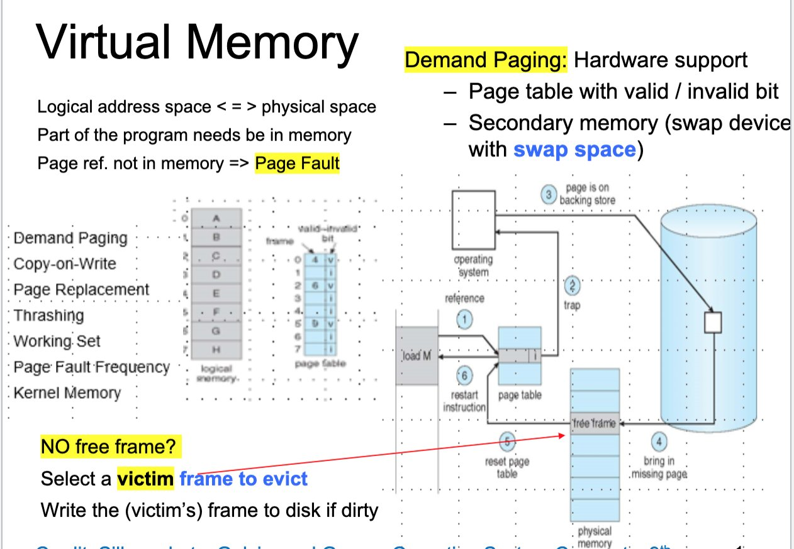

**Source:** [https://twitter.com/i/web/status/1926614486263247065](https://twitter.com/i/web/status/1926614486263247065)
**Original Post Date:** 2025-05-28 09:23:54

# Virtual Memory Management in Operating Systems: Demand Paging and Page Replacement

## Introduction
Virtual memory is a fundamental concept in modern operating systems that enables efficient memory utilization through address space abstraction. This knowledge base explores the core mechanisms of virtual memory management, focusing on demand paging, page replacement algorithms, and fault handling processes. Understanding these concepts is crucial for system developers and architects working with low-level memory management.

## Key Concepts and Terminology

Virtual memory operates through the abstraction of logical address spaces (program view) mapped to physical address spaces (RAM locations). This mapping is managed by page tables that track valid/invalid states for each memory page.

Demand paging, a hardware-supported mechanism, loads program pages only when needed. This approach optimizes memory usage by avoiding unnecessary loading of entire programs into RAM.

- Logical vs Physical Address Spaces: Program view mapped to physical memory locations
- Page Faults: Triggered when accessing non-resident pages
- Copy-on-Write: Optimizes page sharing between processes

> **Note/Tip:** Understanding the working set size is crucial for determining optimal memory allocation

> **Note/Tip:** Kernel memory typically remains unpaged to ensure OS stability

## Demand Paging Process

The demand paging workflow involves: 1) Logical address generation, 2) Page table lookup, and 3) Physical address resolution. When a page fault occurs, the system must load the required page from secondary storage.

Page replacement becomes necessary when no free frames are available. The selection of victim frames impacts overall system performance.

```plaintext
Page Table Structure:
Frame | Valid/Invalid Bit | Modified Flag
0     | 1                  | 0
1     | 0                  | 1
2     | 1                  | 0
```

## Performance Considerations

Thrashing occurs when excessive page swapping degrades system performance. Managing the working set size and optimizing page replacement algorithms helps mitigate this issue.

Page fault frequency serves as a critical metric for evaluating memory management efficiency.

1. Monitor page fault rates to detect potential thrashing conditions
1. Adjust working set size based on available physical memory
1. Implement efficient page replacement strategies

## Key Takeaways

- Demand paging optimizes memory usage by loading pages only when needed, reducing initial memory overhead
- Page fault handling and victim selection are critical for system performance optimization
- Managing the working set size effectively prevents thrashing and maintains optimal memory utilization

## Conclusion
Virtual memory management through demand paging and efficient page replacement strategies is essential for modern operating systems. Understanding these mechanisms enables developers to create more efficient applications and optimize system performance.

## External References

- [Operating System Concepts by Silberschatz et al](https://www.wiley.com/en-us/Operating+System+Concepts%2C+10th+Edition-p-9781118063330)
- [Linux Kernel Memory Management Documentation](https://www.kernel.org/doc/html/latest/admin-guide/mm/index.html)


## Media

**Image Description:** The image is a slide from a presentation on **Virtual Memory** in computer systems. It provides an overview of the concepts, mechanisms, and processes involved in managing virtual memory, particularly focusing on **Demand Paging** and **Page Replacement**. Below is a detailed description of the slide, highlighting the main subject and technical details:

---

### **Main Title: Virtual Memory**
The slide is titled "Virtual Memory," indicating that the content revolves around the principles and mechanisms of virtual memory management in operating systems.

---

### **Left Side: Key Concepts and Terminology**
1. **Logical Address Space vs. Physical Address Space:**
   - The slide explains that the **logical address space** (used by the program) is mapped to the **physical address space** (actual memory locations in RAM).
   - This mapping is a fundamental aspect of virtual memory.

2. **Demand Paging:**
   - **Definition:** Demand paging is a technique where pages of a program are loaded into physical memory only when they are actually needed (i.e., referenced by the program).
   - **Key Point:** This reduces the need to load the entire program into memory at once, improving memory utilization.

3. **Page Fault:**
   - When a program references a page that is not currently in physical memory, a **page fault** occurs.
   - The system must then load the required page from secondary storage (e.g., disk) into physical memory.

4. **Copy-on-Write:**
   - A mechanism where a page is copied only when it is modified, rather than when it is first accessed. This is useful for sharing pages between processes (e.g., in fork operations).

5. **Page Replacement:**
   - The process of replacing a page in physical memory with another page when there are no free frames available.
   - This involves selecting a victim page to evict from memory.

6. **Thrashing:**
   - A condition where the system spends more time swapping pages between memory and disk than executing useful work, leading to poor performance.

7. **Working Set:**
   - The set of pages that a process is actively using at a given time. Managing the working set is crucial for efficient memory utilization.

8. **Page Fault Frequency:**
   - The rate at which page faults occur, which can be used to evaluate the performance of the memory management system.

9. **Kernel Memory:**
   - Memory used by the operating system kernel, which is typically not paged out.

---

### **Right Side: Detailed Diagram and Mechanisms**
The right side of the slide contains a detailed diagram illustrating the process of **Demand Paging** and **Page Replacement**. Here’s a breakdown:

1. **Page Table:**
   - A **page table** is used to map logical addresses to physical addresses.
   - Each entry in the page table includes a **valid/invalid bit**:
     - **Valid:** Indicates that the page is present in physical memory.
     - **Invalid:** Indicates that the page is not in physical memory and must be fetched from secondary storage.

2. **Secondary Memory (Swap Space):**
   - Pages that are not currently in physical memory are stored in **secondary memory** (e.g., disk swap space).
   - When a page fault occurs, the required page is fetched from this secondary storage.

3. **Page Fault Handling:**
   - **Step 1:** The program references a page that is not in physical memory (indicated by the invalid bit in the page table).
   - **Step 2:** A **trap** is triggered, and the operating system takes control.
   - **Step 3:** The operating system checks the page table and identifies the missing page.
   - **Step 4:** The operating system selects a **victim frame** in physical memory to evict.
     - If the victim frame is dirty (i.e., it has been modified), it is written back to secondary storage.
   - **Step 5:** The missing page is brought into the newly freed frame from secondary storage.
   - **Step 6:** The page table is updated to mark the page as valid, and the program resumes execution.

4. **Visual Representation:**
   - The diagram shows:
     - A **logical address space** divided into pages (e.g., A, B, C, etc.).
     - A **page table** with entries corresponding to each page, including the valid/invalid bit.
     - A **physical memory** area with frames, some of which are occupied by pages and others marked as free.
     - A **secondary storage** (disk) containing pages that are not currently in physical memory.

5. **Highlighted Steps:**
   - The slide emphasizes the process of selecting a **victim frame** when no free frames are available and the need to write the victim frame to disk if it is dirty.

---

### **Highlighted Text and Key Points**
- **Demand Paging:** Highlighted as a key mechanism supported by hardware.
- **Page Fault:** Emphasized as the event that triggers the loading of a missing page.
- **Victim Frame Selection:** Highlighted as a critical step in page replacement when no free frames are available.
- **Swap Space:** Highlighted as the secondary storage used for storing pages not currently in physical memory.

---

### **Overall Theme**
The slide provides a comprehensive overview of virtual memory management, focusing on demand paging, page replacement, and the handling of page faults. It uses both textual explanations and a detailed diagram to illustrate the flow of operations when a program accesses memory pages that are not currently in physical memory.

This slide is likely part of a lecture or presentation on operating systems, specifically covering memory management concepts.
