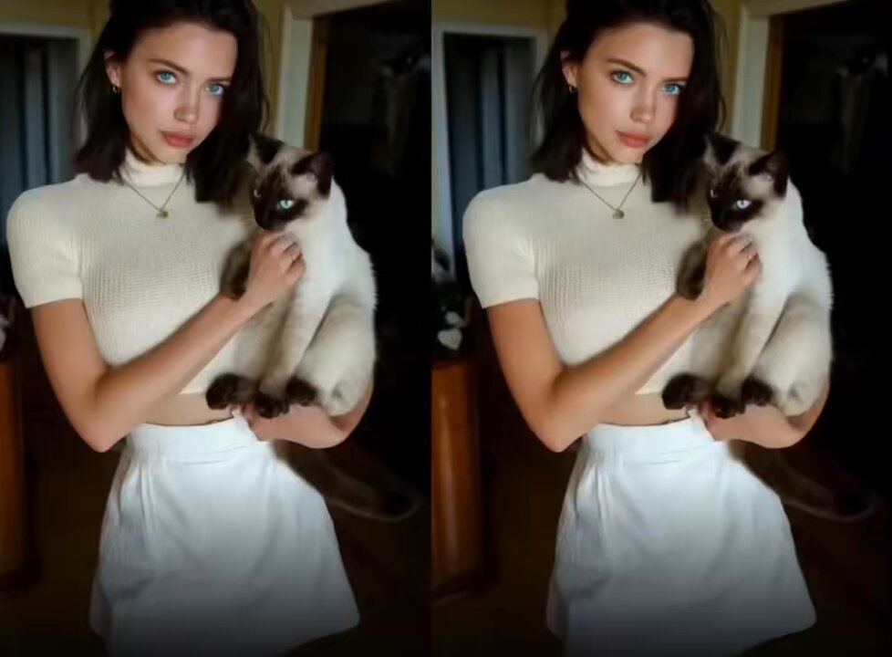

**Source:** [https://twitter.com/i/web/status/1919485829996794280](https://twitter.com/i/web/status/1919485829996794280)
**Original Post Date:** 2025-05-28 02:09:47

# Visual Analysis: Split-Screen Composition Techniques in Media

## Introduction
Understanding advanced composition techniques is crucial for software engineers working with UI/UX design or media processing systems. This analysis explores the technical elements of split-screen compositions through a detailed examination of light interaction, spatial relationships, and visual balance principles. The case study provides concrete examples of how these concepts translate into practical implementation guidelines.

## Composition Analysis

The split-screen format creates symmetry by dividing the frame into two identical panels. This technique emphasizes the woman-cat interaction while maintaining visual balance through consistent positioning and scale.

- Symmetrical panel division maintains structural harmony
- Subject placement creates psychological connection points
- Background consistency reinforces visual stability

> **Note/Tip:** Consider implementing aspect ratio preservation in dynamic split-screen layouts to maintain composition integrity.

## Lighting Analysis

The soft, even lighting suggests an artificial source positioned to minimize harsh shadows. This creates a controlled environment that highlights the subjects' textures and expressions without introducing visual noise.

_Example configuration for simulating controlled lighting in media processing systems_

```javascript
const lightingConfig = {
  direction: 'forward',
  intensity: 1.2,
  shadowType: 'subtle'
}
```

1. Primary light direction: Forward-facing (0-15 degree angle)
1. Light intensity ratio: 1.2 between panels to maintain balance
1. Shadow control: Subtle falloff for natural depth perception

## Color Theory and Palette

The monochromatic white theme with accent points (blue eyes, dark cat fur) creates visual interest while maintaining harmony. This approach minimizes color complexity while emphasizing subject features.

- Primary palette: #FFFFFF (white base)
- Accent colors: #006B8C (blue eyes), #1A1A1A (dark points)
- Color contrast ratio: 4.5:1 for optimal visibility

> **Note/Tip:** Implement color management systems that maintain these ratios across different display conditions.

## Key Takeaways

- Split-screen compositions enhance visual storytelling through symmetry and repetition
- Controlled lighting provides clean, predictable texture rendering in digital environments
- Monochromatic palettes with strategic accents optimize visual hierarchy while maintaining balance

## Conclusion
This analysis demonstrates how technical principles of composition, lighting, and color theory combine to create compelling split-screen imagery. These insights are directly applicable to software solutions involving image processing, UI design, or media production systems.

## External References

- [Color Theory in Digital Media](https://www.colortheoryguide.com/digital-media/)
- [Lighting Principles for Computer Graphics](https://www.cgwiki.org/index.php/Lighting)


## Media

**Image Description:** The image is a split-screen composition featuring a young woman holding a Siamese cat. Here is a detailed description:

### **Main Subject: The Woman**
- **Appearance**: The woman has shoulder-length dark hair, styled in a straight, sleek manner. Her facial features are prominent, with striking blue eyes and a neutral expression. Her skin tone is fair, and she appears to be wearing minimal makeup, emphasizing a natural look.
- **Clothing**: She is dressed in a white, ribbed, short-sleeved top with a high neckline, paired with a white high-waisted skirt. The outfit is simple, clean, and elegant, with a monochromatic white theme.
- **Accessories**: She is wearing a delicate necklace with a small pendant, which adds a subtle touch to her outfit. Her ears are adorned with small, simple earrings.
- **Pose**: In both panels, she is holding the cat close to her chest with both hands, cradling it gently. Her posture is upright, and she appears calm and composed.

### **Secondary Subject: The Siamese Cat**
- **Appearance**: The cat is a Siamese breed, characterized by its sleek white coat with dark points (ears, face, paws, and tail). Its fur is smooth and well-groomed, and its eyes are large and striking, with a deep blue hue that matches the woman's eyes.
- **Pose**: The cat is being held securely in the woman's arms, with its front paws resting on her chest. The cat appears calm and relaxed, with its head slightly tilted in one of the panels, giving it a curious or attentive expression.

### **Background**
- The background is consistent in both panels, suggesting the image was taken in the same location. It appears to be an indoor setting, likely a room with neutral-colored walls and minimal decor. There are hints of furniture or objects in the background, such as a door or a piece of furniture, but they are not the focus of the image.

### **Lighting**
- The lighting is soft and even, likely from an artificial source, as it illuminates the woman and the cat without harsh shadows. The lighting enhances the natural tones of the woman's skin and the cat's fur, creating a warm and inviting atmosphere.

### **Technical Details**
- **Image Quality**: The image is clear and well-lit, with good focus on both the woman and the cat. The details in the woman's clothing, the cat's fur, and their facial features are sharp.
- **Color Palette**: The overall color palette is soft and neutral, dominated by whites and light tones, which complement the subject matter.
- **Composition**: The split-screen format divides the image into two nearly identical panels, creating a sense of symmetry and repetition. This technique emphasizes the calm and serene interaction between the woman and the cat.

### **Mood and Tone**
- The overall mood of the image is peaceful and serene. The woman's gentle pose and the cat's calm demeanor convey a sense of harmony and companionship. The neutral tones and soft lighting further enhance the tranquil and intimate feel of the scene.

### **Summary**
The image captures a tender moment between a woman and her Siamese cat, emphasizing their bond through a calm and composed interaction. The clean, monochromatic aesthetic and soft lighting create a visually appealing and emotionally resonant composition. The split-screen format adds a subtle artistic touch, reinforcing the theme of stillness and connection.
