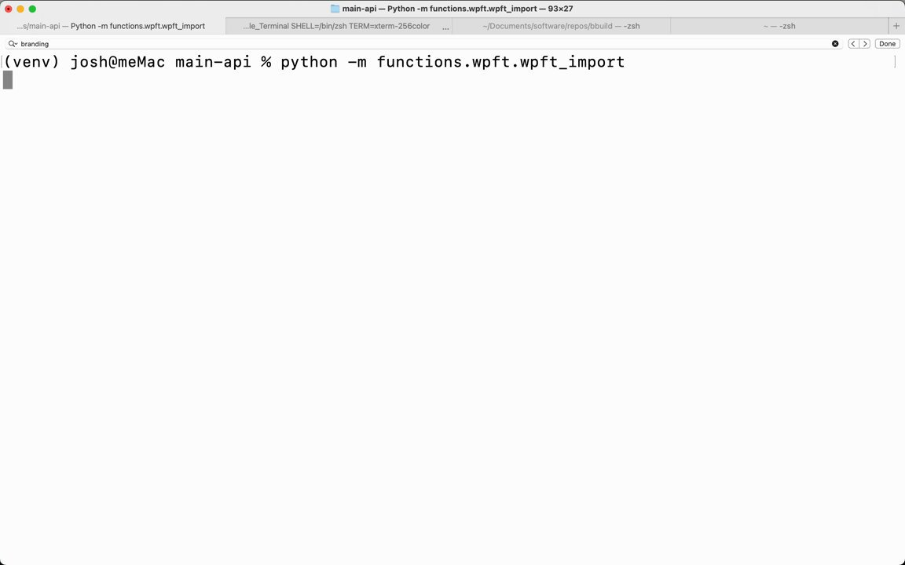

**Source:** [https://twitter.com/i/web/status/1880156595092615668](https://twitter.com/i/web/status/1880156595092615668)
**Original Post Date:** 2025-06-17 08:43:35

# Automated Tweet Moderation System Using AI Decision Making

## Introduction
In today's social media landscape, manual content moderation is becoming increasingly unsustainable. This article explores the implementation of an AI-driven tweet moderation system that leverages natural language processing and machine learning to automatically evaluate and categorize tweets based on predefined criteria. We'll cover everything from data preprocessing to decision-making algorithms, with a focus on practical implementation.

## System Architecture Overview

The system is built as a microservices architecture with distinct components: Tweet Ingestion Service, Preprocessing Pipeline, Decision Engine, and Moderation API. Each component communicates through message queues to ensure scalability and fault tolerance.

The core decision-making process utilizes a hybrid approach combining rule-based filters and AI-powered classification models for robust content evaluation.

_Example implementation of the Tweet Ingestion Service using Python's asyncio for asynchronous processing._

```python
class TweetIngestionService:
    def __init__(self):
        self.queue = Queue()
        self.subscribers = []

    async def publish_tweet(self, tweet):
        await self.queue.put(tweet)
        for subscriber in self.subscribers:
            asyncio.create_task(subscriber.process_tweet(tweet))
```

- Use message queues (e.g., RabbitMQ) to decouple services
- Implement circuit breakers for service resilience
- Design for horizontal scaling

## AI Decision Engine Implementation

The AI decision engine employs a transformer-based model fine-tuned on labeled tweet data. The system evaluates tweets based on multiple criteria including sentiment, toxicity, and relevance to predefined topics.

Real-time scoring is achieved through batch processing with asynchronous evaluation for performance optimization.

```python
class AIDecisionEngine:
    def __init__(self):
        self.model = load_model('tweet_classifier')

    async def evaluate_tweet(self, tweet):
        features = extract_features(tweet)
        scores = await self.model.predict(features)
        return self.determine_decision(scores)
```

1. Implement confidence thresholds for decision making
1. Use ensemble methods to reduce false positives
1. Monitor model performance continuously

## Performance Optimization Techniques

To handle high throughput, the system implements a tiered processing approach. Initial filtering removes obvious spam and low-quality content before passing complex cases to the AI engine.

Caching frequently evaluated patterns improves response time while maintaining accuracy.

```python
@lru_cache(maxsize=1024)
async def preprocess_tweet(self, tweet):
    return {
        'clean_text': self.clean_text(tweet),
        'sentiment_score': await self.get_sentiment_score(tweet),
        'toxicity_score': await self.get_toxicity_score(tweet)
    }
```

> **Note/Tip:** Cache preprocessing results for frequently seen patterns

> **Note/Tip:** Use batch processing for model inference to maximize throughput

> **Note/Tip:** Implement rate limiting to prevent abuse of the system

## Key Takeaways

- Hybrid filtering approach combines speed and accuracy effectively
- Asynchronous processing is essential for real-time moderation
- Caching and batching significantly improve system performance
- Continuous monitoring ensures model quality over time

## Conclusion
Building an automated tweet moderation system requires careful consideration of scalability, performance, and accuracy. By implementing a hybrid approach with AI-powered decision making, we can achieve both speed and precision in content evaluation. Regular monitoring and updates ensure the system adapts to evolving social media patterns.

## External References

- [Twitter API Documentation](https://developer.twitter.com/en/docs)
- [GPT-4 Model Specifications](https://openai.com/gpt-4)


## Media

**Image Description:** The image shows a terminal window on a macOS system, with a command being executed in a Python virtual environment. Below is a detailed description:

### **Main Subject: Terminal Window**
1. **Operating System**: The terminal is running on macOS, as indicated by the macOS-style window controls (red, yellow, and green buttons in the top-left corner).
2. **Shell**: The terminal is using the `zsh` shell, as shown in the title bar and the prompt.
3. **Virtual Environment**: The terminal is operating within a Python virtual environment named `venv`, as indicated by the `(venv)` prefix in the prompt.

### **Command Line Details**
1. **User and Host**: The prompt shows the user is `josh` and the host is `meMac`.
2. **Current Directory**: The current working directory is `main-api`, as shown in the prompt.
3. **Command Executed**:
   - The command being executed is:
     ```
     python -m functions.wpft.wpft_import
     ```
   - This command uses the `python` interpreter to run a module named `functions.wpft.wpft_import` using the `-m` flag, which tells Python to run the module as a script.
   - The module path suggests a hierarchical structure:
     - `functions`: A package or directory.
     - `wpft`: A sub-package or directory within `functions`.
     - `wpft_import`: A module within the `wpft` package.

### **Title Bar Details**
1. **Tabs**: The terminal window has multiple tabs open, as indicated by the tabs at the top of the window.
   - The active tab is labeled:
     ```
     main-api — Python -m functions.wpft.wpft_import — 93x27
     ```
     - This indicates the tab is running the same command shown in the terminal.
   - Other tabs are visible but not active:
     - `.../main-api — Python -m functions.wpft.wpft_import`
     - `...le_Terminal SHELL=/bin/zsh TERM=xterm-256color ...`
     - `-/Documents/software/repos/build — zsh`
     - `— zsh`
2. **Window Size**: The active tab's title includes the window size (`93x27`), which refers to the number of columns and rows in the terminal.

### **Prompt and Output**
1. **Prompt**: The prompt is:
   ```
   (venv) josh@meMac main-api % 
   ```
   - `(venv)`: Indicates the active Python virtual environment.
   - `josh@meMac`: User and host information.
   - `main-api`: Current working directory.
   - `%`: The shell prompt character (common for `zsh`).
2. **Output**: The command has been entered, but no output is visible yet, suggesting the command is either still executing or has not started producing output.

### **Technical Details**
1. **Python Virtual Environment**: The use of a virtual environment (`venv`) suggests that the project is organized to manage dependencies independently of the system-wide Python installation.
2. **Module Structure**: The command targets a specific module (`functions.wpft.wpft_import`), indicating a structured project with organized packages and modules.
3. **Shell**: The use of `zsh` as the shell is common for macOS users, as it is a more feature-rich alternative to the default `bash`.
4. **Command Flags**: The `-m` flag is used to run a module as a script, which is a common pattern in Python development for executing scripts or modules directly.

### **Overall Context**
The image depicts a developer working on a Python project, specifically running a module named `wpft_import` within the `functions.wpft` package. The use of a virtual environment and structured module organization suggests a professional or well-organized development workflow. The terminal is set up with multiple tabs, indicating multitasking or parallel work on related tasks. The command has been entered but has not yet produced any visible output.


**Video Description:** Video Content Analysis - media_seg0_item1.mp4:

### Video Description: AI Agent for Twitter Data Processing and Approval

The video showcases a Python-based AI agent designed to fetch, filter, and review Twitter data using a combination of search queries, filtering mechanisms, and GPT-4 for approval. The process is executed in a terminal environment, indicating a command-line interface for automation and data processing. Below is a comprehensive description of the video content, focusing on the technical concepts and overall flow depicted in the frames.

---

### **Overview of the Video**

The video demonstrates a step-by-step process where an AI agent is used to fetch tweets from Twitter, filter them based on specific criteria, and then review them for approval using GPT-4. The primary goal appears to be automating the retrieval and curation of relevant tweets for further analysis or action.

---

### **Key Frames and Technical Concepts**

#### **Frame 1: Initialization and Fetching Tweets**
- **Command Execution**: The video starts with a Python script being executed in a terminal environment. The command is:
  ```
  (venv) josh@meMac main-api % python -m functions.wpft.wpft_import
  ```
  This indicates that the script is part of a Python project, likely using a virtual environment (`venv`), and is being run from a directory named `main-api`.

- **Search Query**: The agent uses a search query:
  ```
  "I'd pay for" -filter:links -filter:retweets -filter:replies
  ```
  - The query searches for tweets containing the phrase "I'd pay for."
  - Filters are applied to exclude tweets with links, retweets, and replies, ensuring the focus is on original content.

- **Fetching Tweets**: The agent fetches tweets in batches:
  - **Page 1**: Fetches 16 tweets.
  - **Page 2**: Fetches 17 tweets.
  - **Total**: 33 tweets fetched in total.

#### **Frame 2: Database Interaction and Filtering**
- **Retrieving Existing Tweet IDs**: The agent retrieves existing tweet IDs from a database:
  ```
  Retrieving existing tweet IDs from the database...
  Number of existing tweets: 48
  ```
  This step ensures that the agent does not process duplicate tweets.

- **New Tweets to Process**: After filtering out existing tweets, the agent identifies 33 new tweets to process:
  ```
  Number of new tweets to process: 33
  ```

#### **Frame 3: Reviewing Tweets with GPT-4**
- **Approval Process**: The agent uses GPT-4 to review the fetched tweets for approval:
  ```
  Reviewing Tweets with GPT-4 for approval...
  ```
  - **Tweet 1**: Rejected.
  - **Tweet 2**: Approved.
  - **Tweet 3**: Rejected.
  - **Tweet 4**: Rejected.
  - **Tweet 5**: Rejected.
  - **Tweet 6**: Rejected.
  - **Tweet 7**: Rejected.
  - **Tweet 8**: Rejected.
  - **Tweet 9**: Approved.
  - **Tweet 10**: Rejected.

- **Tweet Preview**: The video provides previews of the tweets being reviewed:
  - **Tweet 2 (Approved)**:
    ```
    "Twitter/X feature I'd pay for: Use AI (or whatever) to hide all reply-baitey posts in my..."
    ```
  - **Tweet 9 (Approved)**:
    ```
    "I'd pay for @duolingo if I could do it monthly and if it wasn't so glitchy. My triple xp evaporated..."
    ```

#### **Frame 4: Final Approval Decisions**
- The agent continues to review and make decisions on the remaining tweets, with most being rejected. The process highlights the use of GPT-4 for intelligent filtering and approval, ensuring only relevant and high-quality tweets are selected.

---

### **Technical Concepts Highlighted**
1. **Python Scripting**: The use of Python for automating the data retrieval and processing tasks.
2. **Virtual Environment**: The use of a virtual environment (`venv`) to manage dependencies and ensure a clean execution environment.
3. **Twitter API**: The agent interacts with Twitter to fetch tweets, demonstrating knowledge of Twitter's API and search functionalities.
4. **Filtering Mechanisms**: The use of filters (`-filter:links`, `-filter:retweets`, `-filter:replies`) to refine search results.
5. **Database Interaction**: The agent retrieves existing tweet IDs from a database to avoid duplicates, showcasing database integration.
6. **GPT-4 Integration**: The use of GPT-4 for intelligent review and approval of tweets, demonstrating AI-driven decision-making.
7. **Command-Line Interface**: The entire process is executed in a terminal, emphasizing automation and scripting for data processing.

---

### **Overall Flow of the Video**
1. **Initialization**: The Python script is executed in a terminal environment.
2. **Fetching Tweets**: The agent uses a search query to fetch tweets from Twitter, filtering out links, retweets, and replies.
3. **Database Check**: Existing tweet IDs are retrieved from a database to avoid duplicates.
4. **New Tweets Identification**: The agent identifies new tweets to process.
5. **Review and Approval**: GPT-4 is used to review the tweets, making approval decisions based on relevance and quality.
6. **Final Output**: The agent outputs the approval decisions for each tweet, highlighting the approved tweets.

---

### **Conclusion**
The video provides a comprehensive demonstration of an AI-driven process for fetching, filtering, and reviewing Twitter data. It showcases the integration of Python scripting, Twitter API usage, database interaction, and GPT-4 for intelligent decision-making. The step-by-step execution in a terminal environment emphasizes automation and the power of combining AI with data processing for efficient content curation. The video is particularly relevant for developers and data scientists interested in social media analytics, AI-driven decision-making, and automation workflows.

Key Frames Analysis:
Frame 1: ### Description of Frame 1:

The image shows a terminal window on a macOS system, where a Python script is being executed. Below is a detailed breakdown of the visible content:

#### **Terminal Window Details:**
1. **Title Bar:**
   - The top of the window shows the macOS title bar with the standard red, yellow, and green buttons for closing, minimizing, and expanding the window, respectively.
   - The title of the terminal tab is labeled as `main-api`.

2. **Command Line Interface:**
   - The terminal is running a Python script using the command:
     ```
     (venv) josh@meMac main-api % python -m functions.wpft.wpft_import
     ```
     - The command indicates that the script is being executed in a virtual environment (`venv`).
     - The script being run is located in the `functions.wpft` module, specifically the `wpft_import` function.

3. **Output of the Script:**
   - The script appears to be an AI agent designed to fetch and process tweets based on a search query. The output is structured and includes the following steps:

     #### **Step 1: Search Query**
     - The agent is using a search query:
       ```
       "I'd pay for" -filter:links -filter:retweets -filter:replies
       ```
       - This query searches for tweets containing the phrase "I'd pay for" while excluding tweets with links, retweets, and replies.

     #### **Step 2: Fetching Tweets**
     - The agent fetches tweets in batches:
       - **Page 1 of 2:**
         - Fetched 16 tweets from page 1.
       - **Page 2 of 2:**
         - Fetched 17 tweets from page 2.
       - **Total Tweets Fetched:**
         - The agent fetched a total of 33 tweets.

     #### **Step 3: Database Interaction**
     - The agent retrieves existing tweet IDs from a database:
       - Number of existing tweets: 48.
       - Number of new tweets to process: 33.

     #### **Step 4: Reviewing Tweets**
     - The agent is set to review the new tweets using GPT-4 for approval:
       ```
       Reviewing Tweets with GPT-4 for approval...
       ```

4. **Icons and Progress Indicators:**
   - Various icons and symbols are used to indicate progress:
     - A rocket icon (`🚀`) at the start of the process.
     - A checkmark (`✅`) indicating successful completion of fetching tweets.
     - A magnifying glass (`🔍`) symbolizing search operations.
     - A box (`📦`) symbolizing database operations.

5. **Environment Details:**
   - The terminal is running on a macOS system (`josh@meMac`).
   - The shell being used is `zsh` (as indicated in the terminal tabs).

#### **Overall Context:**
The script is part of an automated process that fetches tweets based on a specific query, filters them, retrieves existing tweet data from a database, and prepares new tweets for review using GPT-4. The output is well-structured, providing clear progress updates and statistics.

This frame captures the initial stages of the script execution, focusing on fetching and processing tweets.
Frame 2: The image shows a terminal window with a Python script running, likely performing a Twitter data-fetching and processing task. Here's a detailed breakdown of the visible content:

### **Header Information**
- The terminal window is running a Python script named `main-api` with the command:
  ```
  Python -m functions.wpt.wpt_import
  ```
- The terminal is using the `zsh` shell with the `xterm-256color` terminal type.

### **Search Query**
- The script is searching Twitter for tweets using the query:
  ```
  "I'd pay for" -filter:links -filter:retweets -filter:replies
  ```
  This query searches for tweets containing the phrase "I'd pay for" while excluding tweets with links, retweets, and replies.

### **Tweet Fetching**
- The script fetches tweets in pages:
  - **Page 1 of 2**: Successfully fetched 16 tweets.
  - **Page 2 of 2**: Successfully fetched 17 tweets.
  - **Total Tweets Fetched**: 33 tweets.

### **Database Retrieval**
- The script retrieves existing tweet IDs from a database:
  - **Number of Existing Tweets**: 48 tweets.
  - **Number of New Tweets to Process**: 33 tweets (the newly fetched tweets).

### **Tweet Review with GPT-4**
- The script reviews the fetched tweets using GPT-4 for approval:
  - **Tweet 1**: Rejected.
  - **Tweet 2**: Approved.
  - **Tweet 3**: Rejected.
  - **Tweet 4**: Rejected.
  - **Tweet 5**: Rejected.

### **Tweet Preview**
- A preview of **Tweet 2** (the approved tweet) is shown:
  ```
  "Twitter/X feature I'd pay for: Use AI (or whatever) to hide all reply-baitey posts in my..."
  ```

### **Summary**
- The script is designed to fetch tweets based on a specific query, filter out certain types of tweets (links, retweets, replies), and then review them using GPT-4 for approval.
- The fetched tweets are compared against existing tweets in a database, and new tweets are processed accordingly.
- The output shows the results of the review process, with some tweets being approved and others rejected.

This appears to be part of a data processing pipeline for analyzing and filtering Twitter data based on specific criteria.
Frame 3: ### Description of Frame 3:

The image shows a terminal or command-line interface with text output related to a process involving tweets and their review using GPT-4. Below is a detailed breakdown of the visible content:

---

#### **Header Information:**
- The terminal window is open, displaying multiple tabs or processes at the top. One of the tabs is labeled:
  ```
  main-api - Python -m functions.wpt.wpt_import - 93x27
  ```
  This suggests that the script is being executed using Python, specifically involving a module named `functions.wpt.wpt_import`.

---

#### **Main Content:**
1. **Retrieving Existing Tweet IDs:**
   - The process begins by retrieving existing tweet IDs from a database:
     ```
     Retrieving existing existing tweet IDs IDs from the database...
     ```

2. **Tweet Count Information:**
   - The number of existing tweets in the database is displayed:
     ```
     Number of existing existing tweets: 48
     ```
   - The number of new tweets to be processed is also shown:
     ```
     Number of new new tweets to process process: 33
     ```

---

3. **Reviewing Tweets with GPT-4:**
   - The process involves reviewing tweets using GPT-4 for approval:
     ```
     Reviewing Tweets with GPT-4 for approval...
     ```

---

4. **Agent Decision for Tweets:**
   - The output shows the decisions made by an "Agent" (likely an AI or automated system) for individual tweets. Decisions are marked with either a checkmark (`✓`) for approval or an "X" (`✗`) for rejection.
     - **Tweet 1:**
       ```
       Agent decision decision for Tweet 1: ✗ Rejected
       ```
     - **Tweet 2:**
       ```
       Agent decision decision for Tweet 2: ✓ Approved
       ```
     - **Tweet 3 to Tweet 8:**
       All these tweets are rejected:
       ```
       Agent decision decision for Tweet 3: ✗ Rejected
       Agent decision decision for Tweet 4: ✗ Rejected
       Agent decision decision for Tweet 5: ✗ Rejected
       Agent decision decision for Tweet 6: ✗ Rejected
       Agent decision decision for Tweet 7: ✗ Rejected
       Agent decision decision for Tweet 8: ✗ Rejected
       ```
     - **Tweet 9:**
       ```
       Agent decision decision for Tweet 9: ✓ Approved
       ```
     - **Tweet 10:**
       ```
       Agent decision decision for Tweet 10: ✗ Rejected
       ```

---

5. **Tweet Previews:**
   - Previews of specific tweets are shown, along with their corresponding decisions:
     - **Tweet 2 (Approved):**
       ```
       "Twitter/X feature I'd pay for: Use AI (or whatever) to hide all reply-baitey posts in my..."
       ```
     - **Tweet 9 (Approved):**
       ```
       "I'd pay for @duolingo if I could do it monthly and if it wasn't so glitchy. My triple xp evaporated..."
       ```

---

#### **Additional Notes:**
- The text appears to be part of a script or program that automates the review and approval of tweets.
- The process involves fetching tweets from a database, reviewing them using GPT-4, and making decisions on whether to approve or reject them.
- The output is structured to show the number of existing tweets, new tweets, and the decisions made for each tweet.

---

This frame provides a clear view of a tweet review and approval process, highlighting the use of AI (GPT-4) for decision-making and the outcomes for individual tweets.
Frame 4: ### Description of Frame 4:

The image shows a terminal or code editor interface with a list of agent decisions for tweets. The content is structured as follows:

#### **Header Information:**
- The top of the image shows a terminal or code editor interface with multiple tabs open. The active tab is labeled:
  ```
  main-api — Python -m functions.wpt.wpt_import 93×27
  ```
  This suggests that the code is being executed in a Python environment, possibly involving tweet processing or analysis.

#### **Agent Decisions for Tweets:**
- The main content of the frame lists agent decisions for tweets, numbered from **Tweet 3** to **Tweet 14**.
- Each tweet is marked as either **Rejected** (indicated by a red "X") or **Approved** (indicated by a green checkmark).
- The decisions are as follows:
  - **Tweet 3 to Tweet 8:** All rejected.
  - **Tweet 9:** Approved.
  - **Tweet 10 to Tweet 13:** All rejected.
  - **Tweet 14:** Approved.

#### **Tweet Previews:**
- Below the agent decisions, there are previews of the tweets that were approved:
  1. **Tweet 9:**
     ```
     "I'd pay for @duolingo if I could do it monthly and if it wasn't so glitchy. My triple xp evaporated..."
     ```
     This tweet expresses dissatisfaction with the Duolingo app, mentioning issues with glitches and the expiration of triple XP points.

  2. **Tweet 14:**
     ```
     "Hear me out... GPTs should be reading docs and GitHub issues, then circling back a few minutes..."
     ```
     This tweet discusses the idea of GPT models (like those from OpenAI) reading documentation and GitHub issues to improve their understanding and responses.

#### **Additional Notes:**
- The interface appears to be part of a script or program that is processing tweets, likely for moderation or analysis purposes.
- The approved tweets are highlighted, indicating they passed some form of automated or manual review process.
- The content of the tweets provides context for why certain tweets might have been approved or rejected.

#### **Summary:**
The frame shows a terminal interface with agent decisions for tweets, where most tweets are rejected, but two specific tweets (Tweet 9 and Tweet 14) are approved. The previews of the approved tweets provide insights into their content, which includes user feedback about Duolingo and suggestions for improving GPT models. The overall context suggests a system for filtering or reviewing tweets based on certain criteria.
Frame 5: ### Description of Frame 5:

The image shows a terminal or command-line interface on a macOS system, with multiple tabs open. The visible content is primarily text-based, displaying a series of decisions made by an "Agent" for a set of tweets. Here's a detailed breakdown:

#### **Top Section:**
- The top of the image shows multiple tabs open in the terminal window. The tabs are labeled with various names, such as:
  - `main-api - Python -m functions.wpf.wpf_import`
  - `ie_Terminal SHELL=/bin/zsh TERM=...`
  - `.../Documents/software/repos/build - zsh`
- The active tab appears to be the first one, labeled `main-api - Python -m functions.wpf.wpf_import`.

#### **Main Content:**
- The main content of the frame is a list of decisions made by an "Agent" for tweets, numbered from 10 to 19. Each decision is marked as either **Rejected** (with a red "X") or **Approved** (with a green checkmark).
- The decisions are formatted as follows:
  - **Tweet 10:** Rejected
  - **Tweet 11:** Rejected
  - **Tweet 12:** Rejected
  - **Tweet 13:** Rejected
  - **Tweet 14:** Approved
  - **Tweet 15:** Rejected
  - **Tweet 16:** Approved
  - **Tweet 17:** Rejected
  - **Tweet 18:** Rejected
  - **Tweet 19:** Rejected

#### **Highlighted Tweets:**
- **Tweet 14 (Approved):**
  - Content: 
    ```
    "Hear me out...
    GPTs should be reading docs and GitHub issues, then circling back a few minutes..."
    ```
- **Tweet 16 (Approved):**
  - Content:
    ```
    "The @AppleTV app for Windows is utter garbage, 30 minutes trying to get it to play, and it's not..."
    ```

#### **Additional Notes:**
- The text appears to be part of a script or program output, likely related to content moderation or filtering.
- The approved tweets are marked with a green checkmark, while the rejected tweets are marked with a red "X."
- The content of the tweets suggests they are being evaluated for approval or rejection, possibly based on their tone, relevance, or other criteria.

#### **Overall Context:**
The frame appears to be part of a system or script that is automating the review and approval process for tweets. The decisions are clearly logged, and the approved tweets are highlighted for further action or review.

This description focuses on the visible content and structure of the frame, providing a clear and detailed account of the information displayed.
