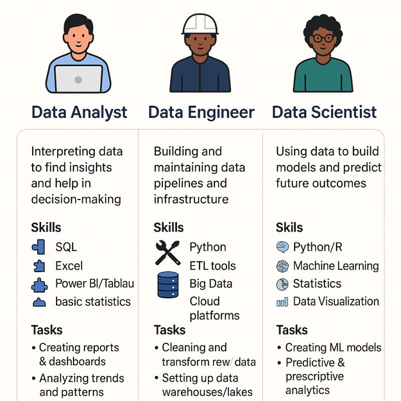

**Source:** [https://twitter.com/i/web/status/1912179151286751403](https://twitter.com/i/web/status/1912179151286751403)
**Original Post Date:** 2025-05-28 06:04:55

# Comparative Analysis of Data Analyst, Data Engineer, and Data Scientist Roles

## Introduction
The field of data science encompasses various specialized roles that require distinct skill sets and responsibilities. This analysis breaks down the core differences between Data Analysts, Data Engineers, and Data Scientists, providing clarity on their respective domains, required competencies, and practical applications. Understanding these distinctions is crucial for both career planning and team composition in data-driven organizations.

## Role Distinctions

Each role serves a unique function within the data lifecycle:

Data Analyst: Specializes in interpreting existing data to derive actionable insights through visualization, reporting, and basic statistical analysis. Their primary focus is on making sense of historical data to support decision-making.

Data Engineer: Acts as the infrastructure architect, designing and maintaining robust data pipelines that ensure reliable data flow between sources and destinations. They enable scalability and efficiency in data processing operations.

Data Scientist: Combines advanced statistical modeling with programming expertise to build predictive models and extract future-oriented insights from complex datasets.

- Data Analysts use SQL for querying, Excel/Power BI for analysis and visualization
- Data Engineers utilize Python, ETL tools, and cloud platforms for infrastructure
- Data Scientists leverage machine learning frameworks with R/Python

> **Note/Tip:** Consider role alignment based on your interest in data interpretation vs. infrastructure vs. modeling

> **Note/Tip:** Cross-training between roles can provide valuable perspective but requires significant time investment

## Skill Overlaps and Specializations

While there's substantial overlap in foundational skills, each role emphasizes distinct areas:

Python is a common language across all three roles, though Data Scientists use it most intensively for modeling.

SQL proficiency varies from basic queries (Analysts) to complex data processing (Engineers).

1. Data Analyst: Excel mastery is critical, statistical foundations are essential
1. Data Engineer: Cloud platforms and ETL tools form the core skill set
1. Data Scientist: Advanced statistics and machine learning knowledge dominate

> **Note/Tip:** Familiarity with all three domains can make you a more versatile data professional

> **Note/Tip:** Focus on mastering one role's specialization before expanding your expertise

## Task Focus and Deliverables

Each role produces different types of outputs based on their primary objectives:

- Data Analyst: Reports, dashboards, trend analyses
- Data Engineer: Data pipelines, ETL processes, data warehousing solutions
- Data Scientist: Machine learning models, predictive analytics frameworks

> **Note/Tip:** Deliverables often overlap in complex projects, requiring cross-functional collaboration

## Key Takeaways

- Data Analysts focus on interpreting existing data for actionable insights
- Data Engineers build and maintain the infrastructure that powers data operations
- Data Scientists create predictive models using advanced statistical techniques
- Python serves as a common language but with varying complexity across roles

## Conclusion
Understanding these distinct roles enables organizations to build more effective teams and professionals to chart appropriate career paths. While there's overlap in foundational skills, each role requires specialized expertise that contributes uniquely to the data value chain.

## External References

- [Microsoft SQL Documentation](https://docs.microsoft.com/sql)
- [Python Data Science Handbook](https://jakevdp.github.io/PythonDataScienceHandbook/)
- [AWS Big Data Solutions](https://aws.amazon.com/big-data/)

## Media

**Image Description:** The image is an infographic that compares three key roles in the field of data science and analytics: **Data Analyst**, **Data Engineer**, and **Data Scientist**. Each role is represented by an icon of a person, along with a brief description of their responsibilities, skills, and tasks. Below is a detailed breakdown:

---

### **1. Data Analyst**
- **Icon**: A person sitting at a desk with a laptop.
- **Description**: 
  - Focuses on interpreting data to find insights and help in decision-making.
- **Skills**:
  - SQL (for querying databases)
  - Excel (for data manipulation and analysis)
  - Power BI/Tableau (for data visualization and reporting)
  - Basic BI statistics (for understanding and analyzing data)
- **Tasks**:
  - Creating reports and dashboards
  - Analyzing trends and patterns in data

---

### **2. Data Engineer**
- **Icon**: A person wearing a hard hat, symbolizing a technical or infrastructure-focused role.
- **Description**:
  - Builds and maintains data pipelines and infrastructure.
- **Skills**:
  - Python (for scripting and automation)
  - ETL tools (Extract, Transform, Load tools for data processing)
  - Big Data (working with large datasets)
  - Cloud platforms (e.g., AWS, Google Cloud, Azure)
- **Tasks**:
  - Cleaning and transforming data
  - Setting up data warehouses and pipelines

---

### **3. Data Scientist**
- **Icon**: A person wearing glasses, symbolizing a role that involves analysis and modeling.
- **Description**:
  - Uses data to build models and predict future outcomes.
- **Skills**:
  - Python/R (programming languages for data analysis and modeling)
  - Machine Learning (building predictive models)
  - Statistics (for understanding data distributions and relationships)
  - Data Visualization (communicating insights effectively)
- **Tasks**:
  - Creating machine learning models
  - Predictive and prescriptive analytics (forecasting and decision-making)

---

### **Overall Layout and Design**
- The infographic is divided into three vertical sections, each corresponding to one of the roles.
- Each section includes:
  - A descriptive title for the role.
  - An icon representing the role.
  - A brief description of the role's responsibilities.
  - A list of skills required for the role.
  - A list of tasks performed by the role.
- The text is concise and uses bullet points for clarity.
- The color scheme is minimalistic, with icons and text in black and blue, set against a white background.

---

### **Key Observations**
1. **Role Distinction**:
   - The **Data Analyst** focuses on interpreting and visualizing data for decision-making.
   - The **Data Engineer** focuses on building and maintaining the infrastructure and pipelines that handle data.
   - The **Data Scientist** focuses on building models and predicting future outcomes using advanced statistical and machine learning techniques.

2. **Skill Overlap**:
   - There is some overlap in skills, such as Python and SQL, which are relevant across all three roles.
   - However, each role emphasizes different skills:
     - Data Analyst: Excel, Power BI/Tableau, basic statistics.
     - Data Engineer: ETL tools, Big Data, Cloud platforms.
     - Data Scientist: Machine Learning, Statistics, R.

3. **Task Focus**:
   - The tasks are tailored to the responsibilities of each role, highlighting the practical applications of their skills.

---

This infographic effectively communicates the key differences and similarities between these three critical roles in the data science and analytics domain. It provides a clear and concise overview for anyone looking to understand the distinctions between these professions.
